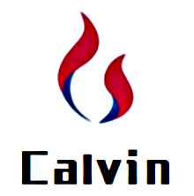

  

    
  
  
  <h1>
    Calvin Books
  </h1>
  <h2> 自律成就自由，学习改变未来，让我们共同成长，一起进步 ！</h2>

# 
书籍分类

## 心灵精神：

### <a href="../books/soul/1-思维的囚徒"><b> 1.《思维的囚徒》●  亚历克斯.佩塔克斯</b></a>

## <b>管理提升：</b>

### <a href="../books/manager/1-高效能人士的七个习惯"><b>1 .《高效能人士的七个习惯》● 史蒂芬·柯维 </b></a>

## <b>职场效能：</b>

## <b>家庭培养：</b>

## <b>生活体验：</b>

## <b>历史人文：</b>

