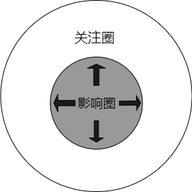

# 《高效能人士的七个习惯》● 史蒂芬·柯维 

《高效能人士的七个习惯》

 	<b> 作者：史蒂芬·柯维</b>

---

    

## 一、 重新探索自我

### 1. 由内而外全面造就自己

&emsp; 品德成功论提醒人们，高效能的生活是有基本原则的，只有当人们学会并遵循这些原则，把它们融入到自己的品德中去，才能享受真正的成功与恒久的幸福。

> 没有正确的生活，就没有真正卓越的人生。 
>
> 
——戴维·斯塔·乔丹（David Starr Jordan）美国生物学家及教育家

::: details <b>你离卓越的人生有多远？你有以下困惑和苦恼吗?</b>

<b>&emsp;&emsp;我的事业十分成功，但却牺牲了个人生活和家庭生活。不但与妻儿形同陌路，甚至无法肯定自己是否真正了解自己，是否了解什么才是生命中最重要的。</b>

- <b>我很忙，确实很忙，但有时候我自己也不清楚是否有价值。我希望生活得有意义，能对世界有所贡献。</b>
- <b>我上过无数关于有效管理的课程，我对员工的期望很高，也想尽办法善待他们，但就是感觉不到他们的忠心。我想如果我有一天生病在家，他们一定会无所事事，闲聊度日。为什么我无法把他们训练得独立而负责呢？为什么我总是找不到这样的员工呢？</b>
- <b>要做的事太多了，我总是感到时间不够用，觉得压力沉重，终日忙忙碌碌，一周7天，天天如此。我参加过时间管理研讨班，也尝试过各种安排进度计划的工具。虽然也有点帮助，但我仍然觉得无法像我希望的那样，过上快乐、高效而平和的生活。</b>
- <b>看到别人有所成就，或获得某种认可，表面上我会挤出微笑，热切地表示祝贺，可是，内心却难受得不得了。为什么我会有这种感觉？</b>
- <b>我个性很强。几乎在任何交往中，我都能控制结果。多数情况下，我甚至可以设法影响他人通过我想要的决议。我仔细考虑了每种情况，并且坚信我的建议通常都是对大家最好的。但是我仍感到不安，我很想知道，他人对我的为人和建议到底是何态度。</b>
- <b>我的婚姻已变得平淡无趣。我们并没有恶言相向，更没有大打出手，只是不再有爱的感觉。我们请教过婚姻顾问，也试过许多办法，但看来就是无法重新燃起往日的爱情之火。</b>
- <b>我那十来岁的儿子不听话，还打架。不管我怎么努力，他就是不听我的话，我该怎么办呢？</b>
- <b>我想教育孩子懂得工作的价值。但每次要他们做点什么，都要时时刻刻在旁监督，还得忍受他们不时地抱怨，结果还不如自己动手来得简单。为什么孩子们就不能不要我提醒，快快乐乐地料理自己的事呢？</b>
- <b>我又开始节食了——今年的第五次。我知道自己体重超标，也确实想有所改变。我阅读所有最新的资料，确定目标，并采取积极的态度激励自己，但我就是做不到，几周后就溃败了。看来我就是无法信守诺言。</b>

<b>&emsp;&emsp;这些都是我在任职咨询顾问和大学教师期间遇到的一些普遍而又深层次的问题，不是一两天就能解决的。</b>
:::

<b>1.1 品德与个人魅力孰重</b>

&emsp; 当时我正潜心研究自1776年以来美国所有讨论成功因素的文献。我阅读或浏览过的论著不下数百，论题遍及自我完善、大众心理学以及自我帮助等等。对于爱好自由民主的美国人民所公认的赢得成功的种种关键因素，已算得上了如指掌。 

&emsp; 从这200年来的作品中，我注意到一个令人诧异的趋势。前150年的论著强调“品德（CharacterEthic）”为成功之本本杰明·富兰克林（BenjaminFranklin）的自传就是这个时期的代表作，它主要描述一个人如何努力进行品德修养。 

> <b>节制、寡言、秩序、决心、节俭、勤勉、真诚、公正、中庸、整洁、冷静、谦虚、节欲</b> 
>
> 
——本杰明·富兰克林（BenjaminFranklin）

::: details <b>第一次世界大战，导致由重视“品德”转而强调“个人魅力（PersonalityEthic）”</b>

<b>&emsp;&emsp;第一次世界大战后不久，人们对成功的基本观念改变了。由重视“品德”转而强调“个人魅力（PersonalityEthic）”，即认为成功与否更多取决于性格、社会形象、行为态度、人际关系以及长袖善舞的圆熟技巧。</b> 

这种思潮朝两大方向发展：
  - 一是着重人际关系与公关技巧；
  - 二是鼓吹积极进取的心态。由此衍生的行为和习惯，有些的确是金科玉律，
    - 例如“态度决定成败”、“微笑比皱眉更能赢得朋友”以及“有志者事竟成”等等。但另一些却显然是玩弄手段，甚至是欺骗性的。
    - 例如运用技巧赢得好感，假装对他人感兴趣以套取情报，或虚张声势，甚至以威胁手段达到目的。

<b>因此，近50年来讨论成功术的著作都很肤浅，谈的都是如何树立社会形象的技巧和如何成功的捷径。但这种用“阿斯匹林”和“创可贴”来治疗心灵痛苦的方法，往往是头痛医头，脚痛医脚，治标而不治本。有时似乎取得了暂时的效果，但是深层次的问题没有解决，不时又会重新浮现。</b> 
<b>我终于了解，过去我与桑德拉潜意识里都受到这种速成观念的影响，才会对儿子采取上述做法。</b>

:::

::: details <b>改变别人，先改变对问题看法</b>

<b>&emsp;&emsp;几年前，我和妻子桑德拉就为类似的问题大伤脑筋。我们的一个儿子学习成绩很差，甚至看不懂试卷上的问题。他与同学交往时也很不成熟，经常弄得周围的人很尴尬。他又瘦又小，动作也不协调。打棒球时，他往往在投手投球之前就挥动了球棒，招来他人的嘲笑。</b> 

<b>&emsp;&emsp; 我和桑德拉觉得，若要十全十美，首先要做完美的父母。于是我们尝试用积极的态度来激发他的自信心：“加油，孩子，你能办得到！我们知道你行！手握高一点，看着球，等球快到面前再挥棒。”只要他稍有进步，我们就大夸一番以增强他的信心：“干得好，孩子，继续。” 尽管如此，还是引来了嘲笑，我们对此大加斥责：“别笑，他还在学习呢。”而这时我们的儿子却总是哭着说：“我永远也学不好，我根本就不喜欢棒球！”</b> 

<b>&emsp;&emsp;所有的努力似乎都徒劳无功，那时我们真是心急如焚，看得出来这一切反而伤害了他的自尊心。开始我们总能对他加以肯定、鼓励和帮助，可是一再失败后，还是放弃了，只能试着从另一个角度来看待。</b> 

<b>&emsp;&emsp;后来，在讲授有关沟通与认知的课程中，我对思维定式的形成，思维定式如何影响观点，观点又如何左右行为等问题深感兴趣，并进一步研究了预期理论（Expectancy Theory）、自我实现预言（Self-fulfillingProphecy）和皮格马利翁效应（PygmalionEffect）。从中我意识到，每个人的思维定式都是那么根深蒂固，仅仅研究世界是不够的，还要研究我们看世界时所戴的“透镜”，因为这透镜（即思维定式）往往左右着我们对世界的看法。</b> 

<b>&emsp;&emsp;我跟桑德拉谈到这些想法，并借此分析我们的困境，终于认识到我们对儿子往往言不由衷。自省后我们承认，内心深处的确觉得儿子在某些方面“不如常人”。所以不论我们多么注意自己的态度与行为，其效果都是有限的，因为表面的言行终究掩饰不住其背后的信息，那就是：“你不行，你需要父母的保护。”</b> 

<b>&emsp;&emsp;此时我们才开始觉悟：要改变现状，首先要改变自己；要改变自己，先要改变我们对问题的看法。</b>

<b>&emsp;&emsp;在我们心目中，这个孩子有失颜面，我们重视成为模范父母，维持良好形象，更甚于对孩子的关切，这种心态也影响到了对孩子的看法。的确，在看待与处理这个问题时，我们偏重许多其他因素，反而忽略了孩子的幸福与快乐。</b> 

- 一方面，因为好面子，我们给予孩子的不是无条件的关爱，造成了他自我评价的低落。所以我们决定从自身下功夫，不再讲究技巧，而是着重调整内心的真正动机和对孩子的看法。我们不再设法改变他，转而从客观的角度去发现和了解他的特色、个性与价值。
- 另一方面，我们也自觉地改变了自己的动机，培育了内在的安全感，不再用孩子的表现来判断自己的价值。

<b>&emsp;&emsp;一旦摆脱了过去对孩子的看法，培育了基于价值观的动机，我们顿时感到一种新气象——不必再拿孩子与旁人比较，不必把固定的社会模式强加在他身上，这样反而能够平心静气地欣赏他的优点。我们相信他有能力应付人生的种种挑战，也就不急于保护他免受外界的嘲笑。</b> 

<b>&emsp;&emsp;可是孩子已习惯于接受保护，因此一开始表现得相当畏缩。他向我们求援，但我们只是认真聆听，不一定如他预期地回应。这无形中传达了一个信息：“父母不用保护你，你没问题！”</b> 

<b>&emsp;&emsp;几个月过去了，他渐渐有了信心，也开始肯定自我价值，终于以自己的速度与步调发挥出了潜能。不论在学业、运动场还是社交场合上，以一般社会标准来衡量，他的表现都是相当杰出的。这一切都发生在转念之间，远远超过了所谓的自然发展速度。后来他还当选学生社团领导、州运动员，门门成绩优秀。另外，他还锻炼出了坦诚、热心的性格，走到哪儿都能与人融洽相处。</b> 

<b>&emsp;&emsp;我和桑德拉都相信，这个孩子“出人头地”的成就中，自动自发因素的作用要多于外在影响。这是前所未有的经验，对我们教育子女以及扮演其他角色很有启发作用，也使我们体验到凭借品德和个人魅力成功的天壤之别。赞美诗中唱得好：努力探寻你自己的心灵吧，因为生活源自于此。</b>
:::  

<b>1.2 光有技巧还不够</b>

::: details <b>引言: "品德"重要性</b>

<b>&emsp;&emsp;从教育儿子的经验、对人们认知过程的研究以及成功论著的阅读中，我顿悟了品德的强大影响力，也认清了自己从小所学并且深植于心的价值观，其实与现在流行的追求捷径的速成哲学相去甚远，而这种差异经常被有意地忽略。多年来我一直向他人传授七个习惯，自信十分有效，却总是发现这些知识与流行的思潮不同甚至相逆，现在终于对个中原因有了深一层的领会。</b> 

<b>&emsp;&emsp;我并非暗示个人魅力论所强调的因素不具效用，比如个人成长、沟通技巧方面的训练，积极思维和影响力方面的教育等，有时确实是成功的要素，但只居于次要，而非主要地位。或许我们在前人的基础上施展个人能力时，太过注重造就自己，却忽略了前人基础的支撑；也或许我们习惯坐享其成，遗忘了耕耘的必要。</b> 

<b>&emsp;&emsp;即使我可以玩弄手段使他人投我所好，为我卖力，因我发奋，和我“惺惺相惜”，然而一旦我品德有缺陷——比如言不由衷、虚情假意，就无法获得长远的成功。因为言不由衷难免遭人怀疑，任何行事都会被视为别有用心，就算所谓的人际关系技巧也无济于事。任凭你巧舌如簧，动机纯良，只要没有或者缺乏信任感，就不要说什么永久的成功。只有心存善念，才能赋予人际关系技巧以生命。</b> 

<b>&emsp;&emsp;只重技巧就仿佛考前临时抱佛脚，纵使有时顺利过关，甚至成绩还不错，但没有日积月累的付出，绝对无法学得精通。</b> 

<b>&emsp;&emsp;试想如果耕种也临时抱佛脚会有多荒谬。春天忘了播种，夏天忙着享乐，秋天能收获什么呢？耕种是一个自然体系，必须付出代价，一步一步完成。一分耕耘，一分收获，没有捷径可循。</b> 

<b>&emsp;&emsp;人类行为和人际关系也是基于收获法则的自然系统。在暂时性的人际交往中，你或许能摸清并操控“人造”法则，按“规矩”办事，暂时蒙混过关；你也可以凭借个人魅力八面玲珑，假扮他人知音，利用技巧赚取好感。但在长久的人际关系中，单凭这些次要优势是难有作为的。倘若没有根深蒂固的诚信和基本的品德力量，那么生活的挑战迟早会让你真正的动机暴露无遗，一时的成功就会被人际关系的破裂所替代。</b> 

<b>&emsp;&emsp;许多人具备这些次要优势，是社会所认可的人才，但是缺乏基本的品德，长期来看，他们与同事、朋友、配偶或者孩子的人际关系早晚会出现问题。只有品德才是交流中最伶俐的“口齿”，正如爱默生（Emerson）所说：“大声喧哗反而难以入耳。”</b> 

<b>&emsp;&emsp;当然，也有品德有余却沟通技巧不足的人，但即便人际关系质量因此受到影响，也是瑕不掩瑜。</b> 

<b>&emsp;&emsp;归根到底，我们的本质要比言行更具说服力，这个道理人人都懂。有些人是我们绝对信任的，因为我们了解他的品德，不论他是否能说会道、擅长交际，我们就是信任他们，而且能够与之合作顺畅。威廉姆·乔治·乔登（William GeorgeJordan）曾说：人性可善可恶，冥冥中影响着我们的一生，而且总是如实反映出真正的自我，那是伪装不来的。</b>
:::

<b>1.3 思维定式的力量</b>

&emsp; 本书包含人类效能的许多原则，是基本而首要的，可永葆成功与幸福，放之四海皆准，不过，我们必须先了解人类的思维定式以及如何实现思维定式的转换，才能真正理解这七个习惯。 

先前提到的品德成功论与个人魅力论就是两种典型的社会思维定式。

> <b>思维定式（Paradigm）</b>这个词来自希腊文，最初是一个科学名词，现在多用来指某种**理论、模型、认知、假说或参考框架**。
>
> - 广义上：指我们“**看**”世界的方法，这种“**看**”和视觉无关，主要指我们的**感知**、**理解**与**诠释**。它是每个人看待世界的方式，未必与现实相符。它是一份地图，而非领域本身，是由每个人的成长背景、经验及选择打造而成，我们会透过它来窥探万事万物。

::: details <b>案例1 ：地图</b>

<b>&emsp;&emsp;为了方便理解，我们可以把思维定式比作地图。我们都知道地图不代表地域，只是对地域的某些方面进行说明。思维定式就是这样，它是关于某种事物的理论、诠释或者模型。</b> 

<b>&emsp;&emsp;假设你想去芝加哥中心区的某个地方，地图本应该帮助你到达目的地，但是由于印刷问题，你得到了一张标注为芝加哥，实际上却是底特律的地图。你能想象无法到达目的地的那种沮丧和无助吗？</b> 

<b>&emsp;&emsp;你可以改变行为，比如更努力，更勤奋，更迅速，但是这种努力只会让你更快地到达错误的地点。你还可以改变态度，比如更加积极地思考，但你仍然到不了正确的地点。或许你并不在乎，因为你抱着积极的态度，不管到了哪里你都高兴。但关键是，你还是走错路了。根本问题不在于你的行为和态度，而在于那张错误的“地图”</b> 

<b>我们每个人脑中都有很多地图，可以分成两大类：</b>

- 一类是依据世界本来面目绘制的地图，反映现实情况；
- 另一类是依据思维定式绘制的地图，反映个人价值观。我们用这些地图诠释所有的经验，从来都不怀疑地图的正确性，甚至意识不到它们的存在。我们理所当然地假定自己的所见所闻就是真实的世界。

<b>&emsp;&emsp;我们的态度与行为皆源自这种假定，我们对事物的看法决定着我们的思想与行为。</b>
:::

::: details  <b>案例2 ：测试检查思维是否定式 ？</b>

<b>&emsp;&emsp;现在来做一个智力和情感的小测验，请花几秒钟观察下面的图1-1和图1-2，并仔细描述所看到的形象。</b> 

    

- <b>你是否看到了一位女士？她的年龄大约多少？长相如何？衣着如何？身份又如何？</b> 

- <b>或许你认为这位女士是个可爱的摩登女郎，鼻子小巧，时尚靓丽。</b> 

- <b>如果我说你看走眼了，这位女士已经六七十岁，而且面带愁容，绝非模特儿，或许过马路时还需要你扶她一把，你会有何反应？</b> 

- <b>如果我们能面对面地讨论，就可以互相交流自己看到的画像的样子，直到对方也看到了自己所看到的。</b> 

<b>但是不行，所以只好请你看图1-3，并将它与图1-2对照。现在你能看到老妇人了吗？一定要看到才能继续往下读，这很重要。</b>

    

<b>&emsp;&emsp;多年以前我在哈佛商学院就读时，首次知道这个实验。当年那位教授想借此说明不同的人对同一件事会有不同的看法，并且都很正确。这不属逻辑范畴，而是心理问题。</b> 

<b>&emsp;&emsp;教授首先把两叠卡片分发给教室两边的同学，其中一叠是图1-1的少妇像，另一叠是图1-3的老妇像。他给我们10秒钟仔细看这些卡片，然后收回。接着用投影仪给我们看综合了二者特点的画像，即图1-2，并要求全班都来描述。结果，事先看过少妇像的，几乎一致认定这就是那位少妇；而先前看到老妇像的同学，也都认为这是位老妇人。</b> 

<b>这时教授请一边的同学向另一边的同学讲述他所看到的并说明理由，双方各执己见：</b> 

> “别开玩笑，我看她不超过20岁，怎么可能是个老太婆？” 
> “你才开玩笑，她少说也有70岁了。” 
> “她这么年轻、漂亮又可爱，我都想约会她了。” 
> “可爱？她是个丑老太婆。” 

<b>&emsp;&emsp;你一言，我一语，双方始终争执不下，不肯服输。大多数人都早就知道另一种可能性的存在，只不过不愿意承认。只有少数同学从一开始就换了一个角度来观察画像。</b> 

<b>&emsp;&emsp;正当大家僵持不下的时候，有位同学走上前去，指着画像上的一条线说：“这是少妇戴的项链。”另一位马上反驳：“不，这是老妇人的嘴。”就这样，大家开始逐一讨论画中的细节，在冷静而详细的讨论过程中，同学们渐渐看到了另一方眼中的画像。但只要把视线移开一下，再回头看时还是会认为那是自己最初看到的样子，即当时在10秒钟之内看到的形象。</b> 

<b>&emsp;&emsp;在后来的工作中，我常常借用这个有关感知的实验，因为它能使我们对人和人际关系的本质有更透彻的认识。首先，它充分说明了条件作用对人类认知和思维定式的强大影响力。连10秒钟都能产生如此这般的影响，更何况一生中的条件作用呢？家庭、学校、教堂、单位、朋友、同事以及流行思潮（如个人魅力论等），都在不知不觉中影口向着我们，左右着我们的思维定式——我们的地图。</b> 

<b>&emsp;&emsp;其次，这个实验还说明了思维定式是行为与态度的源头，脱离了这个源头的言行就是表里不一，言不由衷。以图1-2为例，如果你认为那是一位少妇，自然想不到扶她过街，因为你对她的态度和行为必定出自你对她的看法。</b> 

<b>&emsp;&emsp;由此就凸显了个人魅力论的一个基本缺陷，即仅仅改变表面上的行为与态度，却忽略作为源头的思维定式，那么改变的成效一定有限。</b> 

<b>&emsp;&emsp;这个实验还让我们体会到思维定式对人际交往的影响。以前我们总以为只有自己清楚而客观地看到了事物的本质，但这个实验却让我们开始认识到，别人的观点虽然有异，但也是清楚而客观的。“立场决定观点”。</b> 

<b>&emsp;&emsp;这并不是说没有事实存在。在实验中，起初看到不同图像的人，在图1-2中都看到了同样的白底黑线条，这是他们共同承认的事实。只不过每个人经验不同，诠释也不同，而一旦离开了诠释，事实也就失去了它的意义。</b> 

<b>&emsp;&emsp;我们越是认识到思维定式、地图或者假定以及经验在我们身上的影响力，就越是能够对自己的思维定式负责，懂得审视它，在现实中检测它，并乐于聆听和接受别人的看法，从而获得更广阔的视野和更客观的看法。</b>
:::

<b>1.4 思维转换的力量</b>

&emsp; 或许从这个实验中得到的最重要的启示应该是思维转换，即某人从另一角度看问题的顿悟感。第一印象的影响越深，顿悟的力量就越大，好比一瞬间万道光芒把内心照亮。

&emsp; 或许从这个实验中得到的最重要的启示应该是思维转换，即某人从另一角度看问题的顿悟感。第一印象的影响越深，顿悟的力量就越大，好比一瞬间万道光芒把内心照亮。

> 梭罗（Thoreau）曾经说过：“**一棵邪恶的大树，砍它枝叶千斧，不如砍它根基一斧。**”行为和态度就是枝叶，思维定式就是根基，抓住根本才能让生活出现实质性的进展。

- - **古埃及天文家托勒密认为地球是宇宙的中心，但哥白尼主张太阳才是宇宙的中心，因而激起思维转换。尽管后者曾招致强烈反抗与迫害，但转眼间，人类对宇宙万物的诠释完全改观。**
- - **牛顿的物理学原理虽至今仍是现代工程学的基础，但并未穷尽科学的边界。直到爱因斯坦的相对论提出，又为科学界带来一次革命。**
- - **有关细菌的学说未出现之前，许多妇女死于分娩，许多战士死于伤病而非敌人的攻击；直到细菌论带来了全新的观念，现代医学才有进步的可能。**
- - **今日的美国也是思维转换的成果。传统君权神授、君主专制思维，由民主、民享的观念所取代，才促成民主宪政与自由富足的社会。**

&emsp; 但并非所有的思维转换都是积极的。例如我们前面提到的，人们由强调品德转为强调个人魅力，这种转换反而让我们偏离了通向成功与幸福的轨道。 

&emsp; 不论思维转换的结果是否积极，过程是否渐进，都会让我们的世界观发生改变，而且改变的力度惊人。不论思维定式是否正确，都会决定我们的行为和态度，并最终影响到我们的人际关系。

::: details <b>自我思维转换经历</b>

<b>&emsp;&emsp;我曾经体验过一次小小的思维转换。那是个周日的早晨，在纽约的地铁内，乘客都静静地坐着，或看报或沉思或小憩，眼前一幅平静安祥的景象。这时候突然上来一名男子与几个小孩，孩子的喧哗吵闹声，破坏了整个气氛。那名男子坐在我旁边，任凭他的孩子如何撒野作怪，依旧无动于衷。这种情形谁看了都会生气，全车的人似乎都十分不满，最后我终于忍无可忍对他说：“先生，你的孩子太闹了，可否请你管管他们？”</b> 

<b>&emsp;&emsp;那人抬起眼来看我，仿佛如梦初醒般轻声说：“是啊，我想我是该管管他们了。他们的母亲一小时前刚刚过世，我们刚从医院出来。我手足无措，孩子们大概也一样。”</b> 

<b>&emsp;&emsp;你能想象我当时的感觉吗？我的思维转换了，看此事的角度也瞬间改变，想法、感觉和行为都变了。我怒气全消，不需要再克制自己的态度和行为，因为他的痛苦已经让我感同身受，同情与怜悯之情油然而生。“原来您的夫人刚刚过世？我感到很抱歉！您愿意和我谈谈吗？或者我能为您做些什么？”一切都变了。</b> 

<b>&emsp;&emsp;许多人在生死关头也会大彻大悟，重新审视生命中的优先次序，同样的事情也会发生在人们突然接受一个新角色的时候，比如丈夫、妻子、父母、主管或领导。
如果我们只想让生活发生相对较小的变化，那么专注于自己的态度和行为即可，但是实质性的生活变化还是要靠思维的转换。</b>
:::

<b>1.5 以原则为中心的思维定式</b>

品德成功论植根于一个基本信念之上，那就是人类效能都需要原则作指引，这是放之四海皆准的真理，和物理学中的万有引力法则一样，都是毋庸置疑、不容忽视的自然法则。

::: details <b>原则的真实性和影响力</b>
<b>至于这些原则的真实性和影响力到底怎样，看看弗兰克·柯克（FrankKoch）在海军学院的杂志《过程》（ Proceedings ）中写到的思维转换经历就知道了：</b> 

<b>&emsp;&emsp;两艘演习战舰在阴沉的天气中航行了数日，我就在打头的那艘旗舰上当班，当时天色已晚，我站在舰桥上瞭望，浓重的雾气使得能见度极低，因此船长也留在舰桥上压阵。</b> 

> 入夜后不久，舰桥一侧的瞭望员忽然报告：“右舷位置有灯光。”
> 船长问他光线的移动方向，他回答：“正逼近我们。”这意味着我们可能相撞，后果不堪设想。
> 船长命令信号兵通知对方：“我们正迎面驶来，建议你转向20度。”
> 对方说：“建议你转向20度。”
> 船长说：“发信号，告诉他我是上校，命令他转向20度。”
> 对方回答：“我是二等水手，你最好转向20度。”
> 这时船长已勃然大怒，大叫道：“告诉他，这是战舰，让他转向20度。”
> 对方的信号传来：“这是灯塔。”
> 结果，我们改变了航道。

<b>&emsp;&emsp;我们随着这位船长经历了一次思维转换，结果整个情况都不同了。这位船长因为身处迷雾而看不清事实，但是看清事实在我们的日常生活中是极其关键的一环。</b> 

<b>&emsp;&emsp;原则如灯塔，是不容动摇的自然法则。正如塞西尔·B·德米尔（Cecil．B．deMille）在他执导的电影《十诫》（The TenCommandments）中所揭示的：“我们不可能打破法则，只能在违背法则的时候让自己头破血流。”</b> 

<b>&emsp;&emsp;有人根据自己的经历建立思维定式或者绘制地图，然后借此观察自己的生活与人际关系。但是地图不等于地域本身，它只是一种“主观的事实”，是对某一地域的描述。</b> 

<b>&emsp;&emsp;只有“灯塔”式指引人类成长和幸福的原则才是“客观的事实”，是地域本身。这一法则已经渗透到历史上所有的文明社会中，并成为家庭和机构繁荣持久的基础。</b> 

<b>&emsp;&emsp;任何人只要对人类历史的盛衰循环深切了解，都会承认这些原则是颠扑不破、历久弥新的。国家社会的存亡与兴衰，往往就取决于是否能遵奉这些原则。</b> 

<b>&emsp;&emsp;我所强调的这些原则，并非一些深奥玄妙的宗教哲理，也不属于任何特定的宗教或信仰。可以说世上各主要宗教、民族的伦理道德思想中，几乎都涵盖了它们。这些不辩自明的真理，任何人都可以心领神会，就好像人类与生俱来的良知，不分种族肤色，人人具备。即使被社会流俗或个人否定而隐晦不彰，但它们依然存在。</b> 

<b>&emsp;&emsp;比如“公平”的原则，平等与正义的概念便由此而来。虽然每个社会对何谓公平以及如何维持公平的看法都有很大差异，但基本上都承认该原则的确存在。</b> 

- “诚信”与“正直”的原则是人类相互信任的基础。有了信任，才有可能互助合作，实现个人与群体的持续成长。
- “服务”的原则，即贡献自我，以及“讲求品质”或“追求卓越”的原则。
- “潜能”原则是指人类可以不断成长，进步，释放潜能和施展才华。与此密切相关的是“成长”原则，即潜能得以释放，才华得以施展的过程。这一过程需要“耐心”、“教育”与“鼓励”等原则的配合。

<b>&emsp;&emsp;原则不同于实践。实践是特定的行为或活动，在某一情况下适用的实践未必能在另一种情况下适用。就好比父母不能将教育第一个孩子的方法照搬到第二个孩子身上。</b> 

<b>&emsp;&emsp;实践是个别的、具体的，而原则是深刻的、基本的和普遍的。原则适用于任何个人、婚姻、家庭以及公私机构。如果我们把原则内化为习惯，就能够用不同的实践方法应对任何局面。</b> 

<b>&emsp;&emsp;原则不是价值观。一群盗匪可以有相同的价值观，但却违背了良善的原则。如果说原则是地域，那么价值观就是地图。唯有尊重正确原则，才能认清真相。</b> 

<b>&emsp;&emsp;原则是人类行为的指南针，历经考验，长盛不衰，不证自明。要抓住它们的本质，最简捷的方法就是设想一下反其道而行之的后果，不会有人以为可以靠欺骗、不公、卑鄙、无能、平庸或者堕落来换得持久的幸福与成功。</b> 

<b>&emsp;&emsp;一个人的思维定式或者地图越符合这些原则或者自然法则，就越能正确而高效地生活。比起为改变态度和行为所做出的努力，正确的地图对于个人和人际关系效能的影响要大得多。</b> 
:::

<b>1.6 成长和改变的原则</b>

&emsp; `个人魅力论`之所以让大家趋之若鹜，就是因为它号称能够让人们跨过事物成长的自然历程，迅速而轻松地实现个人效能和人际关系的圆满人生。这种华而不实、“暴发户”式的论调，无异于鼓励不劳而获，即便获得了所谓的成功，也不过是昙花一现。 

&emsp; `个人魅力论`给人一种错觉和幻象，妄图一步登天，这就好比目的地是芝加哥，手上拿的却是底特律的地图。 

> 埃里希·弗洛姆（ErichFromm）对于个人魅力论的根源和成就有很深的见解，他说：现在有这样一种人，行尸走肉一般生活，没有自知之明，他们了解的只是别人期望中的自己。他们的沟通能力、真诚的笑容乃至痛苦的感受都已经被言之无物、伪装的笑容和无聊的绝望所取代。两句话概括：他们已经丧失了天性与个性，并且无可救药；他们与地球上的其他人相比并无本质区别。

::: details <b>引言: "成长和改变的原则"重要性</b>

<b>&emsp;&emsp;人的一生包含了许多成长和进步阶段，必须循序渐进，比如小孩要先学会翻身、坐立、爬行，然后才学会走路、跑步。每一步都十分重要，而且需要时间，不能跳过。</b> 

<b>&emsp;&emsp;人类的成长历程莫不如此，无论是学钢琴还是与同事相处，无论是个人、家庭、婚姻还是社会，都要遵循这一原则。</b> 

<b>&emsp;&emsp;我们通常能够在物质领域理解并接受“循序渐进”的原则，但在精神领域、人际关系，甚至个人品德方面，却很难做到这一点。即使理解了，也未必愿意接受或实践，结果妄图走捷径，想跳过关键步骤到达目的地的大有人在。</b> 
<b>&emsp;&emsp;但是缩短自然成长与发展的过程，结果如何呢？假设你的网球技术普通，却想与高手较量，只为了给人深刻的印象，结局不问可知。难道只靠高昂的意志就能帮助你击败职业高手？又假设你琴艺平平，却向亲朋吹嘘有开演奏会的实力，牛皮终有吹破的一天。</b> 

<b>&emsp;&emsp;自然的成长过程不容违背、忽略或缩短，那只会让你平添失望和挫败感。</b> 

<b>&emsp;&emsp;以10分为标准，假如我在各个方面都只能得2分，那么要达到5分，必须先向3分迈进，正所谓“千里之行，始于足下”，而且要一步一个脚印。</b> 

<b>&emsp;&emsp;如果学生不肯发问，不肯暴露自己的无知，不肯让老师知道他真正的程度，那么绝对学不到东西，也就不能有长进。而且伪装实非长久之计，总有被拆穿的一天。承认自己的无知往往是求知的第一步。梭罗曾说：“如果我们时时忙着展现自己的知识，将何从忆起成长所需的无知？”</b> 

<b>&emsp;&emsp;记得有一次，一位朋友的两个女儿向我哭诉，抱怨她们的父亲太严厉、不知体谅。她们不敢向父母吐露，却迫切需要父母的爱、关怀与教导。</b> 

<b>&emsp;&emsp;于是我去找朋友谈话，他只肯承认自己脾气不好，却不愿为自己的行为负责，也不愿意接受自己“情商”不足的事实，强烈的自尊心阻碍了他迈出改变的第一步。</b> 

<b>&emsp;&emsp;与配偶、子女、朋友或同事相处一定要学会聆听，这需要情感力量的支撑。聆听需要耐心、坦诚和理解对方的愿望，属于品德的高级范畴。相较之下，以低投入的情感给出“高高在上”的建议要容易得多。</b> 

<b>&emsp;&emsp;球技和琴艺如何，很容易判断，可品德和情感就不一样了。在陌生人或同事面前，我们可以伪装得很好，暂时蒙混过关，至少不会被当众拆穿，可能连自己都被骗了。但我相信，多数人都知道自己骨子里到底什么样，而且与自己共同生活和工作的人也心知肚明。</b> 

<b>&emsp;&emsp;我在企业界看过太多投机取巧的例子，那些主管试图通过激昂的演说、微笑训练、外界干预或是接管、收购以及善意或恶意的并购，来“购买”一种新的企业文化，从而达到提升生产力水平、质量水平、道德水平以及服务水平的目的，但却忽略了玩弄权术会让信任度低下的事实。一旦发现这些并不奏效，他们就转而求助于其他个人魅力的技巧，却从不尊重和遵守自然原则与成长历程，而这些恰是高度互信的企业文化的基础。</b> 

<b>&emsp;&emsp;多年以前我也犯过同样的错误。我赶回家参加女儿三岁生日的派对，结果刚进门就发现女儿在前厅角落里，挑衅般地抓着所有的礼物，不让其他小朋友玩。我的第一反应是，在场那么多家长都在目睹女儿的自私表现，这让我十分难堪。再想到我本人就在大学里讲授人际关系，这种难堪情绪又多了一重。我很清楚，至少感觉得到这些家长们都在期待着什么。</b> 

<b>&emsp;&emsp;当时的气氛十分紧张，所有的孩子都挤在女儿身边，伸手要玩他们刚刚送出的礼物，而女儿就是不肯答应。我对自己说：我真应该给女儿传授一下分享的概念，这可是最基本的价值观之一。</b> 

> 我先从简单的要求开始：“宝贝，把小朋友送的礼物分给大家一起玩好不好？”
> “不！”她断然拒绝。 
> 我的第二招是讲道理：“亲爱的，如果你肯在自己家里把玩具分给小朋友们玩，那么等你到他们家里时，他们也会把玩具分给你玩。” 
> 她又说了一个“不”。 
> 我感觉更尴尬了，很明显我管不了女儿。第三招就是，我轻声说：“宝贝，你把玩具分给小朋友们玩，爸爸就奖你一片口香糖。” 
> 她大叫：“我不要口香糖。” 
> 我忍无可忍，第四招就只有恐吓和威胁了：“你再这样子，看我怎么罚你！” 
> 女儿哭道：“我不管，我的东西不要分给别人玩！” 
> 最后我只好采取强硬手段，从她手里抢过一些玩具分给其他小朋友：“孩子们，玩吧。”

<b>&emsp;&emsp;或许女儿需要先经历拥有，然后才会付出。（事实上，我自己在未曾拥有的时候，又何曾付出？）她希望从我这个情感应该更加成熟的父亲身上得到这种经历。</b> 

<b>&emsp;&emsp;可是我当时过于在意其他家长对我的看法，反而不够重视孩子的成长和我们的关系。我从一开始就认定了自己是对的，她应当学会分享，她的做法是错误的。</b> 

<b>&emsp;&emsp;或许正是因为我不够成熟，所以才对女儿期望过高。我不能或者不愿付出耐心或理解，于是希望她能够付出一些东西。为了弥补我的不足，我只好借助于自己的身份和权威来逼她就范。</b> 

<b>&emsp;&emsp;这样反而危害到很多东西，比如我以后会更加依赖外力来达到目的；女儿的成长受阻，独立判断能力和自律能力的发展受挫；我们的关系也遭到破坏。结果惧怕取代合作，双方都更加坚持己见，彼此防备。</b> 

<b>&emsp;&emsp;如果你力量的来源——体型、力气、职位、权威、学历、地位、身份、外表或是过去的成就——发生变化甚至不复存在，那该怎么办呢？</b> 

<b>&emsp;&emsp;如果我当年能成熟一些，就会依靠自己的力量——我自己对分享和成长的理解以及爱和养育的能力——让女儿自行决定要不要分享玩具。或许尝试过讲道理后，我可以带孩子们做个有趣的游戏，转移他们的注意力，也解除女儿的心理压力。现在我知道了，一旦孩子体会到了真正拥有的感觉，自然会乐于与他人分享。</b> 

<b>&emsp;&emsp;经验告诉我，教导孩子也要因时制宜。在关系和气氛紧张的时候，教导会被视为一种评判与否定；关系融洽的时候，在私下里对孩子循循善诱效果会加倍。可惜当年我的耐性和自控能力尚未成熟到这种程度。</b> 

<b>&emsp;&emsp;或许只有真正经历过拥有，才会真正懂得分享。许多人在家庭或婚姻中只知机械式地付出，或者拒绝付出和分享，可能正是由于他们从未体验过拥有，而且缺乏自我认同和自尊。所以教育孩子应该要有充分的耐心让他们体会拥有的感觉，同时用足够的智慧告诉他们付出的价值，另外还要以身作则。</b> 
:::

<b>1.7 症结在于治标不治本</b>

&emsp;&emsp;一般人对于成功的个人、家庭与团体，总是钦羡不已。他们羡慕别人的能干、成熟，家人的团结合作，以及组织的团队精神。但他们真正想知道的却是成功背后的秘诀，向成功者请教的，不外乎如何能够立竿见影、立收解决自身难题的方法。 
&emsp;&emsp;有这种想法的人，就有能提供这类答案的人。有时候速成的办法还颇管用，可暂时消除一些表象的问题。只是真正的症结依旧存在，久而久之问题又会浮现。而且愈是求助于“特效药”，病症拖得愈久，病情愈加恶化。 

::: details <b>让我们回顾一下本章“开头的内容”和“个人魅力论的影响”。</b>

- 我上过无数关于有效管理的课程，我对员工的期望很高，也想尽办法善待他们，但就是感觉不到他们的忠心。我想如果我有一天生病在家，他们一定会无所事事，闲聊度日。为什么我无法把他们训练得独立而负责呢？为什么我总是找不到这样的员工呢？

  - <b>个人魅力论建议</b> 
  > 急于想约束员工却束手无策的经理，个人魅力论建议他采取激烈的手段，大事整顿一番，逼得员工兢兢业业。或者让员工接受相关的训练，以提高工作热忱，甚至另聘更称职的外来和尚。 
  
  后果：但阳奉阴违的员工，私底下可能正质疑着老板究竟有没有为他们着想，有没有把他们当作机器看待。员工的想法也许并非空穴来风，老板心中的确如此看待他们，而主管态度偏差或许就是管理不善的原因之一 

- 要做的事太多了，我总是感到时间不够用，觉得压力沉重，终日忙忙碌碌，一周7天，天天如此。我参加过时间管理研讨班，也尝试过各种安排进度计划的工具。虽然也有点帮助，但我仍然觉得无法像我希望的那样，过上快乐、高效而平和的生活。

   - <b>个人魅力论建议</b>

     > 例如新的计划和培训班。

   - <b>转换思维建议</b>

     > - 有没有可能问题并不在于效率？
     > - 以更短的时间完成更多的工作真的有用吗？
     > - 抑或这只不过能让人对充塞了生活的人与环境做出更快的反应？
     > - 是不是应该看得更深入、更透彻一些，比如那些足以影响对时间、生命与自我的看法的思维定式？

- 我的婚姻已变得平淡无趣。我们并没有恶言相向，更没有大打出手，只是不再有爱的感觉。我们请教过婚姻顾问，也试过许多办法，但看来就是无法重新燃起往日的爱情之火。

  - <b>个人魅力论建议</b>

    >个人魅力论指出，一定有一些新书或者新的课程教人提高表达能力，可以让妻子更加了解丈夫；也可能这些都没用，还不如另筑爱巢。

  - <b>转换思维建议</b>

    > - 是有没有可能问题并不在于妻子？
    > - 是丈夫纵容了妻子的缺点，结果自作自受？
    > - 是不是对配偶、婚姻和爱情的思维定式导致了这些问题？

<b>现在你知道个人魅力论的思维定式是如何深刻地影响甚至决定我们看待问题和解决问题的方法了吧！</b> 

<b>&emsp;&emsp;不论你是否察觉，总之已经有越来越多的人不再对个人魅力论的空洞承诺抱有幻想。在与全美各类组织合作的过程中，我发现那些高瞻远瞩的主管都对所谓的“励志”故事和演讲避而远之。</b> 

<b>&emsp;&emsp;他们需要的是实质性的东西，需要过程，而不仅仅是“阿斯匹林”和“创可贴”，他们希望铲除病根，只关注会带来长期。效应的原则。</b>

:::

<b>1.8 新的思想水平</b>

> 爱因斯坦（AlbertEinstein）曾说：“重大问题发生时，依我们当时的思想水准往往无法解决。”

&emsp; 里里外外地审视自己之后，我们发现那些在个人魅力论影响下产生的问题是如此地侵筋蚀骨，根本不可能再用个人魅力论里那些肤浅的方法解决。

&emsp; 我们需要新的、更深层次的思想水平，即基于原则的思维定式，它能正确引导我们实现高效能，改善人际关系，解决深层问题。

&emsp; 这种新的思想水平就是《高效能人士的七个习惯》要阐述的内容，它强调`以原则为中心`，`以品德为基础`，`要求“由内而外”地实现个人效能和人际效能`。

::: details <b> “由内而外”和“由外而内”区别</b>

> **“`由内而外`”**
>
> - 意思是从自身做起，甚至更彻底一些，从自己的内心做起，包括自己的思维定式、品德操守和动机。
> - 观点：认为个人领域的成功必须先于公众领域的成功；只有先信守对自己的承诺，才能信守对他人的承诺。把个人魅力置于品德之上，妄图在自我完善之前完善人际关系都将徒劳无功。
> - 一个持续的更新过程，以主宰人类成长和进步的自然法则为基础，是螺旋向上的，它让我们不断进步，直到实现独立自强与有效的互赖。

- 如果你想拥有美满的婚姻，那么就做一个能产生助力而非阻力的人，不要一味强求对方。

- 如果你希望青春期的子女更听话，更讨人喜欢，那么先做个言行一致、充满爱心且懂得体谅的父母。

- 如果你希望在工作上享有更多自由与自主，那么先做个更负责尽职的员工。

- 如果你希望获得信任，那么先做个值得信任的人。如果你希望才华不被埋没，那么先修养自己的基本品德。

<b>&emsp;&emsp;我曾有幸与许多才华横溢、卓越不凡的人共事，其中包括企业主管、大学生、宗教与民间组织、家庭成员和夫妇，他们都渴望幸福与成功，或在寻寻觅觅，或在个中煎熬。我的经验告诉我，由外而内获得的解决办法、成功和幸福往往难以长久。</b> 

> **“`由外而内`”**
>
> - 影响：让人自艾自怜，固步自封，并将此归咎于别人和环境的缺陷。

<b>&emsp;&emsp;我见过一些婚姻不和谐的夫妇，两个人都想改造对方，不断列举对方的“罪状”已达到目的。我也见过一些劳资纠纷，双方耗费大量时间和精力订立规章制度，仿佛这样就能够找到信任的基础。</b> 

<b>&emsp;&emsp;世界上冲突最热的三个地方——南非、以色列和爱尔兰，问题僵持不下的根源就在于社会上流行的由外而内的思维定式。每一方都认为问题在“那里”，在“那一方”，如果“那一方”“讲理”或者“自动退出”的话，问题就解决了。</b> 

<b>&emsp;&emsp;由内而外的思维转换对很多人来说都堪称剧烈，主要是由于个人魅力论已经成为社会流行的思维定式，其影响已经十分深入。</b> 

<b>&emsp;&emsp;但就我个人及与人共事的经验，再加上我对历史上成功个人和社会经验的认真思考，我相信七个习惯中的许多原则早已深入人心，存在于我们的良知与常识中。但是要确认和开发这些原则以便加以利用，就必须改变观念，转换思维定式并将其提升到“由内而外”的新境界。</b> 

:::

> 如果能够真诚地理解这些原则，并将其融入生活，相信我们一定能不断发现艾略特（T．S．Eliot）这句话的真义：“我们必不可停止探索，而一切探索的尽头，就是重回起点，并对起点有首次般的了解。”

#### 
  付诸行动

> “我们的思维定式，无论正确与否，是我们的态度与行为的根本，归根到底，是我们的人际关系的根本。” 
>
> 
——史蒂芬·柯维

::: warning 
<b>付诸行动</b>

> 某个商店经理听到手下的售货员对一个女顾客说：“已经好几个星期没有了，未来一段时间看来也不会有。” 
> 经理听了，大吃一惊，就在那个顾客出门之前赶了过去说：“会有的，马上就有了！”但她只是投来古怪的一瞥，径直推门而去。 
> 经理对售货员说道：“永远别对顾客说我们没有，如果当时没有，就说我们已经订了货，而且马上就会到。那么，她想要什么？” 
> 售货员回答：“雨。” 

&emsp; 你有过多少次，像那个经理一样想当然地做出推测？这种事情经常发生，因为我们看问题的观点各不相同。我们有不同的思维定式或参考系，就像我们赖之以观察世界的眼镜。我们看到的世界并非客观世界本身，而是我们在条件限制之下所看到的世界。

&emsp; 我们越能意识到自己的思维定式或推测能力的局限，意识到我们在多大程度上受到自己过去经验的影响，我们就越能直面自己的思维定式，用现实来检验它们、测试它们、必要时改变它们，而且心胸开阔，乐于听取他人的意见。

&emsp; 显然，如果我们只想让生活发生相对较小的变化，我们可以把注意力集中于自己的态度和行为。但是，如果我们想让生活发生实质性的变化，我们必须关注自己的思维定式——我们观察自己和周围世界的方式。

- 你是否有过这种经验，做出推测时发现自己的判断过于匆忙？请对这种经验加以描述。

<u>答：当我儿子哭泣的时候，跑过来和我撒娇，我当时正在工作，内心有点烦躁不安不能专心做事，又被打搅了很难再专注，思维的固式让我的第反应是“姐姐一定又欺负她了”。然后，我做了一件很错误也很自责的事，走出房门就去责怪女儿，但是当我从我母亲口中得知结果后，姐姐没有惹他导致哭泣的，而是弟弟习惯了不开心时，把生气的情绪发泄在姐姐身上，最后，让女儿很委屈让我感到很对不起，顿时陷入固定的思维中。</u>

- 你当时做出的推测是什么？ 

<u>答：因为儿子年龄较小，女儿年龄相对儿子大一些，应该懂事一些，但是女儿性格相对男孩子性格，比较调皮和习惯第一印象，导致了陷入思维的囚徒。</u>

- 想一下你做过的其他推测。本周你将对其中某一项采取什么行动？ 

<u>答: 例如：计划好所有一切才采取行动。</u>

<b>1）检验你的思维定式</b>

- 你曾经到过其他国家，或本国其他地区吗？你觉得哪些事情是陌生的或奇怪的？ 

<u>答: 暂时还没有...</u>

- 人们的行为是否如你预期？你对他们的行为有何看法？ 

<u>答: 暂时还没有...</u>

- 回想你的旅游经验，你认为当地人对你的看法如何？你是否认为他们对你的看法与你对他们的看法可能很类似？ 

<u>答: 暂时还没有...</u>

- 如果你有机会在旅途中认识当地人，你对他们的看法或推测会有什么改变？ 

<u>答: 暂时还没有...</u>

<b>2）转换你的思维定式</b>

- 回想一下通往你的工作场所或你的家的不同途径。是否有些途径比其他的更复杂？是否有时其中一条比其他的更方便？为什么方便，为什么不方便？ 

<u>答: 我工作的地方离我比较远，路程大约1.5 个小时约13公里。我有2种选择：1. 选择坐地铁到五和再转车m566，用时1小时（不堵车时40分钟）到达公司。2. 选择坐公交m267到金荣达工业园再转620，用时1.5或2小时到达公司。下班时，我选择第2选择，因为下班路段五和那边在修路，下班高峰期那边很堵车。</u>

- 你是否发现过一条你以前不知道的新途径？走不同途径的新鲜感又是什么？ 

<u>答：我试过走13公里回家，走了很多不同地方，让我感到有一种能量驱使我坚持走下去走回家动力，那个应该是目标驱动的能量。</u>

- 现在想一下你与他人打交道的方式。与他们打交道是否有好几种途径？你还有可能会尝试哪些新的方式？ 

<u>答：1. 坦诚 2. 好为人师 3. 以人论事 4. 聆听者 。我想尝试的是新方式是“幽默风趣给人向上正能量”。</u>

<b>3）影响你生活的五个原则</b>

- 请列出影响你的日常生活的五个原则。它们以怎样的方式影响你？它们是以积极的，还是消极的方式影响你的生活？ 

1. <u><b>原则一：自律成就自由</b> 影响：产生积极影响，慢慢发现自己面对生活有种向上动力，同时也有疲惫感消极不好影响，但是我的精神变得更好，所以利大于弊。</u>

   

2. <u><b>原则二：重感情</b> 影响：产生消极影响，经常堕落在美好的回忆里出不来，幻想和盼望未来，但有无法改变现在所经历不能回去的状态，导致消极情绪，消极态度，无法从美好回忆里面对现实已经改变的恐惧。</u>

   

3. <u><b>原则三：想把所有事情都计划完美</b> 影响：产生消极影响，经常拖延，无法开始行动。</u>

   

4. <u><b>原则四：整洁</b> 影响：产生积极影响，例如：房间整洁后，内心有种明亮的感觉，行动上有了积极的行动。</u>

   

5. <u><b>原则四：难以接收他人意见</b> 影响：产生消极影响，就会产生排斥反应，相互对立的局面。</u>
   :::

### 2. 七个习惯的简要定义与架构

&emsp; 习惯对我们的生活有极大的影响，因为它是一贯的，在不知不觉中，经年累月影响着我们的品德，暴露出我们的本性，左右着我们的成败。

> <b>人的行为总是一再重复。因此卓越不是单一的举动，而是习惯。</b> 
> 
——亚里士多德（Aristotle）

> 
古希腊哲学家、文艺理论家

品德实质上是习惯的合成。俗语说：“思想决定行动，行动决定习惯，习惯决定品德，品德决定命运。”习惯对我们的生活有极大的影响，因为它是一贯的，在不知不觉中，经年累月影响着我们的品德，暴露出我们的本性，左右着我们的成败。

::: details <b>引言: "习惯力量"</b>
<b>&emsp;&emsp;著名教育家霍勒斯·曼（HoraceMann）曾说：“习惯就仿佛一条缆绳，我们每天为它添上一股新索，很快它就会变得牢不可破。”这后半句我不敢苟同，我认为习惯是可以打破的，而且不能一蹴而就，需要坚持不懈的努力。</b> 

<b>&emsp;&emsp;阿波罗11号的月球之旅，让我们亲眼目睹了人类第一次在月球上行走的奇观，令人叹为观止。但前提是宇宙飞船必须先摆脱强大的地球引力，为此在刚发射的几分钟，即刚升空时的几公里消耗的能量比之后几天几十万公里旅程消耗的能量还要多。</b> 

<b>&emsp;&emsp;习惯也一样有极大的引力，只是许多人不加注意或不肯承认罢了。要根除做事拖沓，缺乏耐心，吹毛求疵或自私自利这些根深蒂固的不良习性，仅有一点点毅力，只做一点点改变是不够的。“起飞”需要极大的努力，然而一旦脱离了引力的束缚，就会迎来广阔的自由天地，创造出高效能生活所必需的凝聚力和秩序。</b>
:::

<b>2.1 “习惯”的定义</b>

本书将`习惯`定义为“**知识**”、“**技巧**”与“**意愿**”相互交织的结果，要养成一种习惯，三者缺一不可。

- `知识`：是理论范畴，指点“**做什么**”及“**为何做**”。
- `技巧`：告诉“**如何做**”。
- `意愿`：促使“**想要做**”。

    

&emsp;&emsp;假设我与同事、配偶或儿女关系冷淡，原因是我只顾倾诉，不愿聆听，那么除非我找到人际交往的正确原则，否则可能根本就不“知道”我必须聆听。

&emsp;&emsp;即使知道需要聆听，也可能不知道“如何”聆听，不懂得深入聆听他人的技巧。
但是仅仅知道需要聆听和如何聆听也是不够的，我还要愿意聆听，才可能形成习惯。习惯的培养需要三方面的努力。

&emsp;&emsp;为人和观念的改变是螺旋式向上的过程——为人改变观念，观念反过来改变为人，如此反复循环，螺旋式向上成长。通过在知识、技巧与意愿三方面的努力，我们可以突破多年思维定式的伪保护，使个人和人际关系效能都更上一层楼。

&emsp;&emsp;改变习惯的过程很难受，毕竟习以为常的事物比较能给人安全感。但为追求一生的幸福与成功，暂时牺牲眼前的安适与利益，也是值得的。经过一番努力与牺牲所换来的果实，将更为甜美。

<b>2.2 成熟模式图</b>

&emsp; 七个习惯并非零落、分散的心理法则。它们符合成长规律，提供了开发个人和人际效能的渐进、连续和高度整合的方法，让我们依次经历“成熟模式”——由依赖到独立，再到互赖，不断进步。

&emsp; 幼年时我们完全依赖他人，需要他人的指引、养育和供给，否则最多存活几个小时或者几天。经年累月后，我们渐渐在身体、智力、情感和经济方面变得独立，直到有一天终于能够很好地照顾自己，能够自我管理和自力更生。

&emsp; 在不断成长与成熟的过程中，我们逐渐认识到自然界的互赖关系，生态学不但支配着自然界，也支配着人类社会。我们还会发现，人性的较高层次必须通过人际关系体现，人生也是互赖的。

&emsp; 从嗷嗷待哺到长大成人的过程遵循了自然法则，而且成长是要多方面衡量的。生理发育成熟不表示智力或情感也同样成熟，反之，生理缺陷并不代表智力或情感发育不足。

“**`成熟模式图`**”（MaturityContinuum）即人类成长的三个阶段，分别为`依赖期`、`独立期`、`互赖期`。

- `依赖（Dependence）`：期以“你”为核心——你照顾我；你为我的得失成败负责。

  - 依赖期的人- 靠别人来实现愿望

  > 1. 生理上无法独立（瘫痪或残疾）的人需要别人帮助；情感上不能独立的人，其价值和安全感都来自他人的看法，一旦无法取悦别人便会极度沮丧；智力上无法独立的人需要他人帮忙思考和解决生活中的大小问题。

- `独立（Independence）`：期以“我”为核心——我可以做到；我可以负责；我可以靠自己；我有权选择。

  - 独立期的人-单枪匹马打天下

  > 1. 生理上独立的人可以自食其力；智力上独立的人可以有自己的思想，兼具想象、思考、创造、分析、组织与表达的能力；情感上独立的人信心十足，能自我管理，不因他人好恶而影响自我价值评价。
  >   
  > 2. 显而易见，独立远比依赖要成熟，可谓人生的重大成就，但却不是最高成就。不过当前社会总是大力推崇人的独立性，许多个人和组织也堂而皇之地以此为目标。大多数励志类书刊都过分强调独立，仿佛人际沟通和团队精神并不重要。其实这多半是对依赖的矫枉过正，是为了避免被他人控制、摆布和利用。

- `互赖（Interdependence）`：期以“我们”为核心——我们可以做到；我们可以合作；我们可以融合彼此的智慧和能力，共创前程。

  - 互赖期的人-群策群力实现最高成就

  > &emsp;&emsp;至于互赖的概念则经常被人与依赖混为一谈，无怪乎我们总是见到有人明明是为了自私的理由抛妻弃子，却都假借独立的名义，逃避社会责任。
  >   
  > &emsp;&emsp;那些宣称要“摆脱桎梏”、“追求解放”、“坚持自我”、“自做自事”的人反而因此暴露了依赖心理——任由他人伤害自己的情感，或是把超出自己控制范围的人和事看作自己遭遇的始作俑者。这种心理是内在而非外在的，因此很难摆脱。
  >   
  > &emsp;&emsp;当然，我们所处的环境的确需要改进，但依赖问题源自个人的成熟度，与环境无关。即使身处较好的环境，也可能是扶不起的阿斗。
  >    
  > 真正独立的品德能够让我们行事主动，摆脱对环境和他人的依赖，是值得追求的自由目标，但仍非高效能生活的终极目标。
  >   
  > 只重独立并不适于互赖的现实生活。只知独立却不懂互赖的人只能成为独个的“生产标兵”，却与“优秀领导”或“最佳合作者”之类的称呼无缘，也不会拥有美满的家庭、婚姻或集体生活。
  >   
  > 人生本来就是高度互赖的，想要单枪匹马实现最大效能无异于缘木求鱼。
  >   
  > 1. 互赖是一个更为成熟和高级的概念。生理上互赖的人，可以自力更生，但也明白合作会比单干更有成效；情感上互赖的人，能充分认识自己的价值，但也知道爱心、关怀以及付出的必要性；智力上互赖的人懂得取人之长，补己之短。
  >   
  > 2. 一个能做到互赖的人，既能与人深入交流自己的想法，也能看到他人的智慧和潜力。
  > 但只有独立的人才能选择互赖，尚未摆脱依赖性的人则无此条件，因为他们无论在品德还是在自我把握方面都尚有欠缺。

::: details <b>引言: "依赖 -> 独立 -> 互赖 " 需要循序渐进</b>
<b>&emsp;&emsp;因此，以下几章先讲述七个习惯中的前三个，着重在如何自我约束，由依赖进步到独立。这些习惯属于“个人领域的成功”范畴，是培养品德的基础，而后才能是“公众领域的成功”，就如同耕种与收获的次序无法颠倒一样，必须是由内而外依次实现。</b> 

<b>&emsp;&emsp;真正独立之后，你就具备了有效互赖的基础，就可以开始致力于更为性格导向的“公众领域的成功”，即习惯四、五、六所讲授的团结、合作与沟通。</b> 

<b>&emsp;&emsp;这并不意味着你必须要等前三个习惯完善之后，才能开始后面的练习。如此安排顺序是为了让你进步得更快，我不建议你用几年的时间一门心思地修炼前三个习惯，直到满意为止。
作为互赖世界的一部分，你每天都要与周围打交道，只不过各种急性发作的问题经常遮掩了真正的症结所在。了解自己在互赖关系中的作用有助于你遵循自然法则，合理安排实践步骤。</b> 

<b>&emsp;&emsp;第七个习惯涵盖了其他六个习惯，谈的是自我更新——在人生的四个层面上实现平衡而有规律的更新。它是不断改进，螺旋向上的成长过程，帮助我们自我提升到一个新的水平，在此水平上我们将会更好地理解和实践其他几个习惯。</b> 

<b>&emsp;&emsp;如下图所示：标示了七个习惯与三个成长阶段的关系，以下各章我们仍将沿用这个图表来讲授七个习惯的前后关联和之间的协作增效，比如它们如何增进彼此的价值，并借此衍生出新的形式。每个概念或习惯都会在后文中予以强调。</b> 

    
	
<b>七个习惯模型</b>

:::

<b>2.3 “效能”的定义</b>

&emsp; 本书介绍的七个习惯都能产生高效能，因为它们基于原则，效果持久，是品德的基础，能帮助你更有效地解决问题，把握机会，不断学习并结合其他原则以实现螺旋向上的成长。

&emsp; 此外，它们以符合自然法则的思维定式为基础，我把这个**自然法则**称为“**`产出／产能平衡`**”（**P/PCBalance**）的原则。

::: details <b>“效能” 解释：如【鹅生金蛋】故事</b>

<b>伊索寓言中有一则关于鹅生金蛋的故事，足以说明这个常遭违反的原则。</b> 

<b>&emsp;&emsp;一个农夫无意间发现一只会生金蛋的鹅，不久便成了富翁。可是财富却使他变得更贪婪更急躁，每天一个金蛋已无法满足他，于是他异想天开地把鹅宰杀，想将鹅肚子里的金蛋全部取出。谁知打开一看，鹅肚子里并没有金蛋。鹅死了，再也生不出金蛋。</b> 

<b>&emsp;&emsp;这则寓言中蕴含了一个自然法则，即效能的基本定义。许多人都用金蛋模式来看待效能，即产出越多，效能越高。而真正的效能应该包含两个要素：</b> 

- 一是“产出”，即金蛋；
- 二是“产能”——生产的资产或能力，即下金蛋的鹅。

<b>&emsp;&emsp;在生活中“重蛋轻鹅”的人，最终会连这个产金蛋的资产也保不住。反之，“重鹅轻蛋”的人，最后自己都可能会被活活饿死，更不用说鹅了。</b> 

<b>&emsp;&emsp;所以，效能在于产出与产能的平衡，P代表希望获得的产出，即金蛋；PC代表产能，即生产金蛋的资产或能力。</b>

:::

<b>2.4 三类资产</b>

人类所拥有的资产，基本上可分为**物质资产**、**金融资产**以及**人力资产**三大类，下面我们要一个一个地分析。

::: details <b>物质资产</b>

<b>&emsp;&emsp;几年前我曾购得一项物质资产——一台电动割草机。我只知道使用，却从不保养。最初两个季度它还好好的，到第三个季度就出故障了。我试着想把它修好，结果却发现引擎的马力已经损失了一大半，和废铁无异。</b> 

<b>&emsp;&emsp;如果我能及早在产能——保养割草机方面花些功夫，现在就能继续享受它的产出——修整过的草坪。可事实上我不得不花费更多的时间和金钱来更换一部新机器，这显然不符合效能原则。</b> 

<b>&emsp;&emsp;急功近利常常会毁掉宝贵的物质资产。保持产出与产能的平衡会帮助你更有效地利用物质资产。</b>

:::

::: details <b>金融资产</b>

<b>&emsp;&emsp;金融资产的有效利用也是一样。有多少人本息不分，或者为了改善生活水平（获得更多的金蛋）而动用本金？本金与利息就相当于产能与产出，本金减少，产生利息的产能就减少，收入当然也会减少，财产缩水，最后连起码的生活水平都无法维持。</b> 

<b>&emsp;&emsp;我们最宝贵的金融资产就是赚钱的能力。如果不能持续投资以增进自己的产能，眼光就会受到局限，只能在现有的职位上踏步，每天忙忙碌碌，就怕老板对自己的印象不佳，既在经济上受制于人，又担心职位不保。这同样称不上效能。</b></b> 

:::

::: details <b>人力资产</b>

<b>&emsp;&emsp;对人力资产而言，产出与产能之间的平衡更为重要，因为正是人控制着物质资产与金融资产。</b> 

<b>&emsp;&emsp;假设夫妻双方都只想着拿到金蛋，享受权益，却不注意维护感情的纽带，即权益的来源，生活中毫无热情、体贴可言，全然不知哪怕一点点的关切和照顾也会对维系深厚感情的重要作用；两个人一味地玩弄手段，操控对方，只顾满足自己的需要，维护自己的地位，还不断地列举证据证明对方的错误。长此以往，爱情、热情、柔情都会渐渐消退——会下金蛋的鹅日益虚弱。</b> 

<b>&emsp;&emsp;亲子关系又如何呢？孩子年幼的时候，依赖性强而且极为脆弱，父母很容易忽略对产能的培养，比如教育、沟通和聆听，只知道利用地位优势来操控子女，实现自己的期望。父母总认为比孩子更强壮，更聪明，而且永远正确，有时干脆直接吩咐他们怎样做，必要的话还用吼叫、恐吓和威胁的方法，一定要遂了自己的心愿。</b> 

<b>&emsp;&emsp;有的父母会一味地纵容子女，借此获得爱戴与好感，即金蛋，结果孩子在成长的过程中毫无标准，缺乏自律能力和责任感。</b> 

<b>&emsp;&emsp;不论权威式还是纵容式的管教，都属于偏重金蛋的心态，或想让子女依自己的规划行事，或想取悦子女，唯独忽略了那只鹅，即子女的责任感、自律能力和自信心，而这些在若干年后对他们面临重大抉择和实现重要目标有非同寻常的意义。而且你们的关系会如何呢？到子女长到十几岁，他能否感到你愿意不妄加评判地聆听，真心地尊重和关怀他，值得他信赖呢？你们的关系是否好到足以让你顺利与他亲近、沟通并施加积极影响呢？</b> 

<b>&emsp;&emsp;比如，你想保持房间整洁，即产出——金蛋；又想让女儿整理房间，即产能，女儿就是那只能产出金蛋的资产鹅。</b> 

<b>&emsp;&emsp;在产出与产能平衡的情况下，女儿会心甘情愿地整理房间，不需要旁人催促。她是一项可贵的资产，一只会生金蛋的鹅。</b> 

<b>&emsp;&emsp;但是如果你只关注房间整洁这个产出，总是用唠叨、威胁、吼叫等方法得到金蛋，那就等于牺牲了鹅的健康与幸福。</b>

:::

<b>2.5 团体的产能</b>

&emsp; 一切正确原则的可贵之处就在于它们的有效性和适用性。本书提到的原则不仅适用于个人，也适用于包括家庭在内的团体。

&emsp; 如果一个团体的成员在利用物质资产时，不遵守产出与产能平衡的原则，便会降低整个团体的效能，最终导致鹅的死亡。

&emsp; 举例来说，某人负责管理一部机器，时值公司处于迅速扩张阶段，升迁机会多多，他急于讨好领导，于是让机器日夜不停地极速运转，却从不维修保养，结果产量大幅提高，成本下降，利润激增。很快他就获得了晋升，得到了金蛋。

&emsp; 但是接替他职位的那个人得到的却是一只生病的鹅，它需要更多休息和保养。结果成本飞涨，利润剧降，这些损失自然会算到接替者的账上，而不是那个破坏了资产的前任，因为会计账簿上只会列出产量、成本与利润。

**产出与产能平衡的原则对于一个团体运用人力资产——顾客与员工来说更为重要**

::: details <b>忽视 “产出与产能平衡的原则”  导致的案例</b>

<b>&emsp;&emsp;有一家以蛤蜊浓汤叫座的餐厅，每天午餐时间都高朋满座。后来餐厅转手，唯利是图的新老板开始在浓汤中掺水，第一个月的确大发横财，因为成本降低，顾客却没少。但是渐渐地顾客不再上当，失去了顾客信任的餐厅终于门可罗雀。此时老板使尽浑身解数，妄图收复失地，只可惜他已经失去了宝贵的资产——顾客的信任，会生金蛋的鹅已不复存在。</b> 

<b>&emsp;&emsp;有些公司一方面大谈顾客至上，另一方面却完全忽略为顾客提供服务的员工。产出与产能平衡的原则告诉我们：你希望员工如何对待顾客，就要如何对待员工。</b> 

<b>&emsp;&emsp;你可以买到员工的双手，却买不到他的心，而心才是忠诚与热忱的根源；你可以买到员工的身体，却买不到他的头脑，而头脑才是创造力与智慧的源泉。</b> 

> 在一次集体活动中有人问我：“怎样对付那些懒散、不称职的员工？” 
> 一位仁兄回答：“投几颗手榴弹！” 
> 有几个人颇附和这种大男子气的主张——“不好好干就走人”。 
> 接着又有一个人问：“谁来收拾残局呢？” 
> “不会有残局。” 
> “那你怎么不这样对待顾客呢？‘不想买就滚蛋！’” 
> “那怎么行呢？” 
> “那这样对待员工就行吗？” 
> “因为他们是我雇来的。” 
> “原来如此。请问你的员工是否忠心耿耿？是否勤奋工作？人员流动率如何？” 
> “开什么玩笑？现在根本找不到得力助手，人人都想请假、兼职、跳槽，对公司毫不在乎。”

<b>&emsp;&emsp;像这种只重金蛋的态度和思维定式，实在难以激发员工的热情和潜能。短期的盈利底线固然重要，但却不应凌驾一切之上。</b> 

<b>&emsp;&emsp;效能在于平衡。一味重视产出会导致糟糕的健康状况、耗损的机器设备、透支的银行存款或破裂的人际关系。而太过维护产能，就如同一个每天长跑三四个小时的人，宣称可以因此多活十年，却不知大好时光都在跑步中流逝。又好像那些只知念书，不肯生产的人，坐享别人的金蛋，自己永远不敢面对现实。</b> 

<b>&emsp;&emsp;唯有在金蛋（产出）与鹅的健康和幸福（产能）之间取得平衡，才能实现真正的效能。虽然你常会因此面临两难选择，但这正是效能原则的精髓所在。它是短期利益与长期目标之间的平衡，是好分数与刻苦努力之间的平衡，是清洁的房间与良好的亲子关系之间的平衡。</b> 

<b>&emsp;&emsp;日常生活中，你是否曾为了多收获几枚金蛋而废寝忘食地工作，结果弄得精疲力尽，无法继续工作？其实若能好好睡一觉，那么第二天就会精力充沛，完成更多的工作，更好地迎接这一天的挑战。</b> 

<b>&emsp;&emsp;再比如，你强迫别人按你的意志行事，结果却发现你们的关系变得空洞无物；反过来，如果你能用时用心经营人际关系，就能赢得信任与合作，通过开诚布公的交流获得实质性的进展。</b> 

<b>&emsp;&emsp;产出与产能平衡的原则是效能的精髓，放之四海而皆准。不管你是否遵从，它都会存在。它是指引人生的灯塔，是效能的定义和模式，是本书中七个习惯的基础。</b>
:::

#### 
  付诸行动

> “七个习惯是提高效能的习惯。真正的效能基于符合自然规律的永恒不变的原则。” 
>
> 
——史蒂芬·柯维

::: warning 
<b>付诸行动</b>

理解七个习惯的一个好方法就是看看它们的对立面。以下图表将**高效能人士**与**低效能人士**作了对比。

|                          高效能人士                          |                          低效能人士                          |
| :----------------------------------------------------------: | :----------------------------------------------------------: |
|                     习惯1：**积极主动**                      |                     习惯1：**消极被动**                      |
| 积极主动的人绝不浅尝辄止。他们知道要为自己的抉择负责，做出的选择总是基于原则和价值观，而不是基于情绪或受限于周围条件。积极的人是变化的催生者。 | 消极的人不愿为自己的抉择负责，他们总是觉得自己是受害者—受到周围环境、自己的过去和他人的拖累。他们不把自己看作是生活的主人。 |
|           习惯2：**以终为始（先定目标后有行动）**            |                  习惯2：**不定目标就行动**                   |
| 个人、家庭、团队、组织通过创造性的构思来设计自己的未来，他们对于任何项目，无论大小，也不管是个人的还是团队的，都下决心完成。他们标识并献身于自己生活中最重要的原则、人际关系和目标。 | 他们缺乏个人愿景，没有目标。他们不思考生活的意义，也不愿制定使命宣言。他们的生活总是遵循社会流行的、而不是自己选择的价值观。 |
|                     习惯3：**要事第一**                      |                  习惯3：**不重要的事先做**                   |
| 以要事为先的人总是按照事务重要性的顺序来安排生活并付诸实践。无论情势如何，他们的生活总是遵循自己最珍视的原则。 | 他们总是在应付各种危机。他们之所以无法关注最重要的事务，是因为他们总是纠缠于周围环境、过去的事情或人间是非。他们陷入成堆的琐事，被紧迫的事务弄得团团转。 |
|                     习惯4：**双赢思维**                      |                     习惯4：**非赢即输**                      |
| 有双赢思维的人能在交往中寻求双方获利、互相尊重。他们基于到处是机遇和富足的心态，基于“我们”而不是“我”，来进行思考。他们总是通过向感情账户存款来建立与他人的互信关系。 | 他们抱的是匮乏心态，把生活看作是一场零和游戏。他们不善与他人沟通，总是从感情账户提款，结果是时时提防他人，陷入对抗的心理。 |
|     习惯5：**知彼解己（先理解别人，再争取别人的理解）**      |                 习惯5：**先寻求别人的理解**                  |
| 当我们怀着理解对方的想法，而不是为了回答对方的问题去聆听时，我们就能进行真正的沟通并建立友谊。这时再坦述己见、争取理解就很自然，也容易多了。理解别人需要的是体谅，而争取别人理解需要的是勇气。效能在于这二者的平衡或适当的结合。 | 他们并未理解对方就先讲述自己的观点，完全基于自己的经验或动机。他们不先对问题做出诊断就盲目开出处方。 |
|                    习惯6：**统合综效。**                     |                 习惯6：**妥协、争斗或逃避**                  |
| 统合综效的人与对方合作，寻求第三变通方案。不是我的，也不是你的，而是第三种更好的解决方案。统合综效的基础是尊重、赞赏甚至庆贺彼此间的差异。它是某种创造性的合作，1＋1＝3，11，111，或者更多。 | 低效能人士相信总体小于部分之和。他们试图在自己的形象中克隆他人。他们把自己与他人的差异看作威胁。 |
|            习惯7：**不断更新（磨刀不误砍柴工）**             |                习惯7：**把自己累得筋疲力尽**                 |
| 高效能人士不断在生活的四个方面（身体、社会／情感、智力、精神）更新自己。这将增加他们实践其他有效习惯的能力。 | 低效能人士没有自我更新、自我改善的规划，最终失去了过去所拥有的锋利刀刃（竞争力）。 |

<b>1）在七个习惯上给自己评分</b>

这个评估能帮你了解自己在实践七个习惯方面的现状。为了了解自己的进步，你可以在读完本书后重新进行一次评估。

仔细阅读下列表格中的每句话，利用自己的最佳判断，圈出标识自己在每个习惯方面做得如何的数字（1表示极差，而6表示杰出）。

<table width="730" border="0.5">
  <tr>
    <th colspan="2" align=center width="730" > 七个习惯上的评分</th>
  </tr>
  <tr>
    <th colspan="2" align=center width="730"> 感情账户 </th>
  </tr>
  <tr>
    <td>1. 我待人和蔼、体谅对方。</td>
    <td>
      <input type="checkbox">1</input>&emsp;
      <input type="checkbox">2</input>&emsp;
      <input type="checkbox">3</input>&emsp;
      <input type="checkbox">4</input>&emsp;
      <input type="checkbox" checked="checked">5</input>&emsp;
      <input type="checkbox">6</input>&emsp;
    </td>
  </tr>
  <tr>
    <td>2. 我信守诺言。</td>
    <td>
      <input type="checkbox">1</input>&emsp;
      <input type="checkbox">2</input>&emsp;
      <input type="checkbox" checked="checked">3</input>&emsp;
      <input type="checkbox">4</input>&emsp;
      <input type="checkbox">5</input>&emsp;
      <input type="checkbox">6</input>&emsp;
    </td>
  </tr>
  <tr>
    <td>3. 我不在别人背后说他的坏话。</td>
    <td>
      <input type="checkbox">1</input>&emsp;
      <input type="checkbox">2</input>&emsp;
      <input type="checkbox" checked="checked">3</input>&emsp;
      <input type="checkbox">4</input>&emsp;
      <input type="checkbox">5</input>&emsp;
      <input type="checkbox">6</input>&emsp;
    </td>
  </tr>
  <tr>
    <th colspan="2" align=center width="730"> 产出 / 产能平衡 </th>
  </tr>
  <tr>
    <td>4. 我能在生活各个方面（家庭、朋友、工作等） 保持适当的平衡。</td>
    <td>
      <input type="checkbox">1</input>&emsp;
      <input type="checkbox">2</input>&emsp;
      <input type="checkbox" checked="checked">3</input>&emsp;
      <input type="checkbox">4</input>&emsp;
      <input type="checkbox">5</input>&emsp;
      <input type="checkbox">6</input>&emsp;
    </td>
  </tr>
  <tr>
    <td>5. 当我致力于某个项目时，总是想着业主的需求 和利害关系。</td>
    <td>
      <input type="checkbox">1</input>&emsp;
      <input type="checkbox">2</input>&emsp;
      <input type="checkbox">3</input>&emsp;
      <input type="checkbox">4</input>&emsp;
      <input type="checkbox" checked="checked">5</input>&emsp;
      <input type="checkbox">6</input>&emsp;
    </td>
  </tr>
  <tr>
    <td>6. 我努力工作，但绝不把自己累得精疲竭。</td>
    <td>
      <input type="checkbox">1</input>&emsp;
      <input type="checkbox">2</input>&emsp;
      <input type="checkbox" checked="checked">3</input>&emsp;
      <input type="checkbox">4</input>&emsp;
      <input type="checkbox">5</input>&emsp;
      <input type="checkbox">6</input>&emsp;
    </td>
  </tr>  <tr>
    <th colspan="2" align=center width="730"> 习惯1：积极主动</th>
  </tr>
  <tr>
    <td>7. 我能掌控自己生活。</td>
    <td>
      <input type="checkbox">1</input>&emsp;
      <input type="checkbox" checked="checked">2</input>&emsp;
      <input type="checkbox">3</input>&emsp;
      <input type="checkbox">4</input>&emsp;
      <input type="checkbox">5</input>&emsp;
      <input type="checkbox">6</input>&emsp;
    </td>
  </tr>
  <tr>
    <td>8. 我把关注集中于我能有所作为的事情上，而不是 集中于我无法控制事情上。</td>
    <td>
      <input type="checkbox">1</input>&emsp;
      <input type="checkbox">2</input>&emsp;
      <input type="checkbox">3</input>&emsp;
      <input type="checkbox" checked="checked">4</input>&emsp;
      <input type="checkbox">5</input>&emsp;
      <input type="checkbox">6</input>&emsp;
    </td>
  </tr>
  <tr>
    <td>9. 我敢于为自己的情绪负责，而不是埋怨环境、 责备他人。</td>
    <td>
      <input type="checkbox">1</input>&emsp;
      <input type="checkbox">2</input>&emsp;
      <input type="checkbox">3</input>&emsp;
      <input type="checkbox" checked="checked">4</input>&emsp;
      <input type="checkbox">5</input>&emsp;
      <input type="checkbox">6</input>&emsp;
    </td>
  </tr>
  <tr>
    <th colspan="2" align=center width="730"> 习惯2：以终为始</th>
  </tr>
  <tr>
    <td>10. 我明白自己在生活中追求什么。</td>
    <td>
      <input type="checkbox">1</input>&emsp;
      <input type="checkbox">2</input>&emsp;
      <input type="checkbox">3</input>&emsp;
      <input type="checkbox" checked="checked">4</input>&emsp;
      <input type="checkbox">5</input>&emsp;
      <input type="checkbox">6</input>&emsp;
    </td>
  </tr>
  <tr>
    <td>11. 我的生活和工作井然有序，很少陷入危急 态势。</td>
    <td>
      <input type="checkbox">1</input>&emsp;
      <input type="checkbox">2</input>&emsp;
      <input type="checkbox" checked="checked">3</input>&emsp;
      <input type="checkbox">4</input>&emsp;
      <input type="checkbox">5</input>&emsp;
      <input type="checkbox">6</input>&emsp;
    </td>
  </tr>
  <tr>
    <td>12. 我每周都有一个清晰的计划，注明我想完成 的事情。</td>
    <td>
      <input type="checkbox">1</input>&emsp;
      <input type="checkbox" checked="checked">2</input>&emsp;
      <input type="checkbox">3</input>&emsp;
      <input type="checkbox">4</input>&emsp;
      <input type="checkbox">5</input>&emsp;
      <input type="checkbox">6</input>&emsp;
    </td>
  </tr>
  <tr>
    <th colspan="2" align=center width="730"> 习惯3：要事第一</th>
  </tr>
  <tr>
    <td>13. 我致力于万恒自己的计划 (避免延误、浪费时间等等)。</td>
    <td>
      <input type="checkbox">1</input>&emsp;
      <input type="checkbox">2</input>&emsp;
      <input type="checkbox" checked="checked">3</input>&emsp;
      <input type="checkbox">4</input>&emsp;
      <input type="checkbox">5</input>&emsp;
      <input type="checkbox">6</input>&emsp;
    </td>
  </tr>
  <tr>
    <td>14. 我不让日常琐事埋没了真正重要的事务。</td>
    <td>
      <input type="checkbox">1</input>&emsp;
      <input type="checkbox">2</input>&emsp;
      <input type="checkbox" checked="checked">3</input>&emsp;
      <input type="checkbox">4</input>&emsp;
      <input type="checkbox">5</input>&emsp;
      <input type="checkbox">6</input>&emsp;
    </td>
  </tr>
  <tr>
    <td>15. 我每天做的事情都是有意义的，有助于实现 我的生活目标。</td>
    <td>
      <input type="checkbox">1</input>&emsp;
      <input type="checkbox">2</input>&emsp;
      <input type="checkbox">3</input>&emsp;
      <input type="checkbox" checked="checked">4</input>&emsp;
      <input type="checkbox">5</input>&emsp;
      <input type="checkbox">6</input>&emsp;
    </td>
  </tr>
  <tr>
    <th colspan="2" align=center width="730"> 习惯4：双赢思维</th>
  </tr>
  <tr>
    <td>16. 我关心别人的成功，就像关心自己的成功一样。</td>
    <td>
      <input type="checkbox">1</input>&emsp;
      <input type="checkbox" checked="checked">2</input>&emsp;
      <input type="checkbox">3</input>&emsp;
      <input type="checkbox">4</input>&emsp;
      <input type="checkbox">5</input>&emsp;
      <input type="checkbox">6</input>&emsp;
    </td>
  </tr>
  <tr>
    <td>17. 我能与别人合作。</td>
    <td>
      <input type="checkbox">1</input>&emsp;
      <input type="checkbox">2</input>&emsp;
      <input type="checkbox" checked="checked">3</input>&emsp;
      <input type="checkbox">4</input>&emsp;
      <input type="checkbox">5</input>&emsp;
      <input type="checkbox">6</input>&emsp;
    </td>
  </tr>
  <tr>
    <td>18. 遇到矛盾时，我努力寻求有利于各方面的 解决方案。</td>
    <td>
      <input type="checkbox">1</input>&emsp;
      <input type="checkbox">2</input>&emsp;
      <input type="checkbox">3</input>&emsp;
      <input type="checkbox" checked="checked">4</input>&emsp;
      <input type="checkbox">5</input>&emsp;
      <input type="checkbox">6</input>&emsp;
    </td>
  </tr>
  <tr>
    <th colspan="2" align=center width="730"> 习惯5：知彼解己</th>
  </tr>
  <tr>
    <td>19. 我对他人的感觉也很敏感。</td>
    <td>
      <input type="checkbox">1</input>&emsp;
      <input type="checkbox">2</input>&emsp;
      <input type="checkbox" checked="checked">3</input>&emsp;
      <input type="checkbox">4</input>&emsp;
      <input type="checkbox">5</input>&emsp;
      <input type="checkbox">6</input>&emsp;
    </td>
  </tr>
  <tr>
    <td>20. 我尽力理解对方的观点。</td>
    <td>
      <input type="checkbox">1</input>&emsp;
      <input type="checkbox">2</input>&emsp;
      <input type="checkbox">3</input>&emsp;
      <input type="checkbox" checked="checked">4</input>&emsp;
      <input type="checkbox">5</input>&emsp;
      <input type="checkbox">6</input>&emsp;
    </td>
  </tr>
  <tr>
    <td>21. 倾听时，我试图从对方的角度，而不仅从自己 角度来观察问题。</td>
    <td>
      <input type="checkbox">1</input>&emsp;
      <input type="checkbox">2</input>&emsp;
      <input type="checkbox" checked="checked">3</input>&emsp;
      <input type="checkbox">4</input>&emsp;
      <input type="checkbox">5</input>&emsp;
      <input type="checkbox">6</input>&emsp;
    </td>
  </tr>
  <tr>
    <th colspan="2" align=center width="730"> 习惯6：统合综效</th>
  </tr>
  <tr>
    <td>22. 我赞赏并力图了解他人的见解。</td>
    <td>
      <input type="checkbox">1</input>&emsp;
      <input type="checkbox">2</input>&emsp;
      <input type="checkbox" checked="checked">3</input>&emsp;
      <input type="checkbox">4</input>&emsp;
      <input type="checkbox">5</input>&emsp;
      <input type="checkbox">6</input>&emsp;
    </td>
  </tr>
  <tr>
    <td>23. 我竭力寻求新的、更好的想法和解决方案。</td>
    <td>
      <input type="checkbox">1</input>&emsp;
      <input type="checkbox">2</input>&emsp;
      <input type="checkbox">3</input>&emsp;
      <input type="checkbox" checked="checked">4</input>&emsp;
      <input type="checkbox">5</input>&emsp;
      <input type="checkbox">6</input>&emsp;
    </td>
  </tr>
  <tr>
    <td>24. 我鼓励他人表达他们的观点。</td>
    <td>
      <input type="checkbox">1</input>&emsp;
      <input type="checkbox">2</input>&emsp;
      <input type="checkbox">3</input>&emsp;
      <input type="checkbox">4</input>&emsp;
      <input type="checkbox" checked="checked">5</input>&emsp;
      <input type="checkbox">6</input>&emsp;
    </td>
  </tr>
  <tr>
    <th colspan="2" align=center width="730"> 习惯7：不断更新</th>
  </tr>
  <tr>
    <td>25. 我珍惜自己的身体和将康。</td>
    <td>
      <input type="checkbox">1</input>&emsp;
      <input type="checkbox">2</input>&emsp;
      <input type="checkbox" checked="checked">3</input>&emsp;
      <input type="checkbox">4</input>&emsp;
      <input type="checkbox">5</input>&emsp;
      <input type="checkbox">6</input>&emsp;
    </td>
  </tr>
  <tr>
    <td>26. 我努力建立并改善与他人的关系。</td>
    <td>
      <input type="checkbox">1</input>&emsp;
      <input type="checkbox">2</input>&emsp;
      <input type="checkbox">3</input>&emsp;
      <input type="checkbox" checked="checked">4</input>&emsp;
      <input type="checkbox">5</input>&emsp;
      <input type="checkbox">6</input>&emsp;
    </td>
  </tr>
  <tr>
    <td>27. 我肯花时间追求生活的意义和乐趣。</td>
    <td>
      <input type="checkbox">1</input>&emsp;
      <input type="checkbox">2</input>&emsp;
      <input type="checkbox">3</input>&emsp;
      <input type="checkbox" checked="checked">4</input>&emsp;
      <input type="checkbox">5</input>&emsp;
      <input type="checkbox">6</input>&emsp;
    </td>
  </tr>
</table>

<b>2）图解你在七个习惯上的效能</b>

计算出每个习惯的总分后，在下面表格中相应于你的得分处圈出你的位置，并计算出七个习惯的总分。总分越高，你的生活与七个习惯的一致性越高。

<table width="730" border="0.5">
  <tr>
    <th colspan="10" align=center width="730"> 七个习惯总分</th>
  </tr>
  <tr>
   <td></td>
   <td>感情账户</td>
   <td>P / PC 平衡</td>
   <td>习惯 1</td>
   <td>习惯 2</td>
   <td>习惯 3</td>
   <td>习惯 4</td>
   <td>习惯 5</td>
   <td>习惯 6</td>
   <td>习惯 7</td>
  </tr>
  <tr>
   <td>杰出 18&emsp;</td>
   <td><input type="checkbox"/></td>
   <td><input type="checkbox"/></td>
   <td><input type="checkbox"/></td>
   <td><input type="checkbox"/></td>
   <td><input type="checkbox"/></td>
   <td><input type="checkbox"/></td>
   <td><input type="checkbox"/></td>
   <td><input type="checkbox"/></td>
   <td><input type="checkbox"/></td>
  </tr>
  <tr>
   <td>17</td>
   <td><input type="checkbox"/></td>
   <td><input type="checkbox"/></td>
   <td><input type="checkbox"/></td>
   <td><input type="checkbox"/></td>
   <td><input type="checkbox"/></td>
   <td><input type="checkbox"/></td>
   <td><input type="checkbox"/></td>
   <td><input type="checkbox"/></td>
   <td><input type="checkbox"/></td>
  </tr>
  <tr>
   <td>16</td>
   <td><input type="checkbox"/></td>
   <td><input type="checkbox"/></td>
   <td><input type="checkbox"/></td>
   <td><input type="checkbox"/></td>
   <td><input type="checkbox"/></td>
   <td><input type="checkbox"/></td>
   <td><input type="checkbox"/></td>
   <td><input type="checkbox"/></td>
   <td><input type="checkbox"/></td>
  </tr>
  <tr>
   <td>很好 15</td>
   <td><input type="checkbox"/></td>
   <td><input type="checkbox"/></td>
   <td><input type="checkbox"/></td>
   <td><input type="checkbox"/></td>
   <td><input type="checkbox"/></td>
   <td><input type="checkbox"/></td>
   <td><input type="checkbox"/></td>
   <td><input type="checkbox"/></td>
   <td><input type="checkbox"/></td>
  </tr>
  <tr>
   <td>14</td>
   <td><input type="checkbox"/></td>
   <td><input type="checkbox"/></td>
   <td><input type="checkbox"/></td>
   <td><input type="checkbox"/></td>
   <td><input type="checkbox"/></td>
   <td><input type="checkbox"/></td>
   <td><input type="checkbox"/></td>
   <td><input type="checkbox"/></td>
   <td><input type="checkbox"/></td>
  </tr>
  <tr>
   <td>13</td>
   <td><input type="checkbox"/></td>
   <td><input type="checkbox"/></td>
   <td><input type="checkbox"/></td>
   <td><input type="checkbox"/></td>
   <td><input type="checkbox"/></td>
   <td><input type="checkbox"/></td>
   <td><input type="checkbox"/></td>
   <td><input type="checkbox"/></td>
   <td><input type="checkbox"/></td>
  </tr>
  <tr>
   <td>好 12</td>
   <td><input type="checkbox"/></td>
   <td><input type="checkbox"/></td>
   <td><input type="checkbox"/></td>
   <td><input type="checkbox"/></td>
   <td><input type="checkbox"/></td>
   <td><input type="checkbox"/></td>
   <td><input type="checkbox"/></td>
   <td><input type="checkbox" checked="checked"/></td>
   <td><input type="checkbox"/></td>
  </tr>
  <tr>
   <td>11</td>
   <td><input type="checkbox" checked="checked"/></td>
   <td><input type="checkbox" checked="checked"/></td>
   <td><input type="checkbox"/></td>
   <td><input type="checkbox"/></td>
   <td><input type="checkbox"/></td>
   <td><input type="checkbox"/></td>
   <td><input type="checkbox"/></td>
   <td><input type="checkbox"/></td>
   <td><input type="checkbox" checked="checked"/></td>
  </tr>
  <tr>
   <td>10</td>
   <td><input type="checkbox"/></td>
   <td><input type="checkbox"/></td>
   <td><input type="checkbox" checked="checked"/></td>
   <td><input type="checkbox"/></td>
   <td><input type="checkbox" checked="checked"/></td>
   <td><input type="checkbox"/></td>
   <td><input type="checkbox"/></td>
   <td><input type="checkbox"/></td>
   <td><input type="checkbox"/></td>
  </tr>
  <tr>
   <td>不错 9</td>
   <td><input type="checkbox"/></td>
   <td><input type="checkbox"/></td>
   <td><input type="checkbox"/></td>
   <td><input type="checkbox" checked="checked"/></td>
   <td><input type="checkbox"/></td>
   <td><input type="checkbox"checked="checked"/></td>
   <td><input type="checkbox"checked="checked"/></td>
   <td><input type="checkbox"/></td>
   <td><input type="checkbox"/></td>
  </tr>
  <tr>
   <td>8</td>
   <td><input type="checkbox"/></td>
   <td><input type="checkbox"/></td>
   <td><input type="checkbox"/></td>
   <td><input type="checkbox"/></td>
   <td><input type="checkbox"/></td>
   <td><input type="checkbox"/></td>
   <td><input type="checkbox"/></td>
   <td><input type="checkbox"/></td>
   <td><input type="checkbox"/></td>
  </tr>
  <tr>
   <td>7</td>
   <td><input type="checkbox"/></td>
   <td><input type="checkbox"/></td>
   <td><input type="checkbox"/></td>
   <td><input type="checkbox"/></td>
   <td><input type="checkbox"/></td>
   <td><input type="checkbox"/></td>
   <td><input type="checkbox"/></td>
   <td><input type="checkbox"/></td>
   <td><input type="checkbox"/></td>
  </tr>
  <tr>
   <td>差 6</td>
   <td><input type="checkbox"/></td>
   <td><input type="checkbox"/></td>
   <td><input type="checkbox"/></td>
   <td><input type="checkbox"/></td>
   <td><input type="checkbox"/></td>
   <td><input type="checkbox"/></td>
   <td><input type="checkbox"/></td>
   <td><input type="checkbox"/></td>
   <td><input type="checkbox"/></td>
  </tr>
  <tr>
   <td>5</td>
   <td><input type="checkbox"/></td>
   <td><input type="checkbox"/></td>
   <td><input type="checkbox"/></td>
   <td><input type="checkbox"/></td>
   <td><input type="checkbox"/></td>
   <td><input type="checkbox"/></td>
   <td><input type="checkbox"/></td>
   <td><input type="checkbox"/></td>
   <td><input type="checkbox"/></td>
  </tr>
  <tr>
   <td>4</td>
   <td><input type="checkbox"/></td>
   <td><input type="checkbox"/></td>
   <td><input type="checkbox"/></td>
   <td><input type="checkbox"/></td>
   <td><input type="checkbox"/></td>
   <td><input type="checkbox"/></td>
   <td><input type="checkbox"/></td>
   <td><input type="checkbox"/></td>
   <td><input type="checkbox"/></td>
  </tr>
  <tr>
   <td>极差 3</td>
   <td><input type="checkbox"/></td>
   <td><input type="checkbox"/></td>
   <td><input type="checkbox"/></td>
   <td><input type="checkbox"/></td>
   <td><input type="checkbox"/></td>
   <td><input type="checkbox"/></td>
   <td><input type="checkbox"/></td>
   <td><input type="checkbox"/></td>
   <td><input type="checkbox"/></td>
  </tr>
  <tr>
   <td>2</td>
   <td><input type="checkbox"/></td>
   <td><input type="checkbox"/></td>
   <td><input type="checkbox"/></td>
   <td><input type="checkbox"/></td>
   <td><input type="checkbox"/></td>
   <td><input type="checkbox"/></td>
   <td><input type="checkbox"/></td>
   <td><input type="checkbox"/></td>
   <td><input type="checkbox"/></td>
  </tr>
  <tr>
   <td>1</td>
   <td><input type="checkbox"/></td>
   <td><input type="checkbox"/></td>
   <td><input type="checkbox"/></td>
   <td><input type="checkbox"/></td>
   <td><input type="checkbox"/></td>
   <td><input type="checkbox"/></td>
   <td><input type="checkbox"/></td>
   <td><input type="checkbox"/></td>
   <td><input type="checkbox"/></td>
  </tr>
 </table>
<b>3）你的习惯</b>

习惯是知识、技巧和意愿的交叉点。知识是做什么和为何做，技巧是如何做，而意愿是动力——想做。所有这三者必须集合在一起才能形成一个习惯。

请列出你的两个习惯，一个好习惯，一个坏习惯。并写出关联于这两个习惯的知识、技巧和意愿。

<u>答：好习惯：坚持每天锻炼1小时。 坏习惯：拖延。  <b>关联知识</b>：练出8块腹肌，使身体更高挑和挺拔，使自己精神和意志变得强大，但过分最求完美想快速达到目的，一直坚持了一段时间后，没有产生相应的效果，导致锻炼时间变得更晚了或拖延推迟完成。  <b>关联技巧</b>：在Keep App 上寻找相关的腰部、退步训练，先进行放松、拉伸、减脂、再拉伸、放松。然后有时进行篮球相关运动，进行减脂。但也导致了上班经常迟到，工作很多时候无法进展。  <b>关联的意愿</b>： 读了这本书后，我想更早起来锻炼身体，早点进行休息不熬夜，改进坏习惯，做到积极规划时间，合理安排，晚上准备计划，早上进行。</u>

习惯有巨大的引力——比大多数人认识到的或愿意承认的还要大。打破一个根深蒂固的习惯需要做出极大的努力，而且一般还会涉及生活的重大变化。

看看你写下的坏习惯。你愿意为了打破这个坏习惯做出一切必要的努力吗？若是，请写下三件为了打破这个习惯你将着手做的事情。请记录下你的进步过程。

<u>1. <b>改进拖延</b>：给自己设定做事时间限制，感到拖延时，立即行动。</u>

<u>2. <b>改进解压方式</b>：将解压方式由消极方式改变为运动、冥想、看书或以沉思反省方式放松和解放思维的压力，放弃消极而不重要的方式进行放松。</u>

<u>3. <b>改进以自我沟通方式</b>：将以自我意见的方式或他人说话影响，做出反应的沟通方式，先暂停三秒，以自我转换后，聆听和幽默沟通进行高效思考沟通。</u>

    
	
<b>七个习惯模型</b>

看一下图七个习惯模型，你位于何处？花几分钟记录下你的现状及其原因。你的什么行为和态度让你处于目前这种状况？你开始看到自己最需要在哪方面做出努力了吗？

<u>答：目前处于<b>依赖期</b>，我的行为开始进行积极主动。我需要做到从依赖期转变成独立期，包括生活、学习、工作的三个方面</u>

:::

## 二、个人领域的成功：从依赖到独立

### 习惯一：积极主动——个人愿景的原则

人性的本质是主动而非被动的，人类不仅能针对特定环境选择回应方式，更能主动创造有利的环境。

采取主动不等于胆大妄为，惹事生非或滋事挑衅，而是要让人们充分认识到自己有责任创造条件。

> “最令人鼓舞的事实，莫过于人类确实能主动努力以提升生命价值。” 
>
> 
————亨利·戴维·梭罗（Henry David Thoreau）

>
> 
美国文学家及哲学家
> 

读这本书的时候请试着跳出自我的框框，把意识转移到屋子的某个角落，然后用心客观地审视自己，你能站在旁观者的角度来观察自己吗？你能描述现在的心情吗？你现在精神状态如何？再想一想你的头脑是怎样工作的，它反应灵敏吗？是不是正在为这个心理实验的目的而疑惑？

以上都是人类特有的精神活动，而动物则缺乏这种`自我意识`（**Self-awareness**）的能力。

> **`自我意识`**：即思考自己的思维过程的能力。

人之所以能成为万物之灵，一代又一代地不断实现重大进步，关键就在于此。这也是我们能从自己和他人的经验中吸取教训，培养和改善自身习性的根本原因。

凭借自觉意识，我们可以客观㈣们是如何“看待”自己——也就是我们的“**`自我思维`**”（**Self-paradigm**）。所有正确有益的观念都必须以这种“**`自我思维`**”为基础，它影响我们的行为态度以及如何看待别人，可说是一张属于个人的人性本质地图。有了这种认识之后，将心比心，我们也就不难体会他人的想法。否则难免会以己之心度人之意，以致于表错情会错意。幸好人类独有的自我意识，使我们能够检讨自己的自我思维究竟确实发自内在，还是来自社会的制约与环境的影响。

<b>1. 社会之镜</b>

&emsp;&emsp;如果我们仅仅通过“**`社会之镜`**”（**Social Mirror**），即时下盛行的社会 观点以及周围人群的意见、看法和思维定式来进行自我认知，那无异于从哈哈镜里看自己。

> “你从不守时。” 
>
> “你怎么总是把东西弄乱？” 
>
> “你肯定是个艺术家！” 
>
> “你真能吃！” 
>
> “我不相信你会取胜！”
>
>  “这么简单的事你都弄不懂吗？”

&emsp;&emsp;然而，这些零星的评语不一定代表真正的你，与其说是影像，不如 说是投影，反映的是说话者自身的想法或性格弱点。

&emsp;时下盛行的社会观点认为，环境与条件对我们起着决定性的作用。 我们不否认条件作用的影响巨大，但并不等于承认它凌驾于一切之上， 甚至可以决定我们的命运。 实际上根据这种流行看法而绘制的社会地图一共可以分为三种，也 可以说是已经被广泛接受的用来解释人性的三种“**`决定论`**”，有时单独使用，有时交叉混合使用：

>  `基因决定论 （Genetic Determinism）`
>
> 认为人的本性是祖先遗传下来 的。比如一个人的脾气不好，那是因为他先祖的DNA中就有坏脾气的因 素，又借着基因被继承下来。

> `心理决定论（Psychic Determinism）`
>
> 认为人的本性是祖先遗传下来 的。比如一个人的脾气不好，那是因为他先祖的DNA中就有坏脾气的因 素，又借着基因被继承下来。

> `环境决定论（Environmental Determinism）：`
>
> 主张环境决定人的本 性。周遭的人与事，例如老板、配偶、叛逆期子女，或者经济状况乃至 国家政策，都可能是影响因素。

这三种地图都以“**`刺激—回应`**”理论为基础，很容易让人联想到巴甫 洛夫（Pavlov，1849～1936，曾获1904年诺贝尔生理学医学奖——译 注）所做的关于狗的实验。其基本观点就是认为我们会受条件左右，以 某一特定方式回应某一特定刺激。

    
	
<b>消极被动模式</b>

- 那么这些“**`决定论`**”地图的准确性和作用如何？

- 能否清晰反映人类真 正的本性？

- 能否自圆其说？

- 是否以内心的原则为基础？

  

<b>2. 选择自由——刺激和回应之间</b>

::: details  <b>维克多·弗兰克尔提出：“选择自由”</b>

<b>&emsp;维克多·弗兰克尔（Victor Frankl，1905～1997，出生于奥地利的美 国神经与精神病学教授——译注）的感人事迹可以帮助我们回答上述疑问。 </b> 

<b>&emsp;弗兰克尔是一位深受弗洛伊德心理学影响的决定论者。该学派认为 一个人的幼年经历会造就他的品德和性格，进而决定他的一生。 身为犹太人，弗兰克尔曾在“二战”期间被关进纳粹德国的死亡集中 营，其父母、妻子与兄弟都死于纳粹魔掌，只剩下一个妹妹。他本人也 饱受凌辱，历尽酷刑，过着朝不保夕的生活。  </b> 

<b>&emsp;有一天，他赤身独处于狭小的囚室，忽然有一种全新的感受，后来他称之为“人类终极的自由”。虽然纳粹能控制他的生存环境，摧残他的 肉体，但他的自我意识却是独立的，能够超脱肉体的束缚，以旁观者的 身份审视自己的遭遇。他可以决定外界刺激对自己的影响程度，或者说，在遭遇（刺激）与对遭遇的回应之间，他有选择回应方式的自由或能力。  </b> 

<b>&emsp;这期间他设想了各式各样的状况，比如想象他从死亡营获释后，站在讲台上给学生讲授自己从这段痛苦遭遇中学得的宝贵教训，告诉他们 如何用心灵的眼睛看待自己的经历。  </b> 

<b>&emsp;凭着想象与记忆，他不断修炼心灵、头脑和道德的自律能力，将内心的自由种子培育得日益成熟，直到超脱纳粹的禁锢。对于物质环境， 纳粹享有决定权和一定的自由，但是弗兰克尔享有更伟大的自由——他 强大的内心力量可以帮助他实践自己的选择，超越纳粹的禁锢。这种力量感化了其他的囚犯，甚至狱卒，帮助狱友们在苦难中找到生命的意 义，寻回自尊。 </b> 

<b>&emsp; 在最恶劣的环境中，弗兰克尔运用人类独有的自我意识，发掘了人性最根本的原则，即在刺激与回应之间，人有选择的自由。  </b> 

`选择的自由`包括人类特有的四种天赋：

- **`自我意识外`**，
- “**`想象力（Imagination）`**”，即超越当前现实而在头脑中进行创造的能 力；
- “**`良知（Conscience）`**”，即明辨是非，坚持行为原则，判断思想、 言行正确与否的能力；
- “**`独立意志（Independent Will）`**”，即基于自我意识、不受外力影响而自行其是的能力。 

<b>&emsp;其他动物即使智慧再高也不具备这些天赋。用计算机程序打个比 方：动物的程序由本能与训练设定，它们可以被训练做出回应，但却不 能对训练负责，换言之，动物无法指导训练，不能改变程序，甚至根本 意识不到。人类却可自创程序，完全不受本能与训练所约束。因此，动 物的能力有限，人类却永无止境。生而为人，如果也像动物一样，只听 命于本能及后天环境的影响，发展自然极其有限。但若能加以锻炼和开 发，则会在不同程度上实现我们独具的人类潜能，在刺激与回应之间自 由选择就是我们最大的能力。 </b>

:::

<b>3. “积极主动”的定义</b>

&emsp;弗兰克尔在狱中发现了人性的这个基本原则，并用其绘成了一幅精准无误的地图（由此发展出高效能人士在任何环境中都应具备的、首要的，也是最基本的习惯——“**`积极主动（Be Proactive）`**”。

    
	
<b>积极主动模式</b>

&emsp;积极主动不仅指行事的态度，还意味着为人一定要对自己的人生负 责。个人行为取决于自身的抉择，而不是外在的环境，人类应该有营造 有利的外在环境的积极性和责任感。 

&emsp;`责任感（Responsible）`，从构词法来说是能够回应（Responseable） 的意思，即选择回应的能力。所有积极主动的人都深谙其道，因此不会 把自己的行为归咎于环境、外界条件或他人的影响。他们根据价值观， 有意识地选择待人接物的方式，不会因为外界因素或一时情绪而冲动行 事。

 &emsp;积极主动是人类的天性，即使生活受到了外界条件的制约，那也是 因为我们有意或无意地选择了被外界条件控制，这种选择称为消极被动 （Reactive）。这样的人很容易被自然天气所影响，比如风和日丽的时 候就兴高采烈；阴云密布的时候就无精打采。而积极主动的人则心中自 有一片天地，无论天气是阴雨绵绵还是晴空万里，都不会对他们产生影 响，只有自己的价值观才是关键因素，如果认定了工作第一，那么即使 天气再坏，敬业精神依旧不改。 

&emsp;消极被动的人还会受到“社会天气”的影响。别人以礼相待，他们就 笑脸相迎，反之则摆出一副自我守护的姿态。心情好坏全都取决于他人 的言行，任由别人的弱点控制自己。 

&emsp;积极主动的人理智胜于冲动，他们能够慎重思考，选定价值观并将 其作为自己行为的内在动力；而消极被动的人则截然相反，他们感情用 事，易受环境或条件作用的驱使。

 &emsp;但这并不意味着积极主动的人对外界刺激毫无感应，只不过他们会 有意无意地根据自己的价值观来选择对外界物质、心理与社会刺激的回 应方式。

> “除非你愿意，否则没人能伤害你。”
>
> 
——埃莉诺·罗斯福（Eleanor Roosevelt，美国小罗斯福总统的夫人)

> “除非拱手相让，否则没人能剥夺我们的自尊。”
>
> 
——圣雄甘地（Gandhi）

::: details <b>“积极主动” 包含 "自由选择"</b>

<b>&emsp;有一次，我做一个主题为“积极主动”的演讲。讲到一半时，一位女听众突然站起来大声喧 哗，引起不少人侧目。她自觉不好意思，才勉强坐回座位。可是依旧按捺不住，又向周围的人 大发议论，神情相当愉快。我不禁想一探究竟，于是问她是否愿意与大家分享心得，让她有了 一吐为快的机会：</b> 

<b>&emsp; “你们绝对想象不到我的经历！我是一个护士，曾经看护过一个算得上世界上最挑剔，最难 侍候的病人。我做什么他都觉得不够好，不但从来没有一句感谢的话，而且还处处找茬，与我 作对，结果我每天都过得十分痛苦，然后又不由自主地把痛苦发泄在家人身上。其他护士也有 同感，我们简直就希望他早点死掉。”</b> 

<b>&emsp; “可是刚才你却在台上大谈积极主动，说什么除非我自愿，否则没有什么事可以伤害到我， 我的痛苦都是我自找的！这实在让我接受不了。”</b> 

<b>&emsp; “可是后来我又反复思考了这番话，从内心深处问自己：我真有能力选择自己的回应方式吗？” </b> 

<b>&emsp;“结果居然发现我的确有这个能力。当我囫囵吞枣般咽下这苦口良药，并承认是自己选择了痛苦之后，我渐渐认识到我的确可以选择不痛苦。”</b> 

<b>&emsp; “所以那一刻我站了起来，感觉自己像是个重生的犯人，有种向全世界狂呼的欲望：‘我自由了！我摆脱了牢笼！不再受制于别人对待我的方式。’”</b> 

 <b>&emsp;因此，伤害我们的并非悲惨遭遇本身，而是我们对于悲惨遭遇的回应。尽管这些事的确会让 人身心受创或者经济受损，但是品德和本性完全可以不受影响。事实上越痛苦的经历，越能磨 炼意志，开发潜能，提升自如应对困境的能力，甚至还可能感召他人争取同样的自由。</b> 

:::

::: details <b>人生有三种价值观</b>

<b> 弗兰克尔曾指出人生有三种主要的价值观：</b>

- 一是`经验价值观 （Experiential Value）`，来自自身经历；
- 二是`创造价值观（Creative Value）`，源于个人独创；
- 三是`态度价值观（Attitudinal Value）`，即面临绝症等困境时的回应。

<b>这三种价值中，境界最高的是态度价值。依我多年的经验证明，这种说法的确有道理。 逆境往往能激发思维转换，使人以全新的观点看待世界、自己与他人，审视生命的意义，进而思考应该如何回应，这种更宽广的视角反映 的就是可以提升和激励所有人的态度价值观。</b>

::: 

<b>4. 采取主动</b>

&emsp; 人性的本质是主动的。人类不仅能针对特定环境选择回应方式，更 能主动创造有利环境。但这不等于胆大妄为，惹事生非或滋事挑衅，而 是要让人们充分认识到自己有责任创造条件。

&emsp; 我经常**建议有意跳槽**的人采取更多主动，不妨做几个关于兴趣和能 力的测验，研究自己心目中的行业的状况，甚至思考自己的求职对象正 面临何种难题，然后以有效的表达方式，向对方证明自己能够协助他们 解决问题。

这就是“**`解决方案式的推销（自己）`**”（**Solution Selling**）， 是事业成功的重要诀窍之一。

&emsp; 前来咨询的人通常都不否认这种做法的确有助于求职或晋升，但是又常常以各种借口拒绝采取必要步骤来实践这种主动。

> - “我不知道该到哪儿去做关于兴趣和能力的测验。” 
>
> - “如何知道某行业或者某公司面临的难题呢？谁能帮我？”
>
> - “我不知道 该如何有效表达自己的想法。” 

太多人只是坐等命运的安排或贵人相助，事实上，好工作都是靠自己争取而来的。在我家，任何人都别想推卸责任，让别人替他设法收拾残局。即使孩子年纪还小，我照样要求他们：“自己想办法。”而家人也 已习惯这种作风。 要求责任感并非贬抑。主动是人的天性，尊重这种天性，至少可提 供对方一面镜子，以便清晰且未扭曲地反映自我。 由于个人的成熟度不同，对尚处于情绪依赖阶段的人，不必期望太高。但至少可创造有利的气氛，逐渐培养他的责任感。

<b>5. 变被动为主动</b>

&emsp; 积极主动与消极被动有天壤之别，尤其再配合聪明才智，差距就更 远了。 采取主动是实现人生产能与产出平衡的必要条件，对于培养七个习 惯来说也不例外。本书的其余六个习惯，都以积极主动为根基，而每个 习惯又都会激励你采取主动，但是如果你甘于被动，就会受制于人，面 临截然不同的发展与机遇。

::: details <b>案例 1： 将被动为主动</b>

<b>&emsp; 我曾经参加过某行业的每季业绩检讨会，当时正值经济衰退，那一行所受的打击更甚。因此 会议一开始，各厂商的士气都很低落。</b> 

 <b>&emsp; 第一天的主题是该行业的现况。大家表示，不得不裁掉熟识的员工以维持企业的生存。结果 会后，每个人都比会前还要灰心。 </b> 

<b>&emsp; 第二天讨论该行业的未来，主题围绕着日后左右其发展的因素。议程结束时，沮丧的气氛又 深一层，人人都认为事情还会更加恶化。 </b> 

<b>&emsp; 到了第三天，大家决定换个角度，着重于积极主动的做法：“我们将如何应对？有何策略与 计划？如何主动出击？”于是早上商讨加强管理与降低成本，下午则筹划如何开拓市场。以脑力 激荡方式，找出若干实际可行的途径，再认真讨论。</b> 

<b>&emsp; 结果为期3天的会议结束时，人人都士气高 昂，信心十足。 </b> 

<b>这次会议的结论是： </b> 

- 一、本行业现状并不好，可以预测短期内还会更恶化。
-  二、但我们可以采取正确的对策，改进管理，降低成本，提高市场占有率。 
- 三、这个行业的状况会比过去都好。

<b>积极行动不同于积极思考。我们不但需要面对现实，还要面对未来。但真正的现实是，我们有能力以积极态度应对现状和未来，逃避这 一现实，就只能被动地让环境和条件决定一切。 包括企业、家庭和各级社会团体在内的任何组织都可以采取积极的 态度，将其与创造力结合起来，在内部营造积极主动的企业文化氛围， 不必坐等上苍的恩赐，而是通过集思广益，主动培育团体的共同价值观 和目标。</b>

:::

<b>6. 聆听自己的语言</b>

&emsp; 我们可以利用自我意识检讨自身的观念，以言语为例，它颇能真切 反映一个人对环境的态度。 

::: danger  消极被动的人
消极被动的人，言语中往往会暴露出推卸责任的意图。
例如： 

 - “我就是这样做事的。”我天生这样，这辈子改不掉了。 
 - “他把我气疯了！”责任不在我，是外界因素控制了我的情绪。
 -  “我根本没时间做。”又是外界因素——时间控制了我。 
 - “要是我妻子能更耐心一点就好了。”别人的行为会影响我的效能。
 -  “我只能这样做。”意味着迫于环境或他人。
:::

::: details  <b>"积极主动的人" 和  "消极被动的人" 区别</b>

| 
消极被动的人
         | 
积极主动的人
     |
| :----------------------------------------------------------- | :----------------------------------------------------------- |
| 1. 我已无能为力。 2. 我就是这样。 3. 他把我气疯了！ 4.  我可以控制自己的情绪。  5. 他们不会答应的。 我只能这样做。 6.  我不能……  7. 我不得不…… 8. 要是……就好了。 | 1. 试试看有没有其他的可能。 2. 我可以选择不同的作风。 3. 我可以控制自己的情绪。 4. 我可以想出有效的表达方式。 5. 我能选择恰当的回应。 6. 我选择…… 7. 我更愿意…… 8. 我打算 |

<b>左边一栏的语言源于决定论的思维定式，其本质就是推卸责任。我 负不了责任，我无法自由选择回应的方式。</b>

:::

::: details   <b>“推卸责任”是无法自由选择的回应</b>

> 曾经有一位学生这样向我请假：“请您准我的假，我必须随网球队到外地比赛。” 
>
> 我问他：“你是自愿，还是不得不去？”
>
> “我真的不得不去。” 
>
> “不去会有什么后果？”
>
>  “他们会把我从校队中开除。” 
>
> “你愿意出现这种结果吗？”
>
>  “不愿意。” 
>
> “换句话说，为了待在校队，你选择请假，可是缺课的后果又如何呢？” 
>
> “我不知道。” 
>
> “仔细想一想，缺课的自然后果是什么？”
>
>  “您不会开除我吧？” 
>
> “那是人为的社会后果，而不能留在网球队，就不能打球，那是自然后果。缺课的自然后果 是什么呢？” 
>
> “我想大概是失去了学习这堂课的机会。”
>
> “不错，所以你必须权衡后再做出选择。如果换成是我，我知道我也会选择网球巡回比赛， 但千万不要说你是被迫这么做的。”
>
>  最后这个学生当然还是参加比赛，但却是出于自己的选择。

<b>&emsp;推诿责任的言语往往会强化宿命论。说者一遍遍被自己洗脑，变得 更加自怨自艾，怪罪别人和环境，甚至把星座也扯了进去。</b>

> 我曾碰到这么一位男士，他说：“你讲得很有道理，可是每个人的状况不同。我的婚姻真是让我忧心忡忡，我和太太已经失去了往日的感觉，我猜我们都已经不再爱对方了。该怎么办 呢？”
>
>  “爱她。”我回答。 
>
> “我告诉过你，我已经没有那种感觉了。” 
>
> “那就去爱她。”
>
>  “你还没理解，我是说我已经没有了爱的感觉。” 
>
> “就是因为你已经没有了爱的感觉，所以才要去爱她。”
>
>  “可是没有爱，你让我怎么去爱呢？” 
>
> “老兄，爱是一个动词，爱的感觉是爱的行动所带来的成果，所以请你爱她，为她服务，为 她牺牲，聆听她心里的话，设身处地为她着想，欣赏她，肯定她。你愿意吗？”

<b>&emsp;在所有进步的社会中，爱都是代表动作，但消极被动的人却把爱当做一种感觉。好莱坞式的电影就常灌输这种不必为爱负责的观念——因 为爱只是感觉，没有感觉，便没有爱。事实上，任由感觉左右行为是不 负责任的做法。</b>

<b>&emsp;积极主动的人则以实际行动来表现爱。就像母亲忍受痛苦，把新生命带至人世，爱是牺牲奉献，不求回报。又好像父母爱护子女，无微不 至，爱必须通过行动来实现，爱的感觉由此而生。</b>

:::

<b>7. 关注圈与影响圈</b>

:::  details   <b>关注圈</b>

<b>&emsp;看一个人的时间和精力集中于哪些事物，也能大致判断他是否积极 主动。每个人都有格外关注的问题，比如健康、子女、事业、工作、国债或核战争等等，这些都可以被归入“**`关注圈`**”（**Circle of Concern**），以区别于自己没有兴趣或不愿理会的事物。</b>

    
	
<b>关注圈</b>

::: 

::: details   <b>影响圈</b>

<b>&emsp;关注圈内的事物，有些可以被掌控，有些则超出个人能力范围，前者可以被圈成一个较小的“**`影响圈`**”（**Circle of Influence**）。（见图3-4）观察一个人的时间和精力集中于哪个圈，就可以判断他是否积极主动。</b> 

    
	
<b>图 3-4</b>

<b>&emsp;积极主动的人专注于“影响圈”，他们专心做自己力所能及的事，他 们的能量是积极的，能够使影响圈不断扩大，扩张和成长。（见图3- 5） 图3-5 积极主动者的焦点 （积极能量扩大了影响圈）</b> 

    
	
<b>图3-5 积极主动者的焦点
（积极能量扩大了影响圈）</b>

<b>&emsp;反之，消极被动的人则全神贯注于“关注圈”，紧盯他人弱点、环境 问题以及超出个人能力范围的事情不放，结果越来越怨天尤人，自艾自 怜，并不断为自己的消极行为寻找借口。错误的焦点产生了消极能量， 再加上对力所能及的事情的忽略，就造成了影响圈日益缩小。（见图3- 6） 图3-6 消极被动者的焦点 （消极能量缩小了影响圈） </b>  

    
	
<b>图3-6 消极被动者的焦点</b>

<b>&emsp;只要我们的焦点在关注圈，就等于是允许自己受制于外界条件，自 然就不会主动采取必要措施来推动积极变化。  </b>  

<b>&emsp;人与人的地位、财富、角色与人际关系不尽相同，因此在某些情况 下，一个人的关注圈可能会小于影响圈。（见图3-7）这说明此人由于 自己的缘故，在情感方面缺乏远见和判断力，消极而又自私，全部精力 都放在关注圈内。 图3-7  </b>  

<b>&emsp;积极主动的人虽然更看重自己的影响力，但也有一个关注圈，只不 过他们的关注圈往往不小于影响圈，这样才能有效发挥影响力。 </b> 

:::

<b>8. 直接控制、间接控制和无法控制</b>

::: details <b>1. 直接控制</b>

- 问题与自身的行为有关。
- 可以通过培养正确习惯来解决，这显然在影响圈范围内。
- 属于 “个人领域的成功”。

:::

::: details <b>2. 间接控制</b>

- 问题与他人的行为有关。
- 可以通过改进施加影响的方法来解决。（如采取移情方式而不是针锋相对，以身作则而不是口头游说。）
- 属于 ““公众领域的成功”。

:::

::: details <b>3. 无法控制</b>

- 我们无能为力的问题。（例如我们的过去或现实的环境）
- 我们要做的就是改变面部曲线，以微笑、真诚与平和来接受现实。纵使有再多不满，也要学着泰然处之，这样才不至于被问题控制。

:::

<b>9. 扩大影响圈</b>

::: details <b>引言：圣雄甘地事迹</b>

<b>&emsp;有人误以为“积极主动”就是胆大妄为、滋事挑衅或目中无人，其实不然，积极处世者只是更为机敏，更重视价值观，能够切乎实际，并掌握问题的症结所在。</b> 

<b>&emsp;圣雄甘地就曾受到印度议员的抨击，因为他不肯随声附和，和他们
一起谴责大英帝国对印度人民的奴役，而是亲自下乡，在田间与农民同
甘共苦，点滴做起，一步步扩大了在劳苦大众中的影响，最后终于赢得
全国人民的支持和信任。他一介布衣，却凭着热忱和勇气，通过绝食抗
议和道德说服的途径使英国人屈服，让三亿人民摆脱了殖民统治，由此充分显现了他能将影响圈扩大到极致的力量</b>

:::

<b>10. “如果”和“我可以”</b>

::: details <b>“如果”—关注圈</b>

关注圈相关的语句多半带有假设性质，例如：
> “要是我的房屋贷款付清了，我就没这么烦心了。”  
> “如果我的老板不这么独断专行……”  
> “如果孩子肯听话……”  
> “如果我学历更高……”  
> “如果我有更多属于自己的时间……”  

- 把外在环境视作问题症结的想法本身就成问题，应该说是我们给了
外部环境控制自己的权力，这种“由外而内”求变的思维定式就是以外在
环境改变作为个人改变的先决条件。

:::

::: details <b>“我可以”—影响圈</b>

> 
<b>《旧约》里有段约瑟（Joseph）的故事。</b>
 
>
> &emsp;约瑟17岁就被兄弟卖到埃及，成为埃及法老的护卫
> 长波提乏（Potiphar）的奴隶。面对同样的遭遇，任何人都难免自怨自艾，并对出卖和奴役自己的人满腔怨愤，但是约瑟却能够积极处世，专心磨炼自己，不久便备受信任，帮助主人打理家事，掌管财产。  
>
> &emsp;后来他遭人诬陷，身陷囹圄达13年之久，皆因他坚持不肯出卖自己的良心。即便身处这样的困境，他积极的态度依然不改，他从自身做起，时刻想着“我可以”而不是“如果”，化悲愤为动力，没多久就掌管了整座监狱，后来又掌管了整个埃及，成为一人（法老）之下，万人之上的大人物。

<b>&emsp;我知道这种激烈的思维转换并非人人能及，毕竟让他人或外界条件 作替罪羊要容易得多。但是人人都应该对自己的人生负责，应该为自己 营造有利环境，而不是坐等好运或噩运的降临。 </b> 

<b>&emsp;婚姻出现裂痕的时候，只顾着揭发对方的过错不但于事无补，而且 这种强调“错不在我”的做法本身就证明了你是个连自己都无法保护的受害者，自然更谈不上影响对方。不断的指责不但无法使人改过迁善，反 而会令人恼羞成怒。 </b> 

<b>&emsp;真正有效的策略应从自身能控制的方面着手，也就是先改进自己的 缺失，努力成为模范妻子或丈夫，给予对方无条件的爱与支持。我们当 然也盼望能感受这份苦心，进而改善自己的行为。不过对方的反应如 何，并非重点所在。 </b> 

<b>&emsp;除了好丈夫、好妻子，我们何妨试着做个好学生或好职员。如果遇 上实在无能为力的状况，保持乐观进取的心情仍是上上策，不管快乐或 不快乐，同样积极主动。有些事物不是人力所能控制，比方说天气，但 我们仍可保持内心或外在环境的愉悦气氛。对力不能及之事处之泰然， 对能够掌握之事则全力以赴。</b> 

:::

<b>11. 手杖的另一头——必然后果</b>

在把生活中心由`关注圈`移至`影响圈`之前，有**两件关注圈内**的事值得深思，

- 自由选择的后果 ，但后果由自然法则决定， 非人力所能左右。
- 自由选择的的错误。

::: details <b>被蛇咬故事</b>

<b>&emsp;实际上伤我们最深的，既不是别人的所作所为，也不是自己所犯的 错误，而是我们对错误的回应。就仿佛被毒蛇咬后，一心忙着抓蛇只会 让毒性发作更快，倒不如尽快设法排出毒液。</b> 

<b>&emsp;如果犯了错却不肯承认和改正，也不从中吸取教训，等于错上加错，自欺欺人。文过饰非，强词夺理无异于一错再错，结果是越描越黑，给自己带来更深的伤害。</b> 

:::

::: tip 
面对错误的积极态度

1. 发现错误，马上承认，改正并从中吸取教训，这样才 能真正反败为胜。正如俗语说“失败是成功之母”。

2. 反思错误的影响，防止“踢猫效应”影响到下一刻发生的事件。

:::

<b>12. 做出承诺，信守诺言</b>

- `影响圈的核心`：是做出承诺与信守诺言的能力。

- `积极主动的本质`：就是对自己或别人有所承诺，然后从不食言。

::: tip 
做出承诺与信守诺言的途径

1. 做出承诺，并信守诺言。

2. 确立目标，并付诸实践。

&emsp;做出承诺与信守诺言正是培养高效能习惯的根本力量。 

&emsp;知识、技巧 和意愿都位于影响圈内，改善其中任何一项都会改善三者之间的平衡，三者的交集越大，就说明我们对于习惯及其原则的修养越完善，就越能 够以崇高的品德实现平衡而高效能的生活。

:::

#### 
  付诸行动

 
 积极主动：为期30天的试验

> 生活是一本书，而你就是它的作者。你决定了它的情节和步调，而且你只有你在一页一页地翻着它。 
 ——贝丝·蒙德·康尼

::: warning 
<b>付诸行动</b>

<b>1）多培养积极主动性 </b>

积极的人使用积极的语言：“我能”、“我要”、“我宁愿”等等。消极的 人使用消极的语言：“但愿”、“我办不到”、“我不得不”、“要是”。 想想过去几周内自己以消极方式做出回应的两三件事情。描述一下 自己是怎么说的。 

1．<u>___________________________________________________</u>

2．<u>___________________________________________________</u>

 3．<u>___________________________________________________</u>

现在，想想在同样情况下自己可以采取的几种积极的回应。请写在 下面。

 1．<u>___________________________________________________</u>

 2．<u>___________________________________________________</u>

 3．<u>___________________________________________________</u>

请记住，在下周仔细倾听自己使用的语言，你的语言是更积极了， 还是更消极了？  <u>___________________________________________________</u>

<b> 2）你的圈子有多大 写下你在本周内所面临的各种挑战和问题。它们分别归入哪个圈 子？你的瞬间回应又是什么？ </b>

你需要设法让自己的影响圈逐步扩大。这两个圈子中，从每个圈子 选一个你本来打算在下周做出应对的挑战。你将怎样改变自己的回应以 更有效地应对该挑战？

1．影响圈

<u>___________________________________________________</u>

2．关注圈 

<u>___________________________________________________</u>

<b> 3）采取主动 找出一个在工作或生活中令你备感挫折的问题，判断它属于直接控 制、间接控制还是无法控制的问题，然后在影响圈内找出解决问题的第 一个步骤，并付诸行动。</b>

<u>___________________________________________________</u>

试行“积极主动”的原则30天，写下自己的影响圈有何变化？ 

<u>___________________________________________________</u>

你是否有什么事情一直想做，但又觉得缺乏天赋、时间或能力？为 了克服自己的弱点，你应当做些什么呢？作为一周伊始，你又能在本周 做一件什么事呢？

<u>___________________________________________________</u>

如果你能开发自己的一项新的才能，你想要什么？ 

<u>___________________________________________________</u>

如果你能到世界任何一个地方去旅行，你想去哪里？

<u>___________________________________________________</u>

如果你能改变自己生活中的某件事情，你想改变哪一件?

<u>___________________________________________________</u>

制定让你实现上面三个愿望（对三个问题的回答）的计划，把它写 下来。

<u>___________________________________________________</u>

:::

### 习惯二：以终为始——自我领导的原则

<b>1. “以终为始”的定义</b>

> 和内在力量相比，身外之物显得微不足道。 
>
> 
——奥利弗·温德尔·霍姆斯（Oliver Wendell Holmes） 

>
> 
美国最高法院大法官

“**`以始为终`**” 的定义：
- 以你的<b>人生目标</b>作为衡量一切的标准。
- 在做任何事之前，都要先<b>认清方向</b>。
- <b>明确真正的目标，勇往直前，坚持到底，实践使命。</b>

“**`以始为终`**”的原则：

- 1. <b>任何事都是两次创造而成</b>
- 2. <b>自我领导</b>
  3. <b>个人使命宣言</b>

<b>2. 任何事物都需要两次创造</b>

“**`以始为终`**” 的一个原则基础是“**`任何事都是两次创造而成`**”。
- 1. 我们做任何事都是先在头脑中构思，即**智力上**的或第一次的创造（Mental/First Creation）。
- 2. 付诸实践，即**体力上**的或第二次的创造 。

::: details <b>以建筑、企业、教育子女为例</b>

<b>&emsp;以建筑为例，在拿起工具建造之前，必须先有详尽的设计图；而绘 出设计图之前，须先在脑海中构思每一细节。有了设计图，然后有施工计划，这样按部就班，才能完成建筑。假使设计稍有缺失，弥补起来， 可能就事倍功半。设计蓝图代表愿景，整个建筑过程均以它为准绳，因此宁可事先追求尽善尽美，以免亡羊补牢。 </b> 

<b>&emsp;创办企业也是如此，要想成功，必须先明确目标，根据目标来确定 企业的产品或服务，然后整合资金、研发、生产、行销、人事、厂房、 设备等各方面的资源，朝既定目标奋力前行。“以终为始”往往是企业的 成功关键，许多企业都败在第一次创造——事先缺乏明确目标，以致资金不足，规划不周或对市场情况的解读有误。 </b> 

<b>&emsp;教育子女也要先定目标，才可能培养出既自律又有责任感的子女， 在日常相处中牢记这个目标，不要做出任何有损他们自律或自尊的举动。</b> 

<b>&emsp;以终为始的原则适用范围极广。明白了两次创造的理，把制定目标看得与实践本身同样重要，影响圈就会日益扩大，反之就会日益缩小。</b> 

:::

<b>3. 主动设计还是被动接受</b>

&emsp;“任何事物都是两次创造而成”是个客观原则，但“第一次的创造”未必都是经过有意识的设计。

&emsp;有些人自我意识薄弱，不愿主动设计自己的生活，结果就让影响圈外的人或事控制了自己，其生活轨迹屈从于家庭、同事、朋友或环境的压力。如果说人生是一出戏，那么这些人的人生剧本就源于早年的经历、所接受的教育或外界条件的制约。 

&emsp;无论你是否意识到，是否能够控制，生活的各个层面都存在第一次 的创造。每个人的人生都是第二次的创造，或者是自己主动设计的，或者是外部环境、他人安排、旧有习惯限定的。自我意识、良知和想象力这些人类的独特天赋让我们能够审视各种第一次的创造，并掌控自己的那一部分，即自己写自己的剧本。换句话说，

- 习惯一：谈的是“**`你是创造者`**”
- 习惯二：谈的是“**`第一次创造`**”。

<b>4. 领导与管理：两次创造</b>

“**`以终为始`**”的另一个原则基础是**自我领导**，但领导（Leadership）不同于管（Management）。

::: danger   
<b>领导和管理的区别</b>

**领导**

- （思想）关注高层，思考的是“我想成就的是什么事 ”。

- 领导是第一次的创造，必须先于管理。

**管理**

- （行为）关注基层，思考的是“怎样才能有效地把事情做好”。
- 管理是第二次的创造。

:::

::: details <b>案例：丛林里清除矮灌木</b>

<b>&emsp;要理解两者的区别并不难。要理解两者间的这一区别不难。想象一 下，一群工人在丛林里清除矮灌木。他们是生产者，解决的是实际问 题。管理者在他们后面拟定政策，引进技术，确定工作进程和补贴计 划。领导者则爬上最高那棵树，巡视全貌，然后大声嚷道：“不是这块丛林！” </b> 

<b>&emsp;而忙碌的生产者和管理者会怎么回答呢？“别嚷啦，我们正干得起劲呢。” </b> 

<b>&emsp;很多个人、团队和企业都是这样埋头猛砍，却意识不到他们要砍的 并非这片丛林。当今世界日新月异，更突出了有效领导的重要性，无论你身处在独立期还是互赖期。与路线图相比，我们更加迫切需要的是一个愿景或目的地以及指路的罗盘（一套原则或指导方针）。世事难料，没人可以预见未来，一切都要靠自己的判断，而内心的罗盘则能够使你 判断正确。  </b> 

<b>&emsp;成功，甚至求生的关键并不在于你流了多少血汗，而在于你努力的方向是否正确，因此无论在哪个行业，领导都重于管理。  </b> 

<b>&emsp;个人生活中的领导意识更为匮乏，很多人连自己的价值观都没有搞清楚，就忙于提高效率，制定目标或完成任务。 我相信为人父母者也难免会走入类似的管理误区，只想到规矩、效率与控制，忽略了目的、方向与亲情。</b> 

:::

<b>5. 改写人生剧本：成为自己的第一次创造者</b>

::: details <b>成为自己的第一次创造者</b>

<b>1. 想象力</b>：能让我们在心里演练那些尚未释放的潜能；

<b>2. 良知</b>：能让我们遵 循自然法则或原则，发挥自己的独特才智，选择合适的贡献方式，再有 就是确定自己的指导方针以便将上述能力付诸实践；

<b>3.自我意识</b>：积极处世的基础；

<b>想象力、良知、 自我意识的结合则能让我们编写自己的人生剧本。 </b>

:::

::: details <b>案例 1：萨达特（Anwar Sadat）的自传</b>

<b>&emsp;已故埃及总统萨达特（Anwar Sadat）的自传，讲述了一个最令人振奋的改写人生剧本的故 事。萨达特是在仇恨以色列的环境中长大成人的，一度以仇恨以色列来调动民众的意志。这个 剧本有很强的独立性和浓厚的民族主义，但它也是愚蠢的，忽视了当今世界相互依存的事实。 萨达特也知道这一点。</b> 

<b>&emsp;于是，萨达特决心改写自己的人生剧本。因为参与推翻法鲁克国王，他被关进了监牢。在那 里，他学会了从旁观者的角度来观照自己，反躬自省，改造自我。 </b> 

<b>&emsp;当终于成为埃及总统时，他改变了自己对以色列的态度。他访问了耶路撒冷的以色列国会，开启世界历史上最勇于突破先例的和平运动，而这一大胆的行为最终产生了戴维营协议。 </b> 

<b>&emsp;萨达特利用他的独立意识、想象力和良知进行自我领导，改写了自己的“人生剧本”，影响了数百万人的生活。 </b> 

<b>&emsp;当我们因袭的“人生剧本”有违我们的生活目标时，我们能够利用想 象力和创造力书写新的剧本，它将更为符合我们内在的价值观。 </b> 

<b>&emsp;假设我是一位严厉的父亲，每当子女做出令我反感的行为，立刻会 火冒三丈，把教训子女的真正目的抛诸脑后；拿出做父亲的权威，迫使 子女屈服。在眼前的冲突中我固然得胜，亲子关系却出现裂痕。孩子表面顺从，但口服心不服，受到压抑的情绪，日后会以更糟的形式表现出来。</b> 

<b>&emsp;让我们再回到本章一开始提到的实验。在我的丧礼上，子女齐集一 堂，表达孝思。我期望他们个个都很有教养，满怀对父亲的爱，而不是 与父亲起冲突的创痛。但愿他们心中所充满的是往日美好的回忆，记得 老爸曾与他们同甘共苦过。我所以有这些期望，因为我重视子女、爱护 子女，以做他们的父亲为傲。 </b> 

<b>&emsp;但在实际生活中，却不一定时时牢记这些，表面对孩子的态度并不 能真正反映我心底的情感，因为繁复的事务扰乱了我的方向。 </b> 

<b>&emsp;好在这个缺点并非无法克服。我可以排除外来不合宜的价值观与其 他制约，由此建立自己的价值观与方向，和对生命的负责，来改写人生 剧本，让自己的人生真正符合自己的意愿。 以终为始意味着要带着清晰的方向和价值观来扮演自己的家长角色 或其他角色，要为自己人生的第一次创造负责，为改写自己的人生剧本 负责，从而使决定行为和态度的思维定式真正符合自己的价值观和正确 原则。 </b> 

<b>&emsp;它还意味着我们每天都要牢记这些价值观，因为这会让我们保持积 极主动的态度，以价值观为行动准则，一旦生活有变，就可以根据个人 价值观决定因应之道，无须受制于情绪或外界环境。</b> 

:::

<b>6. 个人使命宣言</b>

以终为始最有效的方法，就是撰写一份`个人使命宣言`。

- 即人生哲学或基本信念。
- 宣言主要说明：
  - 自己想成为怎样的人（品德）；
  - 成就什么样 的事业（贡献和成就）；
  - 及为此奠基的价值观和原则；

::: details <b>案例 1：罗尔夫·科尔（Rolfe Kerr）— 个人使命宣言</b> 

◆家庭第一。 

◆借重宗教的力量。

 ◆在诚信问题上决不妥协。 

◆念及相关的每一个人。 

◆未听取正反双方意见，不妄下断语。 

◆征求他人意见。 

◆维护不在场的人。 

◆诚恳但立场坚定。 

◆每年掌握一种新技能。 

◆今天计划明天的工作。 

◆利用等待的空闲时间。 

◆态度积极。

 ◆保持幽默感。 

◆生活与工作有条不紊。 

◆别怕犯错，怕的是不能吸取教训。 

◆协助属下成功。 

◆多请教别人。

 ◆专注于当前的工作，不为下一次任务或提升瞎操心。

:::

::: tip 
<b>个人宪法</b> 

<b>&emsp;你可以把个人使命宣言称为`个人宪法`。对于个人来说，基于正确原则的个人使命宣言也同样是评价一切的标准，成为我们以不变应万变的力量源泉。它既是做出任何关键抉择的基础，也是在千变万化的环境和情绪下做出日常决策的基础。</b> 

<b>&emsp;只要心中秉持着恒久不变的真理，就能屹立于动荡的环境中。因为 一个人的应变能力取决于他对自己的本性、人生目标以及价值观的不变 信念。</b> 

<b>&emsp;确立了个人使命宣言之后，我们就能随机应变，不必带着成见或偏 见来对事态妄加推断，也不必因循守旧地给各种事物定性分类，这样自 然能保持一份安全感。</b> 

<b>&emsp;我们的个人环境也在以前所未有的速度发生变化，快得让许多人都难以适应，只好选择退缩或放弃，坐等好运降临。</b> 

<b>&emsp;其实大可不必如此。弗兰克尔在纳粹死亡集中营里，不仅领悟到积极主动的原则，还体会到了目标和生命意义的重要性。后来他倡导了一 种“标记疗法”（Logotherapy），基本原理就是：许多心智或情感疾病都是由于失落感或空虚感作祟，而标记疗法可以帮助病人找回生命的意义与使命感，以祛除这些感觉。</b> 

<b>&emsp;有了使命感，你就同时拥有了积极主动的要素，指导生活的愿景和价值观，长期和短期目标以及正确的方向。使命感还会赐予你基于正确原则的书面宪法，让你能够据此高效能地利用时间、精力和才能。</b> 

:::

<b>7. 核心区</b>

制订个人使命宣言必须**从影响圈的核心开始**，基本的思维定式就在 这里，即我们用来观察世界的“透镜”。

::: tip 
<b>核心</b>

1. **自我意识**
   - 检查我们的地图或思维定式是否符合实际，是否基于正确的原则。
2. **良知**
   - 作为罗盘来审视我们独特的聪明才智和贡献手段。
3. **想象力**
   - 制定我们所渴求的人生目标，确定奋斗的方向和目的，搜罗使命宣言的素材。

:::

    
	
<b>一切思想观念的根源</b>

- “**`安全感`**”：代表价值观、认同、情感的归属、自尊自重与是否拥有个人的基本能力。
-  “**`人生方向`**”：是“地图”和内心的准绳，人类以此为解释外界事物的理据以及决策与行为的原则和内在标准。
-  “**`智慧`**”：是人类对生命的认知、对平衡的感知和对事物间联系的理 解，包括判断力、洞察力和理解力，是这些能力的统一体。
-  “**`力量`**”：则指采取行动，达成目标的能力，它是做出抉择的关键性力 量，也包括培育更有效的习惯以替代顽固旧习的能力。

它们相辅相成——安全感与明确的人生方向可以带来真正的智慧， 智慧则能激发力量。若四者全面均衡，且协调发展，便能培养高尚的人 格、平衡的性格与完美的个体。 这四者相辅相成，安全感与明确的方向可以带来智慧，智慧则能激 发行动。若四者十分健全且均衡发展，便能产生高尚的人格、平和的个 性与完美正直的个体。

::: danger 
<b>安全感、智慧、人生方向、力量</b>

这四者的成熟程度，它们之间的平衡、协调和整合的情况，它们对生活各方面的积极影响，都取决于你的基本思维定式。

|                不安全感                | 安全感                                    |
| :------------------------------------: | ----------------------------------------- |
| 生活总是被变化莫测的外力所干扰和左右。 | 对于自己的真 正价值有着清晰而深刻的认识。 |

|                没有人生方向                | 人生方向                                    |
| :------------------------------------: | ----------------------------------------- |
| 一个是以“社 会之镜”及其他不确定的变化性 因素为基础。 | 一个是以坚实的内在方向为基础。 |

|                没有力量                | 力量                                    |
| :------------------------------------: | ----------------------------------------- |
| 最低层次是成为别人手中的提 线木偶，事事 由人。 | 最高层次就是完全依照自己的价值 观行事，不受外人和外界的干扰。 |

|                没有智慧                | 智慧                                    |
| :------------------------------------: | ----------------------------------------- |
| 完全扭曲事实的错误地图。 | 所有事物和原则都适度关联的正确地图。 |

---
:::

<b>8. 各种生活中心</b>

无论你是否意识得到，人人都有生活中心，它们对生活各方面的强烈影响向毋庸置疑。

下面几种生活中心可以帮助我们理解它们是如何影响上述四个因素和我们的生活的。

> 
<b>以配偶为中心</b>

>  
> &emsp;&emsp;婚姻可说是最亲密持久、最美好可贵的人际关系，因此以丈夫或妻子为生活重心，再自然不过>>了。
> &emsp;&emsp;但根据我多年来担任婚姻顾问的经验，以配偶为重心的婚姻关系，
> 多半发生情感过度依赖的问题。太过于重视婚姻，会使人的情感异常脆
> 弱，经不起些许打击，甚至无法面对如新生儿降临或经济窘迫等变化。
> 
> &emsp;&emsp;婚姻会带来更多的责任与压力，一般人通常根据以往所受的教养来
> 应付。然而两个背景不同的人，思想必定有差异，于是乎理财、教养子
> 女、婆家或岳家的问题，都会引起争执。若再加上其中一方情感难以独
> 立，这桩婚姻便岌岌可危。
> 
> &emsp;&emsp;如果我们一方面在情感上依赖对方，一方面又与对方有所突击，就
> 极易陷入爱恨交织、进退失据的矛盾中。为了保护自己，便更加退缩及
> 排斥对方。于是，冷嘲热讽代替了真实的感受，感情用事的结果是失去
> 了方向、智慧与力量。纵使表面似乎保住了安全感，实则不然。

> 
<b>以家庭为中心</b>

>  
> &emsp;&emsp;以家庭为重的现象也十分普遍，而且似乎理所当 然。家的确带来爱与被爱、同甘共苦以及归属的感觉，但过分重视家 庭，反而有害家庭生活。
>
> &emsp;&emsp;太仰赖家庭提供安全感及价值感，太重视家族传统与名誉，通常无 法接受任何可能影响这些传统与声誉的改变。以家庭为重的父母，不能 为子女的真正幸福着想，他们的爱往往是有条件的。结果若非导致子女 更为依赖，就是变得叛逆。

> 
<b>以金钱为中心</b>

>  
> &emsp;&emsp;谁也无法否认钱的重要，经济上的安全感也是人类最基本的需求之一，因此追求财富无可厚非。但若惟利是图，往往得不偿失。
> 
> &emsp;&emsp;如果一个人的安全感与价值观完全建立在金钱的多寡上，势必寝食难安，因为影响财富的变数太多，任何一个闪失都令人承受不起。但是钱却不能带来智慧或指引生命的方向，只能提供有限的力量与安全感。
>
> &emsp;&emsp;有人为了逐利，不惜将家庭及其他重要事物摆在一边，而且以为别人都认同这种做法。我认识一位可敬的父亲，准备带子女出游时，忽然接到公司要求加班的电话，但是他回绝了，因为“工作还会再来，童年却只有一次”。这一幕深深印在子女脑海里，永志不忘。

> 
<b>以工作为中心</b>

>  
> &emsp;&emsp;只知埋头苦干的“工作狂”，即使牺牲健康、婚姻、家庭与人际关系也在所不惜。他的生命价值只在于他的职业或工作——医生、作家或演员……
>
> &emsp;&emsp;正因为他们的自我认同和自我价值观都以工作为基础，所以一旦无法工作，便失去了生活的意义。任何妨碍工作的因素都很容易影响到他们的安全感；他们的人生方向取决于工作需要；而智慧和力量也只限于工作领域，无益于其他生活领域。

> 
<b>以名利为中心</b>

>  
> &emsp;&emsp;许多人深受占有欲驱使，不仅想把汽车、豪宅、游艇、珠宝、华服等这些有形的物质据为己有，对于那些无形的名誉、荣耀与社会地位也不肯放过。很多人都从亲身经历中知道名利并不可靠，很可能会瞬间落空，同时受诸多因素影响。
> 
> &emsp;&emsp;必须靠名利与物质来肯定自我的那些人，必定终日忧心忡忡，患得患失。面对名气、地位或者条件好过自己的人就觉相形见绌，面对稍逊自己的人又趾高气扬。自我评价和自我认识如此飘忽不定，起落频繁，却还要固执地守住自己的资产、所有物、有价证券、地位和名誉不放。难怪有人会在股票大跌或政坛失意后一死了之。

> 
<b>以享乐为中心</b>

>  
> &emsp;&emsp;与名利紧密相关的享乐也可能成为生活的中心，这在享乐之风盛行的速成主义世界里不足为奇。电视与电影向人们展示了另外一些人的财富和安逸生活，从而激发了人们的渴望。
> 
> &emsp;&emsp;然而银幕上的浮华生活对于人格、效能和人际关系的影响却远不如表面看起来那么美好。
> 
> &emsp;&emsp;适度娱乐可使人身心舒畅，有利于家庭及其他人际关系的改善，但是短暂的娱乐和刺激并不能给持久的快乐与满足。贪图享乐的人很快就会厌烦已有的刺激，渴望追求更高层次的刺激和“快感”。长期沉溺于此，他就会以是否能够享乐来评价一切。
>
> &emsp;&emsp;休太长的假，看太多的电影或电视，打太多的电子游戏，长期无所事事，都等于浪费生命，无益于增长智慧，激发潜能，增进安全感或指引人生，只不过制造更多的空虚而已。

> 
<b>以敌人或朋友为中心</b>

>  
> &emsp;&emsp;以敌人或朋友为中心 青少年尤其容易以朋友为重，为了被同龄人的团体所接纳，他们愿付出一切代价，对于这个团体内流行的价值观也照单全收。他们对团体极度依赖，易受他人的感觉、态度、行为或情绪的影响。
> 
> &emsp;&emsp;以朋友为中心和以配偶为中心类似，都是感情上过分依赖某个人，因此也容易出现需要／冲突的恶性循环和不良后果。
> 
> &emsp;&emsp;以敌人为中心的情况似乎闻所未闻，实则相当普遍，只是往往不为本人所注意罢了。当一个人觉得遭到某个在社会层面或感情层面上十分重要的人物（如主管）的不公平待遇后，很容易对其耿耿于怀，并处处作对，这就是以敌人为生活中心。
>
> &emsp;&emsp;有些离婚的人也对与前任配偶的过节念念不忘，心里放不下对对方的怨愤，需要不断谴责对方的缺点来证明自己的无辜。
> 
> &emsp;&emsp;有些子女成年后，仍为父母当年的忽视、偏心或辱骂而在公开场合或私下里愤愤不平，消极地抱怨自己不幸的人生剧本，这些也都是以敌人为中心的表现。以朋友或敌人为中心的人没有内在的安全感，自我价值变化无常，受制于他人的情绪和行为；人生方向也取决于他人的回应，时时揣摩如何反击；他们的智慧受限于以敌人为中心的偏执心理；毫无力量可言，总是被别人牵着鼻子走。

> 
<b>以宗教为中心</b>

>  
> &emsp;&emsp;我相信任何有宗教信仰的人都知道，经常去教堂的人不一定有崇高的精神。有些人热衷于宗教活动，却无视周围人的紧急求助，违反了自己标榜的信仰；而另一些不那么热衷于宗教活动，甚至没有宗教信仰的人，其言行却更合乎宗教劝人向善的宗旨。
> 
> &emsp;&emsp;以宗教为中心的人，往往关注个人形象或出席活动，戴着伪善的面具，其安全感和内在价值也因此受到影响。他们的人生方向并非来自良知，而是随波逐流。他们喜欢给别人贴标签，比如说这些人是“积极的”，是“自由派”，那些人是“消极的”，是“保守派”。
> 
> &emsp;&emsp;宗教也不能长期为人指引人生方向。以宗教为中心的人在礼拜日和工作日的思考或行为方式完全不同，这种不完整的人格会威胁到他们的安全感，需要进一步给别人贴标签和给自己辩护。
>
> &emsp;&emsp;把宗教当作目标而不是实现目标的手段会削弱智慧和平衡感。虽然宗教声称能通过教导赐人力量，但也只是以上帝传授神圣力量的工具的身份，并未声明自己就是力量本身。

> 
<b>以自我为中心</b>

>  
> &emsp;&emsp;时下最常见的恐怕就是以自我为中心的人，他们最明显的特征就是自私自利，与多数人的价值观相逆。然而市面上盛行的个人成功术无一不是以个人为中心，鼓吹只索取，不付出，却不知狭隘的自我中心观会使人缺乏安全感和人生方向，也不会有智慧及行动力量。这就像是以色列的死海，只有流入，没有流出，于是变得死水一潭。唯有以造福人群，无私奉献为目的追求自我成长，才能在这四方面不断长进。

<b>9. 识别自己的生活中心</b>

&emsp;&emsp;你现在的状况如何？什么是你的生活中心？有时并不容易回答。也许最好的办法就是详细考察支撑自己人生的因素。如果你能在下表中认出一种或几种行为，你就能追踪到导致这些行为的生活中心——一个限制效能的生活中心。

&emsp;&emsp;一般说来，我们的生活中心是以上某几种中心的混合体，依环境不同而有所变化。大多数人的生活受到多种因素的影响，可能今天以朋友为中心，明天又变为以配偶为中心。

::: danger 
<b>各种重心的特征</b>

| 中心类别            |                            安全感                            |                           人生方向                           | 智慧                                                         | 力量                                                         |
| ------------------- | :----------------------------------------------------------: | :----------------------------------------------------------: | ------------------------------------------------------------ | ------------------------------------------------------------ |
| 如果你以配 偶为中心 | 1. 感情和安全感建立在配偶对你的态度上。   2. 极易受配偶情绪的影响。   3. 与配偶意见不合或对方不能满足你的期望时你会极度失望，以致心灰意冷或发生冲 突。   4. 凡是可能不利于婚姻关系 的，均被视为威胁。 | 1. 根据个人与配偶的需求决定人生方向。  2. 取舍一切事物 的标准在于是否对婚姻或配偶有利，或以配偶的偏好与意见为主。 | 1. 对周围事物的看法依其对配偶或婚姻关系的有利（不 利）影响而 定。 | 1. 行动力量由于个人或配偶的弱点而受到制约。                  |
| 如果你以家 庭为中心 | 1. 安全感建立在家人的接纳与 实现家庭的期望上。  2. 个人安全感随家庭起伏。  3. 家庭声望决定自我价值。 | 1. 对行为与态度的是非观念来自家庭灌输。  2. 决策的基础是家族利益或家人需要。 | 1. 完全以家庭的角度看待一切，以致眼界 狭窄，过分依 恋庭。    | 1.行动受限于家族模式与家族传统。                             |
| 如果你以金 钱为中心 | 1. 个人价值由手中财富决定。  2. 对任何可能危 及经济安全的 事都充满戒 心。 |                  1. “利”是决定一 切的准则。                  | 1. “以赚钱为人生目标”，自然难有正确判断。                    | 1. 力量被财富能发挥作用的范围所局限，目光狭隘。              |
| 如果你以工 作为中心 | 1. 根据职业角色来认定自我价值。  2. 只有工作时才感觉自在。 |              1. 以工作需要与工作成就衡量 一切。              | 1. 只扮演与工作有关的角色。  2. 把工作视如生命。       | 1. 行动受限于工作模式、 行业机遇、 组织约束、 老板的想法以及在某时对某事的能力欠缺。 |
| 如果你以名 利为中心 | 1. 安全感来自个人名誉、社会 地位或个人财 产。  2. 好与他人攀 比。 |       1. 以是否能保障、增加彰显 自己的财产来衡量一切。       | 1. 通过比较经济实力与社会关系来看待世 界。                   | 1. 行动受限于个人购买能 力或势力范围。                       |
| 如果你以享 乐为中心 | 1. 唯有“乐”到极致才能产生安 全感。  2. 安全感为环境所左右，稍纵即逝，如同麻 醉一般。 |          1. 任何决定都以是否能带来极致享乐为依据。           | 1. 只关注世界能带给自己多少享乐。                            | 1. 几乎毫无力量。                                            |
| 如果你以朋 友为中心 |    1. 安全感来自“社会之镜”。  2. 极其仰赖他人意见。    |   1. ·决策的依据是“别人怎么 想？”  2. 容易感到难堪。   | 1. 以社会流行的观点看世界。                                  | 1. 行动局限在让你感到自 在的社交圈内。  2. 你的行为和你的观点— 样无常。 |
| 如果你以敌 人为中心 | 1. 安全感起伏不定，依敌人行动而变化。  2. ·时刻警惕敌人的行动。  3. 寻求“志同道 合”者的认同。 | 1. 受敌人行动影响，缺乏自主。  2. 任何决策都是为了与敌人作对。 | 1. 见解偏颇，判断有误。  2. ·保护自己， 反应过度，常 陷入偏执。 | 1. 力量有限， 且只来自愤 怒、妒忌、 厌恶与报复心理——只 有破坏，没有建设。 |
| 如果你以宗 教为中心 | 1. 安全感来自教会活动及教会 领袖的评价。  2. 自我肯定和安全感来自所属 教派和与其他教派的比较。 | 1. 以他人根据教会的教导和期 望对自己做出 的评价为行动指导。  | 1. ·认为世人只有信徒与非信 徒之分。                          | 1. 行动力量取决于自己在 教会的地位 或角色。                  |
| 如果你以自 我为中心 |                     1. 安全感变化不 定。                     |         1. ·以个人需求、 欲望、感觉与利益决定一 切。         | 1. ·只重视外在事件、环境或决策对个人的 影响。                | 1. 只能单枪匹马施展力 量，无法与他人合作。                   |

&emsp;&emsp;生活中心如此摇摆不定，情绪上难免起起落落，一会儿意气风发， 一会儿颓唐沮丧；一会儿斗志昂扬，一会儿又落魄消沉。缺乏固定的人生方向，没有持久的智慧，也没有稳定的力量或自我评价。 

&emsp;&emsp;所以，最理想的状况还是建立清晰明确的生活中心，由此才能产生 高度的安全感、人生方向、智慧和力量，使人生更积极，更和谐。

:::

<b>10. 以原则为中心</b>

以`正确原则为生活中心`可以为发展上述四个支撑人生的因素奠定坚实的基础。

::: tip 
<b> 以原则为中心</b>

| 中心类别         | 安全感                                                       | 人生方向                                                     | 智慧                                                         | 力量                                                         |
| ---------------- | ------------------------------------------------------------ | ------------------------------------------------------------ | ------------------------------------------------------------ | ------------------------------------------------------------ |
| 如果你原则为中心 | 1. 安全感基于原则，不会随环境而变化。  2. 你知道原则可以在生活经历中得到验证。  3. 原则是准确、一贯、完美和有力的， 是自我改善的有利工具。  4. 正确原则帮你理解自己的成长，让你更加自信，相信通过学习能增加对客观世界的理解和认识。  5. 这样的安全感来源为你提供了一个稳定不变的核心， 使你能够认清形势变化并抓住机遇做出贡 献。 | 1. 有内心罗盘的指引，能看清自己的目标和实现方法。  2. 能基于正确的资料做出更 有意义，更易执行的决策。  3. 能超脱情绪和环境的影响，冷静观察客观现实，任何抉择都将短期目标、长期目标及其他因素考虑在内。  4. 在各种境遇下，你都能按照被原则指引的良知行动， 主动、自觉地选择最佳方案。 | 1. 你的判断既考虑了长期后果，又照顾到各方面的平衡 和福利。  2. 与处世消极的人相比，你 的见解不同凡 响，思想与行为也独具一 格。  3. 你的基本思维定式是卓有成效的。  4. 你的处世态度是造福人 群，贡献社会。  5. 你积极处世，提供服 务，成就他人。  6. 你向生活学习，把生活看作学习和奉献的课堂。 | 1. 你的局限性仅仅在于对自然法则和正确 原则的理解， 力量的唯一制约是原则本身的必然后果。  2. 你的力量来自自我意识、知识和积极的心态，因而能够摆脱环境及他人态度和行为的制约。  3. 你的行动能力超越了自己所掌握的资源，能帮助你达到高度互赖的阶段。  4. 你的抉择和行动不受当前经济状况或其他条件的影响，有互赖的自由。 |

&emsp;&emsp;如果以原则为生活中心，智慧和人生方向的来源就是正确的地图， 反映事物的真实历史和现状。正确的地图让我们能够清晰了解自己的目标以及实现途径，能够基于正确的资料做出更有意义，更易执行的决 策。 

&emsp;&emsp;而力量来自自我意识、知识和积极的心态，因而能够摆脱环境及他 人态度和行为的制约。 唯一能制约力量的是原则本身的必然后果。前面说过，我们可以自 由选择行动，但无法选择行动的后果——“拾起手杖的一头，也就拾起 了手杖的另一头”。 

&emsp;&emsp;任何原则都有必然后果，遵从原则，后果就是积极的；忽视原则， 后果就是消极的。原则具有广泛适用性，无论是否为人所知，这种制约都是普遍存在的。越了解正确的原则，明智行动的自由度就越大。 

&emsp;&emsp;以永恒不变的原则作为生活中心，就能建立高效能的思维定式，也就能正确审视所有其他的生活中心。

    
	
<b>以原则为生活重心</b>

:::

::: details  <b> 案例：以原则为中心 </b>

现在假定你已经买好票，准备晚上与配偶一起去听音乐会，对方兴奋不已，满怀期待。

可是下午四点钟，老板突然来电话要你晚上加班，理由是第二天上午九点钟有一个重要会议。

> 
<b>其他为中心</b>
 
>
> 1.对以家庭或配偶为中心的人而言
>
> - 当然是优先考虑配偶的感觉，为了不让他（她）失望，你很可能会委婉地拒绝老板。即使为了保住工作而勉强留下来加班，心里也一定十分不情愿，担心着配偶的反应，想着用什么合适的理由来平息他（她）的失望与不满。
>
> 2.金钱为中心的人
>
> - 则看重加班费或加班对于老板调薪决策的影响，于是理直气壮地告诉配偶自己要加班，并理所当然地认为对方应该谅解，毕竟经济利益高于一切。
>
> 3.以工作为中心的人
>
> - 会觉得正中下怀，因为加班既可以让自己增加经验，又是一个很好的表现机会，有利晋升，所以不论是否需要，都会自动延长加班时间，并想当然地以为配偶会以此为荣，不会为爽约一事小题大做。
>
> 4.以名利为中心的人
>
> - 会算计一下加班费能买到什么，或者考虑一下加班对个人形象有何助益，比如赢得一个为工作而牺牲自己的美誉。
>
> 5.以享乐为中心的人
>
> - 即使配偶并不介意，也还是会撇下工作赴约，因为实在需要犒劳自己一下。
>
> 6.以朋友为中心的人
>
> - 则根据是否有朋友同行，或其他工作伙伴是否也加班来做决定。
>
> 7.以敌人为中心的人
>
> - 会乐于留下，因为这可能是一个打击对手的良机——在对手悠哉游哉的时候拼命工作，连他的任务也一并完成，牺牲自己盼一时快乐来证明自己对公司的贡献比对手更大。
>
> 8.以宗教为中心的人
>
> - 则会考虑其他教友的计划，考虑办公室是否有其他教友或者音乐会是否与宗教相关——宗教音乐就比摇滚乐吸引力要大，由此决定取舍。此外，你认为优秀教友会怎么做，加班是奉献还是追求物质利益等也会影响你的决定。
>
> 9.以自我为中心的人
>
> - 只关心哪一样对个人的好处更大：是听音乐会好，还是让老板增加好感更有利？两种选择给自己带来的后果有何不同会是考虑的主要因素。

> 
<b>以原则为中心的人</b>
 
>
> 会保持冷静和客观，不受情绪或其他因素的干扰，综观全局——工作需要、家庭需要、其他相关因素以及不同决定的可能后果，深思熟虑后才做出正确的选择。

:::

<b>11. 开发右脑的两个途径</b>

- 拓宽思路
- 心灵演练与确认

<b>12. 确定角色和目标</b>

#### 
  付诸行动

### 习惯三：要事第一——自我管理的原则

<b>1. 独立意志：有效管理的先决条件</b>
<b>2. 四代时间管理理论的演进</b>
<b>3. 别让琐务牵着鼻子走</b>
<b>4. 勇于说“不”</b>
<b>5. 集大成的时间管理理论</b>
<b>6. 管理方法六标准</b>
<b>7. 个人管理四步骤</b>
<b>8. 付诸实践</b>
<b>9. 第四代时间管理方法的优点</b>
<b>10. 高效能的秘诀——授权</b>
<b>11. 指令型授权</b>
<b>12. 责任型授权</b>
<b>13. 以要事为中心的思维定式</b>

#### 
  付诸行动

## 三、公众领域的成功：从独立到互赖

<b>1. 人际关系的本质</b>
<b>2. 情感账户</b>
<b>3. 六种主要的投资方式</b>
<b>4. 一对一的人际关系</b>
<b>5. 问题的反面是契机</b>
<b>6. 相互依赖的习惯</b>

#### 
  付诸行动

### 习惯四：双赢思维——人际领导的原则

<b>1. 人际交往的六种模式</b>
<b>2. 哪一种最好</b>
<b>3. 不能双赢就好聚好散</b>
<b>4. 双赢思维的五个要领</b>

#### 
  付诸行动

### 习惯五：知彼解己——移情沟通的原则

<b>1. 你真的听懂了吗</b>
<b>2. 移情聆听</b>
<b>3. 心理空气</b>
<b>4. 先诊断，后开方</b>
<b>5. 四种自传式回应</b>
<b>6. 有效的沟通</b>
<b>7. 适时扮演知音</b>
<b>8. 表达也要讲技巧</b>
<b>9. 一对一沟通</b>

#### 
  付诸行动

### 习惯六：统合综效——创造性合作的原则

<b>1. 敞开胸怀，博采众议</b>
<b>2. 课堂上的统合综效</b>
<b>3. 商业领域的统合综效</b>
<b>4. 沟通三层次</b>
<b>5. 寻求第三条道路</b>
<b>6. 消极协作减效</b>
<b>7. 尊重差异</b>
<b>8. 化阻力为动力</b>
<b>9. 自然界是统合综效的最佳典范</b>

#### 
  付诸行动

## 四、自我提升和完善

### 习惯七：不断更新——平衡的自我更新的原则

<b>1. 自我提升和完善的四个层面</b>
<b>2. 身体层面</b>
<b>3. 精神层面</b>
<b>4. 智力层面</b>
<b>5. 社会／情感层面</b>
<b>6. 改变他人</b>
<b>7. 平衡更新</b>
<b>8. 更新中的统合综效</b>
<b>9. 螺旋式上升</b>

#### 
  付诸行动

### 再论由内而外造就自己

<b>1. 代际传承</b>
<b>2. 成为转型者</b>

#### 
  付诸行动

## 附录一

### 你是哪种类型的人——生活中心面面观

## 附录二

### 第四代的时间管理——高效能人士的一天
### 要事第一，事半功倍

## 附录三

### 答读者问

、
