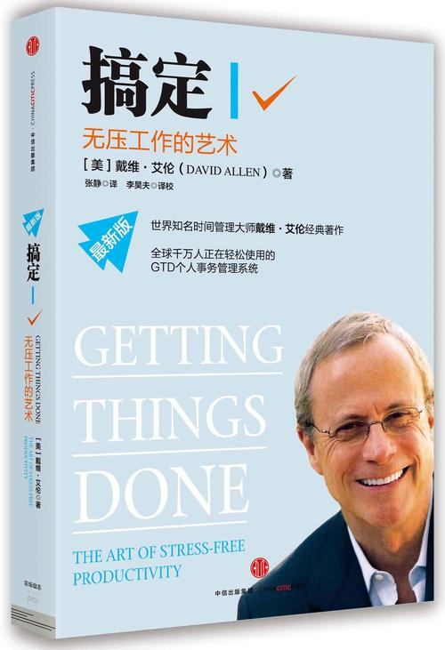
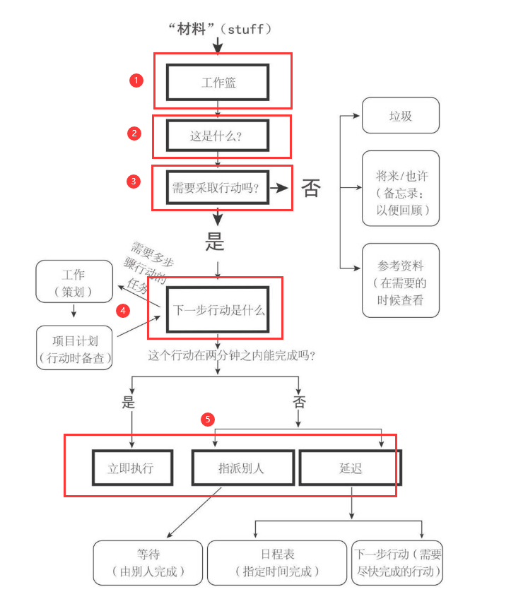
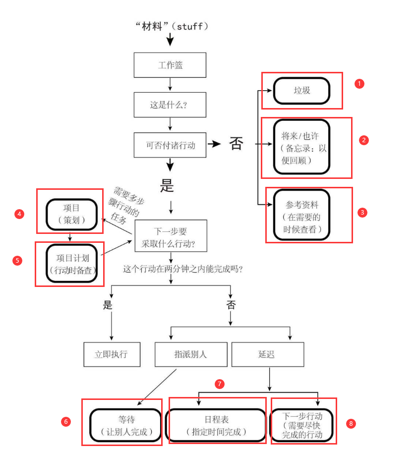
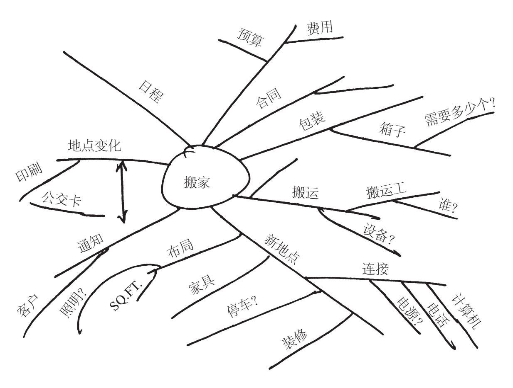

# 《搞定 I》● 戴维·艾伦

《搞定 I》

 	<b> 作者：戴维·艾伦</b>

---

    

## 一、 搞定：通向从容之道

### 1. 新情况，新做法

::: danger  
问题产生

- 增长的需求，匮乏的资源
- 工作不在有清晰的界限
- 工作（生活）的不断变化
- 旧的模式和习惯已让人力不从心
- “大局” 与事务的本质

:::

#### 
 解决之道 

<b>1. 承诺</b>

::: details <b>武术家的“一切就绪状态”</b>

&emsp;&emsp;让我们反省一下，如果你在任何情况下、任何时间内都能够随心所欲地控制自己
  一切事务，情况会是怎么样呢？如果你的内心世界非常清澈，感受不到任何压力，情况会是怎样？如果你能够把100%的精力投入到自己选择的工作中而不受任何外界的干扰，情形又会是怎
  样呢？ &emsp;&emsp;这是有可能实现的。有一种方法可以让你紧紧掌控遍及生活各个角落的所有事情
同时保持放松，花费最少的气力完成一切有意义的工作。它能使你在这个错综复杂的世界里，体验到武术家们所说的“心如止水”的境界，优秀的运动员则称之为“忘我”境界。事实上，你很有能已经体会到这种美妙的感觉了 

  &emsp;&emsp;在这种工作状态下，你头脑清醒，积极的想法层出不穷。每个人都可能进入这种状     态。要想积极有效地应对本世纪复杂多变的生活，人们就都需要这种状态，并且需求程度日益增强。对于所有人来说，如果希望使工作和生活前景保持平衡与积极稳定，那么，这种状态必将成为一种不可或缺的条件。世界级的划船运动员克雷格·兰伯特曾在《碧波上的心境》（*Mind OverWater*）一书中这样描述这种感受：

  > 划船运动员们用这样一个词语来描述这种无摩擦的状态：荡秋千（swing）。这使我们回想起在         后院荡秋千时的那种惬意和欢娱——一种简单的循环往复的运动，完全凭借来自秋千自身的冲力。秋         千承载我们，我们丝毫不需要用力。我们荡起双腿，让秋千在空中划过的弧度越来越高，但是，这         主要是地球引力的功劳。与其说我们荡秋千，还不如说我们被荡了起来。船推动着你前行，是船身         渴望着快速地向前，在它的航线上，在它的自然状态中，只有速度在吟唱着。我们的任务仅仅是与         船身并肩作战，拼命地挥桨加快速度，避免拖其后腿，而过于用力又会阻碍船速。如果努力变成了         为努力而努力，那么结果就会适得其反，这种努力反而会在过程中又化解了自身。形形色色一心往         上爬的人想拼命挤进贵族阶层，然而，他们挖空心思却只能证明自己并不身属此类。贵族们并不需         要努力，他们早已经达到了这种境界。荡秋千就是这样一种“进入状态”的境界。

:::

:::  details <b>“心如止水”的比喻</b>

  - 空手道中用“心如止水”来形容一切就绪的状态。
  - 想象把一粒石子投入沉寂无声的池塘中，池塘中的水会有何反应呢？
    - 答案是：依照所投入物体的质量和力度做出相应的反应，然后又归于平静。池水既不会反应过激，也不会置之不理。 

  &emsp;&emsp;水自然存在，自然而为。它可以淹没一切，却不会被淹没。它可以静止不动，却不会寂寞难耐。它可以被迫改变流向，却依然百折不挠。这一点你是否明白？ 

  &emsp;&emsp;空手道中的击拳动作，其力量来自速度，而不是肌肉，即挥拳最后阶段急剧的“爆发”。这就是为什么瘦小柔弱的人，也能够学会用双手劈开木板和砖块。这并不是靠皮糙肉厚或者凭借蛮力，而是灵活地运用一种能够随着高速度而形成集中冲击的能力。但是如果肌肉紧张，动作就会慢下来。因此，在高级阶段的武功训练中，对平衡和放松状态的教学并不亚于对其他方面的要求。清除杂念、保持清净和适当反应是关键所在。

  &emsp;&emsp;任何造成你反应过度或反应不足的事情都可能反过来控制你，事情往往如此。不能处理好自己的电子邮件、项目、未读的杂志、关于下一步行动的思考、与孩子或者老板的关系，都可能导致比预期差得多的结果。很多人对于一些事情，要么给予过分的关注，要么不屑一顾，这仅仅是因为他们无法做到“心如止水”地行事。
:::

<b>2. 原则</b>

- 有效的处理内心的承诺。

- 你必须明确并收集所有那些“**`经常唤醒你模糊记忆`**”的事情，搞清它们对你而言的真正意义，然后决定如何推动它们。

::: tip 
<b>基本要求步骤：</b>

1. 如果这件事总占据着你的头脑，你的思维就会受阻。任何一件你认为还没有完成的事情，都必须**被置于一个客观、可靠的体系中，或者是我称为“`文件夹`”的工具之中——必须经常回访并予以清理。**

2. 在明白你的工作到底是什么后，你还必须**做出判断：需要采取什么行动来推动工作进程。**
3. 一旦决定了需要采取的行动方案，你必须**在某一个你会经常查阅的系统中保存好与这些行动相关的提示信息。**

:::

::: danger  
当今社会人们的新情况的问题所在？

- “**知识工作**”的本质?

  > 你对工作投入的思考，应该比你现在实际付出的多，但是比你预想的要少。就像彼得·德鲁克的描述：“在知识工作中，没有人指派任务，需要由工作者自己确定。‘这项工作的预期成果是什么’是一个有助于提高知识工作者工作效率的关键性问题，这个问题可能会导致一些极具风险性的决定。

- 为什么有些事情总是萦绕在你的心头?

- 你的大脑并不总是那么管用?

- “**材料**”的转化?

  > 我是这样定义“材料”（stuff）的：进入你的精神或现实世界中但尚未找到归属的任何事情，你尚未确定它对你的真正意义、预期结果和下一步具体行动的所有事情。对很多人来说，他们的组织整理系统没有发挥应有的功效，原因在于没有首先完成对“材料”的转化。

:::

#### 新的做法：管理你的行动

::: details <b>1. 采用自下而上的方法</b>

- **自下而上含义**：即从当前活动和任务的最底层入手来处理事务——对提高个人工作效率最具实用价值。
- **自上而下和自下而上区别：**
  - *自上而下*：首先确定个人或组织的目标和前景，然后定义工作的主要目标，最后把焦点集中到实施计划的细节问题上
  - *自上而下问题*：然而实际情况是，大多数人总是陷于日常繁杂的事务中难以脱身，进而严重阻碍了他们去集中精力总揽大局。
  - *自下而上*：完全掌控各种事务（无论是文件夹中的还是脑海中的），并且采取一切有效方法保持这种清爽的状态，将成为拓宽视野的最佳途径。

- **作用**：如此一来，你的创造力就获得了解放，它将更加有力地支持你着眼于新的高度，使你更有信心进行开拓创新。

:::

::: details <b>2. 对行动的横向管理和纵向管理</b>

- **横向控制**：是把你涉及的所有行动都管理起来，保证毫无遗漏地加以执行。
  - 它的对象是一天里任何一件能够吸引你关注的事项：药店、战略计划、午餐、办公室里枯萎的植物，等等。
- **纵向控制**：是对每个具体主题或项目进行思考和协调，并跟踪其进展情况。
  - 从广义上讲，这就是“项目规划”，它的焦点聚集在某一事务、状况或某一个人身上，勾勒出执行过程中的一切（至少对目前来说）必要想法、细节、重要环节，以及事情的先后次序。
- **作用**：
  - 解除你的心理负担，并把事情做好。
  - 恰到好处的行动管理能让你轻松自如地游历于广阔的工作和生活天地中。
  - 同时，对项目的适度关注能让你彻底了解和掌控项目所需的具体环节。

:::

::: details <b>3. 最重要的技巧：把一切事务赶出大脑</b>

- 问题1：大脑中肩负**短期记忆**的那部分组织:
  - 往往负责存储不完整、尚未决定和没有组织安排好的材料 { 其功能类似于个人计算机中的RAM（随机存储器）。}
  - 大脑保存材料的能力是有限的。
  - 要想让大脑高效工作，就像让CPU高速处理任务一样，必须保证RAM里的排队任务尽量减少。
  - 因为缺乏可信赖的任务解决计划或系统，努力跟进我们承诺完成的事务会让精神不堪重负，并使得我们的思维过程受阻。
  - 事情毫无进展，而压力徒然激增。
- 解决办法：

:::

### 2. 横向管理-工作流程-5个步骤 （掌控生活）

#### 1. 5个步骤-原理：

- **收集**
- **理清**
- **整理**
- **回顾**
- **行动**

#### 2. 收集

> “**未竟之事**” ：寻找和收集你的一切未竟之事，无论大小、轻重、缓急，只要是那些等待处理的、需要改进的、引起注意的事务，都要收集起来。

**收集工具**：

- 有形文件夹
- 纸质记事簿
- 电子记事簿
- 录音设备
- 电子邮件

::: warning 
注意事项

**1. 把一切赶出你的大脑**

**2. 尽量减少收集工具的数量**

**3. 定期清空收集工具**

:::

#### 3. 理清

    
	
工作流程图——<b>理清流程</b>

**1. 工作篮中取出收集问题**

**2. 它是什么？**

**3. 是否需要采取行动 ？**

- **不需要采取行动**
  - 无用的垃圾，根本没必要保留。
  - 目前不需要，但日后可能需要处理（孵化）。
  - 项目具有潜在有用信息，日后可能会派上用场（参考）。
- **需要采取行动** 
  - 你承诺完成哪些工作？达成哪些目标？
  - 下一步需要采取什么行动？

**4. 下一步要采取什么行动？**

> “**下一步行动**”是指那些可执行、可操作的具体行动，并且只有将其完成之后才能推动整个事情向着既定目标发展。

**5. 立即执行、指派他人，或者延迟处理**

- 立即执行

  > 如果行动能在两分钟内完成，那么你就应该立刻执行。

- 指派他人

  > 如果处理这件事情需要花费的时间不止两分钟，那么，你应该问一问自己是不是解决这个问题的最佳人选。
  >
  > 如果回答是否定的，那就委托给一个合适的人员去办理。

- 延迟处理

  > 如果预计花费的时间超过两分钟，而你又恰恰是最佳人选，那么这时，你就不得不推迟行动，把它记录在“下一步行动”清单上，等以后再来完成。

#### 4. 整理

    
	
工作流程图——<b>组织整理流程</b>

**1. 8 类事务清单**

- 一个垃圾清单

- 一个备忘录清单

- 一个项目清单

  ::: details <b>项目清单的内容范例</b>

  - 安排新的董事会成员

  - 研发合资视频项目

  - 8月份度假

  - 聘用一名宣传人员

  - 安排一次员工外出静思会

  - 春季植物园

  - 出版书籍

  - 研究视频项目来源

  - 完成计算机升级

  - 确定明年的会议安排

  - 更新遗嘱

  - 达成就业协议

  - 敲定预算

  - 安装新的走廊照明灯具

  - 完成新产品提议

  - 添置一张新餐桌

  - 学习新的CRM软件

  - 玛丽亚进入中学读书
  :::

- 一个保存项目规划清单

- 一个资料的存储系统清单

- 一个日程表

  - **需要在指定时间执行的行动** 
  - **需要在指定日期执行的行动** 
  - **需要在指定日期获取的信息** 

  > *提醒：不再需要“每日工作清单”*

- 一个下一步行动清单

- 一个等待清单

  

#### 5. 回顾

**1. 回顾的内容和时机**

**2. 成功关键因素：每周回顾**

::: tip 
<b>每周回顾应该完成以下任务：</b>

- 收集和加工处理所有的“材料”。
- 回顾整个系统。
- 更新各类清单。
- 做到彻底、清楚、实时和完整。

::: 

#### 6. 行动

**1. 选择行动方案的三种方法**

- 确定**某一时刻**具体行动的“**`四标准法`**”
- 确认**每日**工作的“**`三分类法`**”
- 总体**检视**工作的“**`六层次法`**”

::: details <b> 四标准法</b>

**四个标准**：情境、有多少时间、有多少精力和重要性。

- 前三个标准描述了你每次采取行动的制约因素
- 第四个标准则是评估行动的价值大小。

**情境**

> 每时每刻，你都受限于自己的行动能力。只有很少一部分事情对地点没有特别要求（像拿一支钢笔和一张纸就可起草对一个项目的想法），但是，大多数事情都只能在特定的地点完成（在家或办公室），或者需要借助某些特定的工具（如一部电话、一台电脑），而这正是限制我们行动选择的首要因素。

**有多少时间**

> 你所能支配的时间长短也是一个重要的限制因素。如果5分钟后你就必须去开会，你现在就不可能去执行那些耗时更久的行动。

**有多少精力**

> 你有多少精力呢？某些事情需要你头脑清醒、思路清晰、富于创造力，而另一些则要求你具备充沛的体力。还有一些事情则对这两方面都没有特别要求。

**重要性** 

>  当你考虑了情境、时间、精力这三个条件后，最后你就要判断哪个行动选项会给你最高的回报了。现在，你有1个小时的时间，你坐在办公室里守着电话和电脑，你的精力指数为7.3（最高为10）。你应该做些什么呢？给客户回一个电话？考虑一下新的提案？处理一下语音信箱里的留言和电子邮件？或者联系一下你的配偶，看看她/他这一天过得怎么样？这时，你可以借助你的直觉，并依赖你此时此刻的判断力。

:::

::: details <b> 三分类法</b>

当你着手处理事务，也就是人们在一般情况下提到的“工作”时，你可能是在从事以下3种不同类型的活动：

- **执行事先安排好的工作。**
- **处理突发事件。**
- **安排自己的工作。**

:::

::: details <b> 六层次法</b>

事情的重要性是决定你行动选择的基本根据。

但是，并没有一个可靠的模型或工具能够帮你确定实际工作中各项任务的优先级别。

为了明确到底哪些工作才是最重要的，我们必须首先搞懂我们工作到底是为了什么。至少可以从六个不同的层次对此进行审视。

我们可以用视野即知觉距离的概念进行类比。

就像从一幢建筑物里往外看，你会在不同的楼层看到不同的景象。

- **5楼视野：目的和原则。**

- **4楼视野：愿景。**

- **3楼视野：目标。**

- **2楼视野：关注点及责任范围。**

- **1楼视野：当前项目。**

- **地面：当前行动。**

让我们由下至上入手。

**地面：当前行动** 

> 在你的行动清单上，堆积着需要处理的一切事务：所有你需要打的电话，所有等待回复的电子邮件，所有要外出处理的事情，还有你打算向老板汇报的日程安排，以及希望同生活伴侣交流的信息。即使地球停止转动、你不再接收更多的任务和信息，你大概也要处理超过100件这样的事项。

**1楼视野：当前项目** 

> 当前需要完成的工作，通常数量在30~100项之间。这些都是你希望在相当短的时间内取得成效的事情。例如，为家里购置一台电脑，组织一次销售会议，把公司总部迁往新址，去看牙医等。

**2楼视野：关注点及责任范围** 

> 你的兴趣及承担的责任和义务，让你承担了之前的各种工作。在生活和工作的重点领域里，你希望各个方面都能取得一定的成果或者保持一定水准。在工作方面，你的责任可能包括若干方面，如战略计划、行政支持、员工培训、市场调研、客户服务或者资产管理。此外，你的个人生活中也有很多领域需要你关注：健康、家庭、财务收支、住宅环境、宗教信仰、娱乐休闲等。这些并不是必须完成的事项，可以将其作为评估我们的经验和行动的标准，以使我们在工作和生活方面保持均衡和可持续发展。将这些责任和义务一并诉诸文字，并经常回顾检视，将有助于你更加全面地对自己的项目清单进行分析和评估。

**3楼视野：目标** 

> 在生活的不同领域，你希望有哪些新的体验？通过1~2年的努力，要为自己的工作开创一个什么样的新局面？随着一些新的责任和义务的产生，你需要经常调整自己的工作重心，以完成所制定的目标。在个人生活领域，情况也大同小异，你希望某些事情尽快完成，这将增加你对生活中某些方面的关注，同时减少对其他方面的关注。

**4楼视野：愿景** 

> 展望未来3~5年的发展前景，你必定会从一个更加广阔的角度着眼：管理策略、周边环境发展的趋势、事业和生活转变的条件。内在的因素包括事业、家庭、财务以及生活质量诉求和考量方面的长期目标；外部因素包括技术进步、全球化进程、市场趋势及竞争等，这些势必都会影响到你的工作和组织整理方法。而在这一层面的决策将会影响前述各个层面的内容。

**5楼视野：目的及原则** 

> 这就是我们整个生活的全景。你的公司为何存在？你自己为何存在？你真正在乎的事情是什么？事物的核心意义会指明它的发展方向。本层是整个检视系统的最高层，是生活的终极指南。你制定的所有目标、前景展望、规划、行动都由此决定，也都为此服务。

:::

### 3. 纵向管理-项目-5个阶段 （控制项目）

#### 1. 5个阶段-原理：

- **定义目标和原则。**
- **展望结果。**
- **头脑风暴/集思广益。**
- **组织整理。**
- **明确下一步的行动方案。**

#### 2. 目标和原则

::: details <b> 目标就是：“为什么”这个问题的价值</b>

下面仅仅是思考“**`为什么`**”这个问题的某些好处：

- **界定成功**
- **建立决策标准**
- **调配资源**
- **激发动机**
- **阐明重点**
- **拓宽选择**

**界定成功**

> 现今的人们极度渴望“获胜”。我们热衷于竞赛，向往成功，或者至少要处于竞赛中的优势地位。但如果你对自己做事的目标还不是一清二楚、心中有数的话，那你根本就没有取得成功的机会。目标界定成功，你的目标是你决定投入多少时间和精力的一个最为重要的参照点，无论是参加某一个职位的竞选，还是设计某一种表格，都是如此。
>
> 如果你对要参加的员工会议主题一无所知，你肯定会感到不舒服。如果你解雇了市场部主管，或聘用了一个能干的工商管理学硕士来担任你的财务总监，那么，你最好仔细考虑一下“为什么”，以便应付董事会的提问，否则，你就休想睡一个安稳觉了。如果你不知道“为什么我们需要这个商务计划”，你就不知道这个商务计划的成功标准，那么你也就无法真正地确定你的商务计划是否切实可行了。

**建立决策标准**

> 当你面对以下这类问题时，你是如何决策的呢？是多花一些钱印刷包含5种颜色的色彩艳丽的产品宣传手册呢，还是凑合着用两种颜色的呢？是否值得雇用一家规模较大的网络设计公司来负责新网站的设计工作呢？是否应该把女儿送去读私立学校呢？
>
> 通常，做出一个艰难决策的唯一途径就是，回到目标上来。
>
> 所有的一切最终都归结到目标上来。首先考虑你试图实现的目标，这样才能知道投入这些资源是否必不可少。如果连目标都尚未明确，后面的一切就只能免谈了。

**调配资源**

> 在公司预算中，我们应该如何支付安置员工的费用呢？我们如何最有效地周转现金，以期在明年最大限度地巩固我们作为零售商的地位呢？我们是否应该在午餐补贴上增加投入，还是把钱花在支付每月例会演讲者的出场费上呢？
>
> 无论哪种情况，问题的答案都将取决于我们希望达成的目标，即：“为什么”。

**激发动机**

> 事实上，如果找不到做某件事情的充分理由，那么它就根本不值得去做。但实际生活中居然有那么多人忘记了自己做事的动机，这种现象总是让我目瞪口呆。其实，一个简单的问题，如“你为什么这样做呢？”，就可以把他们拉回到正确的轨道上来。

**阐明重点**

> 当你紧紧抓住了你工作的真正目标时，一切就变得一目了然了。你只需花上两分钟写下你工作的主要原因，你心目中希望实现的预期目标就会陡然清晰起来，就像用一架望远镜来会聚成像一样。一经对“我们到底希望达成什么样的目标？”这一问题做出回答，那些日益零散且模糊的工作和前景就会清晰明确地呈现在你眼前了。

**拓宽选择**

> 这似乎是自相矛盾的：当目标精确地定位了工作重心时，它也同时开启了人们创造性思维的大门，从而能够去探寻更加广阔的可能性。当你确实了解到隐含的“为什么”时——为什么要开这个会议，为什么要组织员工聚会，为什么你要度假？为什么要取消某个管理岗位，或者为什么要进行合并——它便拓宽了你针对实现预期目标的思考范围。当人们在我的研讨会上描绘出某项工作的目标时，他们通常这样形容：就像脑海中吹过了一阵清新的微风，迷雾渐散，工作的前景清晰地浮现在眼前。

:::

::: details <b> 原则</b>

- 含义：遵循的标准和价值观。

- 作用：

  - 它能为我们的行为提供清晰明确的指导。

  - 界定了我们行动的限制因素以及行为的标准。

:::

#### 3. 展望结果

- **聚焦的力量**
- **网状激活系统**
- **阐明结果**

#### 4. 头脑风暴/集思广益

- **捕捉你的想法**

  

      
  	
<b>思维导图</b>

  

  你可以把这种思维导图记在**便利贴**上，再贴在**白板上**，或者**输入文字处理程序**、**勾勒程序**或**市场上的某种思维导图软件应用程序**。

  **作用**：头脑风暴的最大优点在于，它不仅能够捕捉到新颖独特、富于创意的想法，还能够启发你产生更多的好主意。

  

- **分布式认知**

- **头脑风暴的三个关键技巧**

::: tip  
<b>头脑风暴的三个关键技巧：</b>

**1. 不判断、不质疑、不评估、不批判**

**2. 追求数量、不求质量**

**3. 把分析组织工作置于次要的地位**

:::

#### 5. 组织整理

::: tip  
<b>基本要点：</b>

**1. 明确事件的重要组成部分**

**2. 整理分类（按照下面一个或多个标准）**

**3. 构成因素**

**4. 先后顺序**

**5. 重要程度**

**6. 足够详细的描述**

:::

#### 5. 明确下一步的行动方案

::: tip  
<b>基本要点：</b>

- 针对当前这项工作进程中的每一个环节，确定下一步行动。

* 如果有必要的话，在计划过程中就确定下一步的行动方案。

**1. 抓住关键**

**2. 需要更多的计划吗？**

**3. 当下一步行动需要由别人完成时** 

**4. 需要让事务更加清楚吗？**

**5. 需要采取更多的行动吗？**

:::

## 二、远离压力，提高效率

### 1. 准备工作

### 2. 收集阶段

### 3. 清理阶段

### 4. 组织整理

### 5. 回顾阶段

### 6. 执行阶段

### 7. 学会控制

## 三、三个关键原则

### 1. 原则一：养成收集的习惯

### 2. 原则二：确定 “下一步行动”

### 3. 原则三：学会关注结果
