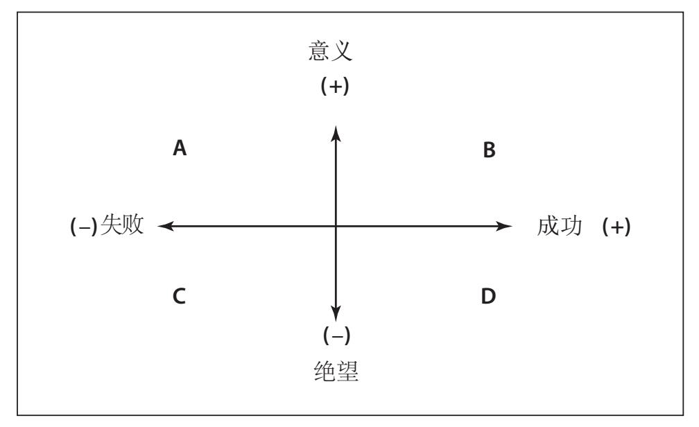
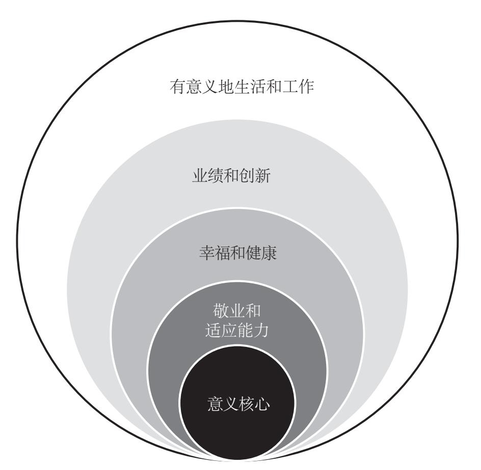

# 《思维的囚徒》● 亚历克斯.佩塔克斯 

# 
《思维的囚徒》

 	<b> 作者： 亚历克斯.佩塔克斯 </b>

---

    

## 原则 1： 自由选择你的态度

### A. 你永远都有选择权

::: details <b>案例 1：抱怨的态度</b>
<b>&emsp;&emsp;在很多人眼里，鲍勃是一位十分成功的银行高管。然而，他的工作经历却是一波三折，富有戏剧性，这让他很有压力。鲍勃对自己的工作几乎没有积极或乐观的态度，这也影响了他的生活态度。他总是不停地抱怨自己承担的职责以及同事、客户、社区和工作中的其他事情。鲍勃的同事和家人听到的只有他的痛苦、消极和绝望的感受。遗憾的是，鲍勃似乎看不见而且也不愿意承认这一切都是他自己造成的。他无休止的抱怨不仅妨碍了自己的工作晋升，还给自己的家庭生活带来了负面影响。他的朋友们不想再被他的负面情绪影响，所以渐渐与他疏远。他的家人尚且还能忍受，但他们的坚持也只是出于爱与责任，与他相处的过程中肯定毫无欢乐可言。</b>
:::

::: details <b>案例 2：真正的自由态度</b>
<b> &emsp;&emsp;纳尔逊·曼德拉是南非第一任黑人总统，也是诺贝尔和平奖的获得者。他的一则励志小故事可以很好地说明个人自由和监禁之间的关系。曼德拉年轻时就曾努力奋斗，致力于改变抑制南非经济和政治发展的种族隔离制度，促进种族平等。1962年，他被捕入狱，被指控密谋推翻国家政权，并被判处终身监禁。在南非人民以及国际机构持续高涨的舆论压力之下，曼德拉终于在被囚禁了二十七年之后，于1990年获释。  
&emsp;&emsp;曼德拉被释放的那一天，时任美国阿肯色州州长的比尔·克林顿正好看到了这则消息。他马上给他的妻子和女儿打电话说：“你们一定要看看，这真是一个历史性的时刻。”当曼德拉从监狱走出来面对国际媒体时，克林顿发现，曼德拉注视着大家，脸上有一丝愤怒，但很快就消失了。后来，克林顿成了美国总统，曼德拉也成了南非共和国总统。两位领导人相见时，克林顿向曼德拉说起了曼德拉获释时他观察到的表情变化。克林顿总统非常诚恳地请曼德拉解释一下那一天他情绪起伏的原因。曼德拉总统回答说：“是的，你说的对。我在监狱时，监狱中一名看守的儿子开办了一个《圣经》学习班，我也参加了……那天，当我走出监狱看到大家都在看我时，再想到是他们剥夺了我二十七年的自由，我就怒气冲天。可是耶稣的灵对我说，曼德拉，在监狱时，你就是自由的。现在你自由了，不要再次成为他们的囚徒。”没错，离开监狱后，曼德拉再次成为民族和解的典范，他没有表现出丝毫的复仇心理或消极情绪。他很清楚，选择态度的自由是人类最基本也是最重要的自由之一。</b>
:::

::: details <b>案例 3：十大积极结果练习</b>
<b> &emsp;&emsp;马克面临困境，因为他得知与他相濡以沫二十四年的妻子被确诊患上了乳腺癌，并且肿瘤是恶性的，已经扩散到了其他两个部位，其中一个部位的癌细胞是侵入性的。马克几乎崩溃了。刚开始他感到很震惊，不敢相信甚至拒绝相信这是事实，后来就陷入了他所说的“极度恐惧焦虑”之中。在知道妻子病情后的几天里（也是他“一生中最漫长的一段时间”），马克一直哭个不停。总之，他不知所措。
绝望中，马克想起了十大积极结果练习，他决定和妻子一起放手一试。感谢他们的分享，下面是他们分享的十大积极结果中较长的一部分，主要是从马克的视角来写的。</b> 

1. 我妻子是独自一人去看活组织切片检查结果的。刚开始，我很生气，因为我觉得她应该让我陪她去才对。后来，我意识到，她不让我陪她去，恰好说明她很勇敢。她打电话给我的一个同事，请他去我的办公室陪我，这样，她打电话告诉我这个坏消息时，我就不那么孤单了。能够有一位如此关心我、体贴我的妻子，我真的感到三生有幸。 

2. 两年前我经历了一次严峻的挑战，做了一个双髋关节置换手术。从做手术到恢复，前后花了大约十二周时间。而一般人需要将近一年时间才能完全恢复。那段时间，我抓紧机会减轻体重、增强体质，基本恢复到了以前的健康状况。有时候我会莫名其妙地想，是不是所有事先发生的这一切都是在为未来的战斗做准备。如果需要我在身体上有所准备的话，那么现在我已经准备好了。 

3. 家人、邻居和朋友已经团结起来，形成了一个同心协力的团队，都投入了挽救我妻子生命的战斗中。看见那么多人在支持和关心我们，我感动得有些说不出话来。我的妻子得到那么多人的关爱，我也因此成了他们关心支持的对象。 

4. 好像我的一生就是在为这个考验做准备。令人不可思议的是，我觉得这恰恰就是对我的考验。没错，我害怕极了。但是不管结果如何，我已经决定与她并肩战斗。 

5. 我天生多疑，还有点儿悲观。现在，我的妻子让我帮助她增加她对于命运不公的怨气。她想同癌症做斗争，想让我激发她求生的意念。现在真的是天赐良机，让我能够日日夜夜分分秒秒坚持不懈地保持积极心态。如果我曾有过忍受恐惧，以及不受恐惧困扰而继续保持积极心态的时候，那就是现在。 

6. 她和我都证明了我们有多恩爱，但是在以后的日子里，我们只会更加恩爱。爱真的是一种极其神秘的东西。 

7. 我们人类倾向于把生命周期看作一个从儿时到晚年的叙事弧。人生故事在展开过程中受到干扰就会被看作悲剧。或许并不尽然，或许宇宙是因为善而存在。或许宇宙的一切都是关于人类在演化发展中如何发现并创造爱与意义的，因为那是上帝本性的自然流露。如果是这样的话，那么我的妻子已经通过生儿育女、结交朋友以及与我缔结姻缘，成功地创造了爱和意义。这一点永远不会被毁灭，而且会永远存在下去。 

<b> &emsp;&emsp;正如弗兰克尔所言，人们接受命运的方式，接受那些无法掌控的事件的方式会让他们的生活更有意义。马克和他的妻子已经很好地证明了这一点。他们在无法逃避的痛苦经历中发现了新的意义，使自己的生活过得很充实。马克和妻子在继续同疾病做斗争和寻找康复之路的过程中，这种意义一直与他们相伴，为他们提供必要的支持和力量。</b>

:::

- #### 不要被大脑的惯性思维牵着走。

- #### 停止抱怨，找到自己的“应对格言”。

- #### 用“十大积极结果练习”强化自由选择意识。

::: tip 
  <b>你可以试着按照下面的做法去做</b>

- 假如你今天失业，列出失业会给你带来的十个积极结果。
- 假如你所在的部门被撤销了，列出部门撤销会给你带来的十个积极结果。
- 列出生产线发生故障会带来的十个积极结果。
- 列出预算被削减20%会带来的十个积极结果。
- 假如你发生车祸，列出车祸会带来的十个积极结果。
- 假如你的信用卡丢失，列出信用卡丢失会带来的十个积极结果。
- 如果你今天失恋，就列出失恋会带来的十个积极结果。
- 如果你的体重增加，就列出体重增加会带来的十个积极结果。

:::

::: warning 
<b>意义反思</b>

- <b>意义时刻练习</b> 
  想象你正面临一件很有挑战的事情，写出这件事情可能带给你的十大积极结果。然后你可以浏览清单，看看这个清单中有哪些新的想法和视角，能帮你找到应对挑战的新方法，从而改变你对挑战的态度。
- <b>意义问题</b> 
  - 你是如何应对职场和个人生活中他人的消极情绪和抱怨行为的？
  - 你爱抱怨吗？为什么你会抱怨？你的抱怨会带来什么结果？你愿意改变自己的态度吗？如果你愿意，你会采取哪些措施来改变你的态度？
  - 你在个人生活和工作中是如何保持积极乐观的态度的？
- <b>意义主张</b> 
  我要选择积极乐观的态度，为明天绘制蓝图，然后采取行动把蓝图变成现实。

:::

### B.  真正的乐观主义

::: details <b>案例 1：真正的乐观主义</b>

<b>&emsp;&emsp;丽贝卡的一生可谓饱经沧桑，历经坎坷，但她总是能看到生活中好的一面。她选择的工作可以展现她的创造才能，她还成了别人获取启发和灵感的源泉。作为一位创意顾问，她建议个人和组织机构走出“我习惯了那样做”和“这肯定不行”的思维模式，去探索其他的方法。她很喜欢自己的工作，因为她的工作能滋养她的灵魂。当她看到客户取得了创新思维突破的时候，她感觉工作给她带来了很多的快乐。不幸的是，丽贝卡由于严重的髋部损伤，不得不坐上了轮椅。轮椅限制了她的行动自由，她无法四处走动以及继续过积极忙碌的生活。更严重的是，她无法去拜访自己的客户。但她并没有因为伤痛而止步不前，她对成为一个真正的乐观主义者的三个步骤有十分深刻的认识。 </b>
&emsp;&emsp;1. 她面对自己的身体伤残，选择了积极的应对态度。 
&emsp;&emsp;2. 她选择了设想其他可能的创造性的表达方式，包括开始把创造性的思维方法写成日志发给自己的客户。 
&emsp;&emsp;3. 她选择的态度激发了她采取行动的热情，这种热情没有让她一蹶不振或自艾自怜。 
<b>丽贝卡除了采取积极乐观的思维方式，还在困境中选择了行使选择权利的自由。所以，她以全新的方式创造性地延长了自己的生命。她在八十九岁高龄做到了这一切。</b>
:::

- #### 能够预见自己的选择带来的后果以及各种应对的可能性。

- #### 有采取行动把可能变为现实的热情。

## 原则 2：实现有意义的目标

### 走出“意义迷宫”

::: details <b>错误的呼唤意志</b>
<b>&emsp;&emsp;维克多·弗兰克尔在他的讲座、演讲以及1978年出版的第一本书中，都郑重地提醒我们关注“对意义的无声呼唤”。他认为对意义的呼唤主要是由抑郁、好斗和瘾症三个症状引发的。弗兰克尔将这些社会症状称为“大众神经三联征”。我们需要在潜在的存在虚无语境下来理解这种呼唤。如今，集体对意义的呼唤比它被弗兰克尔首次发现时得到了更加普遍的运用，而且还不会很快消失。  &emsp;&emsp;现在许多美国人拥有的物质财富比世界上其他任何一个国家的人所拥有的物质财富都要多，但我们却感到焦躁不安，郁郁寡欢，与别人失去了联络，甚至也不关注自己内心的需求。年轻人的自杀率不断升高，贫富差距不断增大。尽管经济不景气，但我们还有足够的资源，可以满足广泛的医疗护理和经济稳定发展的需要，解决贫富差距问题。但是，现在“只为金钱”的价值观已经取代了人与人之间的尊重，甚至已经取代了对人性的尊重。</b>

> 事实上，随着生存竞争的消失，就会出现一个问题：我们为什么活着？如今越来越多的人掌握了谋生的手段，但却过着没有意义的生活。注

<b>&emsp;&emsp;弗兰克尔在他的书里说，随着人类基本生存竞争的消失，随之而来的问题是：我们为什么活着？虽然如今越来越多的人掌握了谋生的经济手段，但他们还得面对另一个问题：我们为什么而活？尽管我们的物质财富很丰富，但我们内心空虚，或用弗兰克尔的话来说，“存在的虚无已经成了迫切需要被解决的问题”。弗兰克尔认为，弗洛伊德的享乐意志和阿德勒的意义意志都表明，人们的某种东西已经缺失。弗洛伊德认为，人有追求享乐的需求或动机，阿德勒则认为人对权力有不懈的追求。事实上，这两种说法都只是在试图掩饰他们内心的空虚罢了，而不一定会让他们找到个人生活的意义。因为他们的意义意志遭受了挫败，出于种种原因，他们选择了另外一种生活方式，而他们选择这种生活方式的前提是，享乐或权力（或两者）能够替代他们曾经失去的东西在他们心中的地位。 
&emsp;&emsp; 人们感到内心空虚的时候就会向外寻求帮助。他们会追求舒适安逸、物质丰富的生活。他们会确保自己大权在握，保证自己可以掌控别人和周围的一切。他们认为，只要他们能找到快乐或者掌控一切，他们就可以找到生命的意义。很可惜，他们的想法是</b>
:::

::: details  <b>活出生命的意义</b>
<b>&emsp;&emsp;她叫夏绿蒂。她二十一岁的儿子因患有自闭症于不久前刚刚去世。夏绿蒂坦率地给我讲述了抚养自闭症孩子的经历，说这么多年来她和她丈夫过得很不容易。她还多次回忆起当时阅读弗兰克尔《活出生命的意义》的情景。她还强调，在那段最艰难的岁月，这本书对她的思想和行为产生了深刻影响。在为人母的过程中，不管遇到多大的挑战，夏绿蒂都能发现生活更深层的意义。她在精心照料患自闭症的儿子的过程中，对人性有了更多的了解。所以，当她的儿子突然英年早逝时，儿子留下的精神遗产自然就成了她后半生生活的支柱。值得注意的是，她后半生从事的都是需要爱心和无私奉献精神的有意义的工作和社会活动。</b>
:::

:::details <b>走向内心</b>
<b>&emsp;&emsp;我们不管遇到什么问题或挑战，都不能坐以待毙，不能等着解决方法自己奇迹般地出现，而是应该积极参与寻找，成为解决方法的一部分。美国职业篮球协会前教练菲尔·杰克逊曾写过一本书，书名叫《神奇的篮圈》（Sacred Hoops）。在这本书里，他告诫我们，实现梦想的最好办法就是从梦中醒来。成为解决方法的一部分就意味着采取行动。你的梦想可能十分美好，生动真实，但采取行动要求你不仅要有梦想，而且要付诸行动。不管是在做梦还是头脑处于清醒状态下，如果我们仍然甘愿做自己思维的囚徒，我们就始终无法透过囚牢栅栏看清外面的世界。为了看得更清楚，我们必须主动走进自己的内心世界。</b> 

> 走向内心开始反省，
> 莫辜负余生好时光。
> 意念中牢房的栅栏，
> 真的比钢还要坚固。注释

<b>&emsp;&emsp;这首歌词再次提醒我们，我们在探索自己的生活和工作的意义迷宫时，总会遇到很多的无奈和挫折，这是自然而然的事情，有时也不一定会一帆风顺地安然度过。探索意义迷宫需要我们心甘情愿，真正恪守承诺，沿着自我探索的道路追寻意义。实现维克多·弗兰克尔所说的意义意志，是一种与生俱来的在任何条件下都能坚持不懈地追求意义的能力。</b>

> 然而，每一个人的绝对意义与其绝对价值是相辅相成的。正是这一点确保了人类的尊严不会轻易被抹杀。在任何情况下，即使是在最为痛苦的情况下，生命都会保持意义潜势，同样，每一个人的价值也会与他形影相随。注释

<b>&emsp;&emsp;遗憾的是，我们经常错失良机，无法充分利用自身宽广的内心世界，感受生活和工作的真正意义。弗兰克尔说，只要我们保持清醒的意识，恪守对有意义的价值观和目标的承诺，我们就能充分享受这种宽广的感觉。当然，人生最困难的事情莫过于认识自己。我们需要花点儿时间和精力来质疑、反思和真正地认识我们是谁，而不是成为别人希望的样子。我们需要花点儿时间和精力来了解自己的长处和才能，利用它们来帮助别人。我们需要花点儿时间与精力来了解什么能让我们的生活有意义。追寻意义要求我们接受迷宫的挑战，敢于冒险。 
&emsp;&emsp;就像古希腊哲学家苏格拉底建议的那样，我们应该走进自己的内心，倾听自己内心的声音。我们应该相信自己的心声，不要被别人所左右。通过观察、质疑、逻辑思辨、认识形而上学（对身体之外的存在的本质思考），我们就能强化自己的观点，对我们自己有更深刻的认识。</b>

> 苏格拉底有句名言：“不知反省的生活不值得过。”苹果公司的创始人史蒂夫·乔布斯十分欣赏这句至理名言，他曾公开表示：“我愿意用我所有的技能来换取与苏格拉底一个下午的相处时间。” 注释

<b>&emsp;&emsp; 归根结底，只有走进内心，实现我们的意义意志，也就是真正恪守承诺，去实现只有我们自己才能实现的有意义的价值观和目标，我们才能发现人类的独特性，在生活和工作中充分发挥自己的潜力。</b>
:::

- #### 享乐意志：

  > 感官的快乐和满足，只是转瞬即逝。

- #### 权力意志：

  > 不要被过度的追求钱权的欲望捆绑，贪婪源于我们内心的恐惧。

- #### 意义意志：

  > 人生真正的意义藏在我们的内心深处主要动机或驱动力。

::: warning 
<b>意义反思</b>

- <b>意义时刻练习</b> 
  这里给大家介绍一下“山脉练习”。这个练习来自弗兰克尔。弗兰克尔在《医生和灵魂》中呼吁我们把自己的生活过得像美丽的山脉一样精彩。把你的生活（特别是工作生活）看作有山峰和峡谷的风景。哪些人和事对你的影响最大？把它们标记在山顶上。哪些人和事对你阻碍最大或对你最不尊重？把它们标记在峡谷中。现在回顾一下，总结山顶上那些人各有什么特点。这些人和事中哪些是最有意义的？哪些是交流中反复出现的主题和价值观？你是如何学习这些主题和价值观并把它们融入自己的生活的？现在回顾一下在峡谷反复出现的主题和价值观。你从这些经历或这些人身上学到了什么？这个练习可以帮助你从一个不同的角度来重新审视你的生活和工作。通过这个练习，你可以发现反复出现的价值观，认识自己的独特性，拓宽自己的视野，加深自己对工作和生活的认识。这是一个展示型练习，一种在生活和工作中发现意义意志的新方法。
- <b>意义问题</b> 
  - 在你的个人生活中，什么是你思想行为的最大动力？享乐意志？权力意志（包括积累财富）？还是意义意志？
  - 在哪些方面你的生活会像一个意义迷宫？
  - 你是如何一直恪守对有意义的价值观和目标的承诺，在你的个人和工作生活中实现意义意志的？
- <b>意义主张</b> 
  我要全力以赴实现意义意志目标，而不是享乐意志或权力意志目

:::

## 原则 3：发现生命的瞬间意义

### 意义需要用心发现

::: details <b>案例 1：米歇尔和亚当相反的故事</b>
<b> &emsp;&emsp;我们无法创造意义，意义需要我们去发现。当然，如果不去寻找意义，肯定就发现不了意义。意义会以各种不同的形式出现。有时它在我们的生活中赫然出现，显得举足轻重，有时在几乎无人察觉的情况下悄无声息地进入我们的生活。我们可能会错失发现意义的良机。直到过了数日、数月，甚至数年以后，事实证明，曾经看似微不足道的某个瞬间却是改变我们一生的关键时刻。或许，是许多时刻的整体意义最终吸引了我们心灵的目光，就好像我们把许多不被人注意的时刻碎片放在一起，拼成了一床象征生活的花被子。弗兰克尔说：“尽管我们不一定能感觉到意义，可是无论我们去哪儿，意义无时无刻不在我们身边。我们唯一要做的就是在日常生活和工作中认识到意义的重要性，并关注意义。”</b>

> 生命的真正意义，必须在大千世界中去追寻，而不能在人身上或内在精神中寻找，因为它不是一个封闭的体系。注释

<b> &emsp;&emsp;人生的意义是什么是一个很难回答的大问题，但如果我们找到了生活中的小问题的答案，这个大问题就会迎刃而解。这些小问题包括：我们正在做什么？我们为什么做？这种关系意味着什么？我们的工作有何意义？每天，我们的生活都会给我们提供很多有意义的答案，但是只有当我们慢下来，抽出一定的时间去欣赏意义，意义才会在我们的生活中开花结果。我们需要亲自发现和了解意义，可是大部分时间我们却在忙于其他事情，无暇分身。令人烦心的工作和家庭琐事让我们对存在的本质提出了质疑。假如我们不能停下来，好好寻找和感受我们自己的存在，意义就会成为一个无法实现的梦想。我们的一生都有丰富的意义，我们所做的一切事情都有意义。我们会为了心中的爱自由地做出某种决定，当我们停下来思考做出决定的理由时，我们就会发现意义。花点儿时间反思每一个生命瞬间的意义，这是让我们最终获取个人整个生命的深层意义的第一步。 
&emsp;&emsp;遗憾的是，不是每一个人都愿意花费时间或精力去寻找生命瞬间的意义。让我们以米歇尔为例。米歇尔不久前刚过完五十岁生日，但她不愿承认自己已经年过半百。她对未来几十年的生活，包括退休生活感到害怕。事实上，她很不开心，觉得生活中没有任何可以值得庆祝的事情。米歇尔离过两次婚，是两个X世代孩子的单身母亲。她觉得自己的个人生活不尽如人意，她的工作生活也无法让她感到满意。第二次离婚后，她就一直很难找到十分稳定的工作。有时，她也确实找到了看似不错的工作，但很快就因对工作不满意而辞职不干了。如此反复之后，她感觉自己的就业压力很大。但她认为这和自己无关，辞职完全是由外界原因造成的，例如老板太寒酸、同事很懒、工作职责不清楚、缺乏支持等。所以，她对自己的工作永远不满意，当然也永远想象不到自己能找到有意义的工作。 
&emsp;&emsp;米歇尔整日忙于在工作和家庭中释放自己的压力，几乎没有时间去寻找自己痛苦的真正根源。所以，渐渐地，她变得越来越沮丧，她开始学会用各种理由来为自己开脱，并养成了这种习惯。她无视自己的角色和职责，不知道自己也是让自己处于窘境的始作俑者之一。由于她忙于抱怨生活对她的不公，所以她实际上已经与生命瞬间的宝贵意义失之交臂。在她看来，生活对她很不公平，所以她只能忍受痛苦，大声抱怨，让周围的人，包括她的家人、朋友和同事，听到她的痛苦。在电影《重返荣耀》中，高尔夫球手沃尔特·哈根说过：“一切意义在于没有意义。”米歇尔肯定会赞同这一说法，因为寻找意义对她来说没有什么价值。她看似过着毫无意义的生活。她认为，除非奇迹发生，否则她还会继续过没有意义的生活。米歇尔拒绝寻找意义，她已经选择了提前退休。 
&emsp;&emsp;亚当的情况则正好相反。亚当是本书早些版本的一位读者。他读完这本书以后给我写了一封信。他在信中说，他运用本书提到的原则解决了自己在生活和工作发生转变时遇到的重要问题。他是一位工程师，在公司工作了三十年，突然间，他发现自己就要被迫离开喜欢的工作，进入一个对他来说无事可干的部门工作。因为公司正在进行改革，所以亚当担心这次工作变动也许离自己被解雇不远了，或许自己很快就要被扫地出门了。他突然发现，他的生活没有了意义。一连好几个月他都在自怨自艾中煎熬，他无形中成了这种思维的囚徒。看完我的书之后，他不再把自己的困境看作一个问题，而是将其看成一个机会。因此，他开始改变自己。尽管他不能马上改变自己的现状，但至少他可以改变自己对待现状的态度——能在现状中找到深层意义。 
&emsp;&emsp;随着亚当生活态度的转变，他的性情、人生观和工作观也得到了改善，并且他在追求全新的个人成就和职业成功方面取得了长足的进步。亚当认为，他看问题的视角和行为方式之所以发生如此巨大的变化，原因就在于，他学会开始欣赏生命的潜在意义了。生命的潜在意义存在于生命的每一个瞬间，甚至在那些让人感到不是特别愉快、不受人欢迎以及意想不到的瞬间。亚当开始意识到，以前的“可怜的我”的想法不能改变自己的窘境，他需要独自承担起发现自己生命中的意义种子的责任。亚当与米歇尔不同，亚当愿意而且能够为自己的困境承担起全部责任，他拒绝提前退休，拒绝停止寻找意义。 
&emsp;&emsp;找到生活的真正意义需要勇气，这并不是说，我们不会有恐惧情绪，而是说我们愿意而且也有能力战胜恐惧。也就是说，如果我们愿意，就可以踏入生命意义的迷宫，并能走出黑暗。往往在最艰难最痛苦的时候，我们的勇气才会面临最严峻的考验。在电影《保卫你的生命》中，导演兼作家艾伯特·布鲁克斯扮演了一位成功的企业主管丹·米勒（Dan Miller）。丹·米勒满心欢喜去汽车4S店提新买的宝马车，但在他把新车开出4S店后，不小心与一辆公共汽车发生了碰撞。丹在事故中丧生。死后，他发现自己来到了一个名为“审判城”的“天国”小站。丹发现，不管是获得下一个更高级的生活模式，还是回到地球重复以前的生活，他都必须接受审判城的审判，为他的一生进行辩护。 
&emsp;&emsp;在审讯室，有人给丹播放了一段他生前的生活视频，让他为自己的行为辩护，特别是为他恐惧表情最明显的那一段视频辩护。下面是丹和他的辩护律师鲍勃·戴蒙德之间的对话片段。 </b>

> 鲍勃·戴蒙德：你从地球来，做事不用脑子，你的人生基本都被用在应付恐惧上了。 
> 丹·米勒：是吗？ 
> 鲍勃·戴蒙德：地球上人人都得面对恐惧。我们的小脑瓜就是专门对付恐惧的。 
> …… 
> 鲍勃·戴蒙德：你有没有胃痛的朋友？ 
> 丹·米勒：每个朋友都胃痛过。 
> 鲍勃·戴蒙德：那都是因为恐惧。恐惧就像茫茫大雾，盘踞在你的脑子里，封锁了一切。真情实感、真正的幸福和真正的快乐，所有这一切都无法挣脱大雾的束缚。但是朋友，你拨开了云雾，就要体会到生活的乐趣了。

<b> &emsp;&emsp;从鲍勃·戴蒙德的解释可以看出，大部分人的大脑潜力只被利用了3%～5%，很多人因为恐惧而限制了自己潜能的发挥。他们不能审视恐惧，也无法看清自己生命中每个小小瞬间的深层意义，这让他们失去了体验美好充实生活的机会。我们当中有很多人都会由丹·米勒的经历联想到自己，我们甚至很想知道，如果我们死后也到了审判城去接受审判，那么审判城又会为我们播放什么样的视频，我们又该如何为自己辩护呢。 
&emsp;&emsp;许多人就像米歇尔和丹·米勒一样，不愿寻找自己所处境况的意义。他们多半是对暴露出来的需要被解决的问题过于担心。他们“没有勇气去面对”。他们不愿正视自己的弱点，选择对它们视而不见，更有甚者还去责怪别人。也有些人选择忙碌，他们整天忙于参加各种活动和娱乐，所以他们无法放慢节奏，反思自己的生活。还有一些人不知道该采取什么步骤去寻找生命瞬间的深层意义。</b>
:::

::: details <b>案例 2：外交官工作的迷茫</b>

<b> &emsp;&emsp;归根结底，一切都是意识问题。有人说，“意识比自作聪明更重要”。意识就是要认识意义。培养意识也需要花费时间。如果我们每日忙于参加太多的活动，或者被动地沉迷于电视节目、智能手机或网络世界，我们就会与无处不在的意义失之交臂。我们必须有意识地去看、去听、去闻、去触摸和品味世界上的一切，才能在我们的生活中发现意义。</b> 

> 过去所有美好的一切都完好无损地保存在过去。换句话说，只要生命还在，所有的愧疚和罪恶还可以获得“救赎”……而一部制作完成的电影或者一部已经存在但此刻正在放映的电影就不是这样。正相反，有关这个世界的电影还正在“拍摄”之中。这恰好说明人类很幸运。未来还有待人类去塑造，也就是说，人类要对自己的未来负责。注释

<b> &emsp;&emsp;意义和颜色一样，也是多种多样的。没有人能决定别人生命的意义，发现生命瞬间的意义是每一个人不可推卸的责任。不管我们是否喜欢工作，如果我们意识到讨厌的工作能让我们支付房租，那么我们的工作就是有意义的。这并不是说，我们要让自己一辈子从事不喜欢的工作，而是说，我们可以在现在从事的工作中发现意义。如果我们因为老板刁钻挑剔而讨厌她，那么我们可以以牙还牙，或者努力去发现困境带给我们的人生启示：或许老板也是一时求胜心切，或许我们听到的不是老板的声音而是以前父母的教诲，或许我们可以利用这个机会锻炼一下与人相处的技巧，或许现在的工作不适合我们。</b> 

<b> &emsp;&emsp;在《活出生命的意义》中，弗兰克尔描述过他为一位外交官诊疗的病例。他在维也纳办公室遇到了一位美国高级外交官。这位外交官早在五年前就开始在纽约市接受心理分析治疗，他找弗兰克尔大概是想继续接受治疗。[插图]一开始，弗兰克尔就问他为什么他认为自己应该接受心理分析治疗，最初治疗的原因是什么。原来这位外交官对自己的职业不满意，觉得自己很难接受美国的外交政策。可是，他的分析师反复对他说，他应该改善同父亲的关系，因为他对老板（也就是美国政府）和上司的不满只是受到了他与父亲关系的影响。所以，根据分析师的说法，他对工作的不满完全是因为他在不知不觉中对父亲心怀怨恨造成的。</b> 

<b> &emsp;&emsp;外交官接受了这种解释，但五年之后他却变得越来越迷茫。他只看到了符号和意象之树，却没有看到现实生活之林。和外交官做过几次访谈之后，弗兰克尔发现，外交官真正的痛苦根源不在于他恨自己的父亲，而在于他没能从事自己渴望的另外一种工作。事实上，他的意义意志因为他的职业深受重挫。最终，外交官意识到了这一点，他决定放弃自己的工作，重新开始。结果表明，他对后来选择的职业非常满意。他苦闷的原因不是因为他的父亲，而是因为他未能选择对他真正有意义的工作。这个例子说明，假如我们能让自己意识到我们有多种选择的可能，我们就为自己打开了通往意义的大门。</b> 

<b> &emsp;&emsp;我们对自己越了解，就越有可能去逐步发现自己的思想、语言和行为模式。我们可能会看清自己应对工作挑战的模式，看清自己处理人际关系的模式。通过寻找这种联系，我们会意识到，我们只是在多次重复同一种人际关系或恋爱关系，也许这个关系是消极的，甚至是有害的，因此它对我们实现最崇高的目标毫无帮助。我们可能也会意识到，我们平时有批评抨击别人的习惯，或者如果别人对我们要求太高，我们就会采取报复行动。我们会意识到，我们只喜欢从自己的角度去看问题，而不知道对同一件事还可以有很多不同的观察角度。同样，我们对自己越了解，就越有可能去发现自己对待健康的习惯性做法。我们会意识到，我们没有及时释放自己的情绪，压抑了自己的愤怒，最后不得不承受更大的压力。我们会意识到，我们的体重增加不一定与我们上周吃的巧克力蛋糕有关系，而可能完全是因为压力过大造成的。</b> 

<b> &emsp;&emsp;如果能更多地关注生命瞬间，我们就能更加接近意义。许多人把意义定义为“重要性”或“某种重要的事情”，但我们把意义定义为“与自己核心本质或真实本性达成的共鸣”。如果感觉某事很重要或知道某事很重要，这是因为它与我们的真实自我产生了共鸣。 例如，我（伊莱恩）多次去希腊小村庄旅游，目睹了生活朴素的村民如何在彼此的交流中找到了深层意义。我想到了自己在美国家庭拥有的所有“物质”，开始思考我为什么会需要那么多的物质。就在这些反省的瞬间，我的意识就提升了。这不是一个金钱至上或反金钱至上的问题，而是金钱和物质在我的生活中应该扮演什么角色的问题。我得出的结论是，最终的目标是首先让自己的内心充实，然后再去追求物质，这和先追求物质然后再去寻找意义正好截然相反。从希腊回国后，我决定处理一部分家里的东西。我决定集中精力追求意义。这个有意义的瞬间或经历教会了我如何提升意义意识，并且过上了一种（我认为）与自己的核心本质能产生共鸣的生活。</b> 

<b> &emsp;&emsp;吸引我们去发现意义的是生活。当我们有意识地生活时，我们会使所做的每一件事都有意义。《韦氏第三版新国际词典》给“work”（工作）列出了二十几个定义，它还包含一百多条以“work”开头的单词或短语，但正是第一个定义中两个小词根“to do”（做）说明了所有工作的意义。不管我们做什么，无论是从事体育锻炼，还是进行艺术创作，这些事情都是有意义的。</b> 

> 生命在任何情况下都有意义。生命的意义确实会存续到生命的最后一刻，直到生命的终结。注释

<b> &emsp;&emsp;不过，知道做事的动因也极其重要，它是我们开始真正自由而有意义的生活的开端。如果我们深入探索，就会发现，“爱”和“良知”是我们做事的两大动力。弗兰克尔将其描述为直觉能力，即不用思考而自然而然做事的能力，对我们自身进行最深刻的解释的能力。弗兰克尔在《活出生命的意义》中写道：“事实是，爱是人类追求的最高终极目标。”</b>
:::

::: details <b>案例 3：悼文的练习 </b>
<b> &emsp;&emsp;你的家人、朋友、生意伙伴、客户或顾客给你做出了最后评价。他们的评价真的如实反映了你的生活和工作吗？他们的评价真的是你最想听到的吗？假设现在你已经去世，同时你可以为自己写悼文，悼文会在葬礼上被宣读。请开始填写下面的表格：</b> 

- *我们今天在这里相聚是为了与_____告别。世界非常需要_____的人，_____就是 就是满足这一需要的最佳人选。*
- *最有成就感的事情是_____，它发生在_____时候。*
- *我相信_____来到这个世界上是为_____。*
- *世界因为_____的存在而更加美好，我们会永远怀念他/她。*
:::

- #### 尝试“存在意义的挖掘练习”。

- #### 强化自己的“意义意识”。

- #### 用“悼文练习”反思自己的工作和生活。

::: tip 
  <b>存在意义的挖掘练习</b>

**无论什么时候，只要你处于某种特别具有挑战的情境中，或者你认为它是你个人生活或工作生活中十分重要的时刻，就问问自己下面这些问题：**

1. 你是如何应对当时的情境或生活的？你是怎么做的？怎么想的？
2. 你当时有何感受？产生了哪些情绪？
3. 你从中学到了什么？学到了什么新知识和技巧？态度有了什么变化？
4. 你将如何从经历中成长？你将如何把自己学到的东西，特别是对自己的主要认识应用到个人成长中？
:::

::: warning 
<b>意义反思</b>

- <b>意义时刻练习</b> 
  假设你已经写好了自传，详细介绍了自己的工作和生活。现在你的自传已经登上《纽约时报》畅销书排行榜。你的自传的标题是什么？请给出自传的章节名称，并做简要介绍。你会在致谢中感谢谁？。
- <b>意义问题</b> 
  - 你在阅读本书的过程中发现了什么意义？
  - 你会选择哪种意义挖掘形式来揭示生命瞬间的意义？
  - 你如何让自己的生活和工作更有使命感，而不是只有任务感？
- <b>意义主张</b> 
  我会在自己的各种经历中寻找和发现意义。
:::

##  原则 4：千万不要违心做事

### 不忘初衷的好方法

::: details <b>案例 1：作者工作经历</b>
<b> &emsp;&emsp;你是否有过这样的经历？你想要做好一件事，你越努力，发现事情的难度越大，结果似乎离目标越来越远。换句话说，是不是有进一步退两步的感觉？我（亚历克斯）就有过这样的人生经历，尤其是工作经历。我想和大家分享一段我的经历。当时，我在美国一所大学行政管理系当全职教授，负责一个研究生学位课程。作为主管，我面临的挑战是如何从该学科的一个专业协会获得认证。获得认证对业内人士来说就好比提升了知名度，有了竞争优势。而知名度和竞争优势自然会给学校带来一系列好处，比如我的课程的招生人数会增加，招聘老师更容易，研究经费会增加，资源库会得到更新等。</b> 

<b> &emsp;&emsp;我当时是系里的一名新教师。我认为这是一个崭露头角的好机会，所以就勇敢地承担起了谋求认证的大任。我开始全力以赴，并向所有人证明，我是一个信守承诺、很有激情的人，并且深信自己很快就会实现目标。事实上，我之前在其他院校也做过同样的认证工作。我自认为，这足以证明，我对自己所做的事情了如指掌，我的经验会让我再次顺利取得胜利。可结果却出乎我的意料。我发现阻力无处不在，我越关注，发现阻力越多。我后来了解到，在这个过程中，我的专业知识事实上成了认证的一个不利条件。我自以为知道该怎么做，知道怎么才能做到最好，所以认为所有同事的做法都是错的。我专注于课程的每个细节，并向自己保证，在整个认证过程中，我能独自纠正和解决所有影响认证的错误和问题。</b> 

<b> &emsp;&emsp;我当时也是一片好心。我认为事后，我的大部分同事没准儿也会承认这一点。遗憾的是，我过于关注结果，结果却事与愿违，无法完成最终的目标。事实上，我在担任课程负责人期间从未获得认证。当时，我完全可以轻而易举地责备其他任何人，或者至少可以把没有实现目标的大部分责任转嫁给其他人，但是我没有这么做。现在我明白了，我自己的做法违背了我的初衷。我努力让大家按照我的想法去做事，结果，同事疏远了我，而我的成功根本离不开同事的支持。后来，我还了解到，由于我坚持自己的“正确”做法，结果让同事在认证过程中贡献甚微，他们没有成就感，在一定程度上，甚至招致了他们某种微妙的暗中破坏行为。荒谬的是，我当时竟然不知道，我才是自己最大的敌人。</b> 

<b> &emsp;&emsp;意义就在我们的生活中，意义就在我们的工作中，意义也在我们寻找意义的过程中。意义就在我们周围，在我们的心里，也在我们的心外。但是如果我们想方设法去创造意义，尤其是在工作中创造意义，可能只会适得其反。工作与生活一样自身充满了生机与活力，但与私人人际关系不同的是，我们对待同事总是缺少真情实感和恻隐之心。我们总是害怕与别人对抗，因为害怕被人报复所以不敢告诉他们我们的真实想法。我们为了显示自己的专业能力也会避免冲突。我们告诉自己以手头工作为主，而忽略了人际动力学。</b> 

> 工作通常代表着一个领域。在这个领域中，个人在社会中的独特性得以显现，因此获取了意义和价值。不过，这种意义和价值与职业本身没有关系，而是与个人的工作对社会做出的贡献有关。注释

<b> &emsp;&emsp;通常来说，我们的表现是可以测量的，我们生产的东西马上就能直观地显现出来。比如，做销售或生产商品、满足配额要求、一天走多少公里、如期交工、烤制面包、修理汽车或者为客户提供服务。而某些专业工作的职责分工则不太明显。比如，长期规划和项目要求共同参与创造、有团队合作精神、能实现复杂的预期目标，以及设计更多的主观目标。这些都需要表现，但也需要对表现进行评估。大部分人在工作中都要对别人负责。我们想通过完美的表现和高效的工作取悦别人，而往往在我们最想取悦他人的时候，我们会让自己处于不利境地。我们会因过于重视最后的结果而忽视了追求的真正目标。</b>
:::

::: details <b>案例 2：安吉拉的工作经历</b>
> 一个人从事什么样的职业并不重要，重要的是他的工作态度。注释

<b> &emsp;&emsp;安吉拉刚大学毕业并拿到了工商管理学位。令她特别激动的是，她工作的杂货店把她提升为了主管。这是她第一次当管理人员，她把这次晋升想象成了在公司升迁的第一步。当然，最重要的是，她想在新的工作职位上有最出色的表现，以此向老板证明，他们的晋升决定是正确的。安吉拉很快就宣布了她的打算。她希望打造更好的团队，分担责任，在她任职期间提高所有员工的业绩。她的工作热情看上去很有感染力，给人感觉好像她马上就能做出一些重大改进。但很快安吉拉就发现，光有美好的愿望还远远不够。</b> 

<b> &emsp;&emsp;“我的同事懒得出奇，无论我说什么或做什么，他们根本就不在意。”有一天安吉拉向我抱怨。的确，她的工作态度极为消极，总是直截了当就指出其他员工的缺点。她的工作状况已经很不正常，据我所知，这都是她自己一手造成的。安吉拉表现出了两种行为特质或趋势：过度意向和过度反思。他们都是维克多·弗兰克尔理论中的核心概念。安吉拉没有意识到，为了达到自己的目的——向别人证明她是一个好的管理者、能够实现规定的业绩目标，她已经开始微观管理自己的员工了。她因为过于急于完成任务（也就是说，她有过度意向），而忽略了实现目标的手段。安吉拉因为急于实现自己的目标，所以只关注自己看到的问题。她越关注，发现的问题就越多（也就是说，她在过度反思）。尽管她的设想很美好，但她由于只关注问题，而不寻找解决日趋严重的管理问题的办法，所以才会出现事与愿违的局面。</b> 

<b> &emsp;&emsp;结果，她越抱怨，越要求加强团队合作、分担责任、改善业绩，她就越发现同事们不按她的要求去做。此外，安吉拉还把大量的精力都耗费在了预期结果上（这是一种预期焦虑表现形式）。后来她发现自己已经无力回天，根本无法实现目标。她的工作态度开始变得十分消极。事实上，与很多人一样，她已经在不知不觉中为自己编织了一个自我实现预言。她发现的问题越多，她需要解决的问题就越多；需要解决的问题越多，她就会越消极。这样就形成了一个恶性循环。可惜的是，安吉拉没有意识到，放弃（至少暂缓）打算可能会让她找到解决困境的方法，完成最初的工作目标。</b> 

<b> &emsp;&emsp;应该指出的是，过度意向和过度反思在很多情况下与疑病症十分相似。疑病症也称“疾病焦虑障碍”，是患者的一种臆想，认为自己患了一种重大的的或者危及生命的，但还未确诊的病症。这些人可能本身并没有病，但生病的想法和由此引发的预期焦虑促使其最后真的生病了。事实上，疑病症才是他们生病的罪魁祸首。</b>
:::

- #### 重视与他人的合作，不强加想法于人。

- #### 巧用“矛盾意向法”化解问题。

::: tip 
 <b> "矛盾意向法"练习</b>

-   <b>什么是矛盾意向？</b>
> 注重结果而不关注过程也会妨碍我们成功地实现目标。我们都明白其中的道理。我们想把事情做好，为此紧张不安，结果却反倒做不好。我们的期望越高，与实际过程越分离，就越难全身心地参与并成功开展项目。这种现象为“矛盾意向”。

- <b>例如 : 发现问题，错误感性抱怨</b> 
“我的老板是个混蛋”“我的老板恨死我了”“我的功劳全被我的老板抢了”……这种话你说过几次？听到过几次？请打住。

- <b>"矛盾意向法"的思维：</b> 
你有没有想过你在说什么，你说话的真正意图是什么，你的话会对你或你的同事有何影响。老板的确也有缺点，但总体来说，大部分人获得现有的职位，也是当之无愧的。他们的晋升也是有一定原因的。如果你因为老板有缺点就对他不屑一顾，那么你可能会使自己丧失学习和成长的好机会。你的老板擅长什么？你可以从老板那里学到什么？什么样的员工与你的老板相处最融洽？你有没有做什么事情让你老板的表现无比糟糕？从弗兰克尔的矛盾意向角度来说，你不好好工作，总是隔几分钟就去问他问题，是不是无形中把你的老板培养成了一个什么都管的微管理者？你的做法可能违背了你的初衷。

- <b>"矛盾意向法"的做法技巧：</b> 
	1. 接收内心的恐惧，夸大恐惧，从而克服恐惧。
	2. 将思维定式转化成思维转换。
	2. 不做违心做事，跳出自己思维的囚徒，找到意义瞬间，找到更深层的意义。
:::

::: warning 
<b>意义反思</b>

- <b>意义时刻练习</b> 
  假设你正面临着一个工作或生活挑战，现在想象一种最糟糕的情景。其实，你是在按照维克多·弗兰克尔的建议，夸大恐惧带来的最差结果。尽管你没有真的经历这种最差结果，但这个练习对你的现状有无启示？你从这个练习的过程和结果中学到了什么？
- <b>意义问题</b> 
	- 你如何确保自己在生活和工作中不违心做事？
	- 假设你正面临变动带来的恐惧，你会如何转移注意力来解决这种恐惧？
	- 你会如何把矛盾意向法应用到自己的工作和生活中？
- <b>意义主张</b> 
  我要警醒，不再违心做事。
:::

## 原则 5：从远处审视自己

### 遇到困境，多做“自我分离”

::: details <b>案例 1：温斯顿的幽默与快乐</b>

<b> &emsp;&emsp;在破坏性很强的卡特琳娜飓风来袭的前一年，我在新奥尔良市参加一个会议，当时有幸认识了专门接送参会者的司机温斯顿。他的顾客认为，至少在一开始这样认为，温斯顿的工作就是安全准时地把参会者接送到旅馆和会议中心。但在温斯顿看来，他的顾客就是他生活意义的重要来源。“欢迎来到新奥尔良！”大家一上车，温斯顿就会这样热情地和大家打招呼。他不但主动为大家介绍沿途重要的景点，还会耐心回答大家对新奥尔良市提出的一些问题。他总是热心地为大家提供各种建议，提升参会者的体验。他还不时用幽默的笑话逗大家开心，甚至在到达终点前带领大家一起唱歌，下车前还不忘提醒大家“别把东西落在车上”！总之，温斯顿把平凡的汽车之旅变成了不平凡的经历。</b> 

<b> &emsp;&emsp;可想而知，并不是每一个参会者都喜欢温斯顿的欢迎手势、幽默笑话、善意建议，尤其是在凌晨，有些乘客喜欢安静，不想被打扰。不过，由于温斯顿真的很喜欢去了解他的顾客，比如他们是谁，他们从哪里来，他们做过什么，他们为什么到这里来，等等。所以，他总是很快就与他们打成一片，这一点真的是令人不可思议。他彬彬有礼的态度，坦率真诚的做法，以及与别人沟通交流的非凡能力丰富了我的参会经历。这段经历既让人难忘，又意味深长。</b> 

<b> &emsp;&emsp;温斯顿的做法表明，他真的很关心别人。他在与乘客打交道的过程中发现了意义。作为一名普通的司机，他坚守承诺，不断探索个人迷宫——他内心深处的汽车行驶路线。温斯顿在工作中发现了更深层的意义，因此，工作对他和那些与他有关系的人来说更有意义。重要的是，温斯顿能从远处，从别人的视角来认识司机工作。通过这种客观的方式来认识自己，他就比只为完成开车“工作”的汽车司机有更多机会与别人建立联系。很多乘客都是第一次来这座城市，不知道应该去哪里，不知道等待他们的会是什么。温斯顿深有同感，他知道他们的需要。他通过一点儿小小的幽默就让所有人都度过了一段更有意义的旅程。</b> 

<b> &emsp;&emsp;在一本有关意义的书里大谈幽默问题，似乎显得有点儿矛盾或至少有点儿奇怪。但是弗兰克尔认为，幽默感是人类与其他动物的区别性特征。我们都知道狗会笑，但狗不会笑出声，更不会笑自己。狗经常会忘记自己埋骨头的地点，即使如此，他们也不会笑自己。幽默本质上是一种自我分离，特别是当我们和自己开玩笑时。很多喜剧演员把自己一生的职业都建立在自我分离的基础之上。他们从远处来审视自己和自己的生活经历，从中找到了幽默和意义。幽默和欢笑是想告诉我们，我们没有必要把自己太当回事，人类的这种自嘲能力能缓解每一个紧张严肃的工作氛围，每一个严肃紧张的工作环境都应该、也都需要幽默来调剂。我们通过幽默不仅告诉别人我们“不在乎那些小事”，而且也告诉自己，我们无一例外地遵守着超越自我的原则。</b> 

<b> &emsp;&emsp;幽默是一种天赋。幽默也是一个重要的平衡器。它可以使首席执行官不再那么令人望而生畏，让出租车司机或汽车司机更加讨人喜欢。反过来，讨人喜欢的首席执行官比大幅加薪更能鼓舞士气。幽默风趣的出租车司机或汽车司机，就像温斯顿一样，可以使你繁忙紧张的一天变得轻松无比。</b>
:::

::: details <b>案例 2：漫画《卡尔文和霍布斯》坦言承认错误</b>
<b> &emsp;&emsp;能够把我们自己与我们自己的错误以及别人的错误分开，是生活和工作中一个非常有用的技巧。没有人喜欢犯错，但如果我们能承认错误，笑对错误，这会让周围所有的人如释重负。错误只不过是供我们学习的经验教训罢了。[插图]谁没有工作糊涂、犯傻的时候？犯错是在所难免的，是人生的一部分。有一句话说得好，人非圣贤，孰能无过？犯错是人之常情。知错能改，善莫大焉！但首先我们要勇于承认自己的错误。</b> 

<b> &emsp;&emsp;上班的时候，如果有人走过来对我们说“我犯了一个错误”，那么大部分人都会同情他。承认错误需要自我分离，你要看着你自己说“我犯大错了”，然后继续你的工作和生活。其实，我们是那个不想犯错但却犯了错的人。我们内心那个不想犯错的人大部分时间主宰着我们的行为。但是错误是转瞬即逝的。如果我们对错误老是念念不忘，我们就会为其所困。如果我们承认错误，一笑了之，我们就是在安慰周围的人，让他们知道他们的错误也是转瞬即逝的，错误并不能说明他们是谁。我们都应该向连载漫画《卡尔文和霍布斯》中的卡尔文学习。在漫画里，卡尔文被绊倒了，翻了个身，摔倒在地上，结果他站起来，伸开双臂说：“谢谢！”我们都应该向我们的错误说一声“谢谢”。更重要的是，我们应该向生活说一声“谢谢”。</b> 

<b> &emsp;&emsp;当然，错误也有种类和轻重程度之分。严重的错误恐怕永远也无法使我们产生幽默的冲动，但它们却能给我们的生活带来启示，教会我们谦逊做人，最终让我们体会到生命的深刻意义。错误让我们知道，即使我们犯了最可怕的错误，我们也比错误更重要。</b>
:::

::: details <b>案例 3： 弗兰克尔遭遇困境中的自我分离的想象力</b>
<b> &emsp;&emsp;弗兰克尔在被关押在集中营期间经常使用自我分离技巧。他常常把自己想象成一个观察者，而不是囚犯，所以才坚持了下来。有一次，他在一个会议上向听众讲述了自己如何使用自我分离幸存下来的经历。下面是他的一部分讲述：</b> 

> 我反复尝试暴露自己的痛苦，以此与痛苦保持距离。记得有一天早上，我从集中营往工地走，饥寒交迫。我的脚被冻烂了，由于营养不良，它们已经肿得不成样子，它们被塞到鞋子里，让我走起路来疼痛难忍。我感觉前途渺茫，绝望之极。然后我就想象自己站在一个宽敞明亮、漂亮温暖的大厅的讲台前，正准备给兴致勃勃的观众做一个题目为“集中营的心理治疗经历”（这是他后来在大会上使用的真实题目）的讲座。我在假想的讲座中讲述的正是我现在所经历的事情。女士们，先生们，请相信我，当时我不敢奢望，有一天我还能有幸真的做这样的讲座。注释

<b> &emsp;&emsp;要像维克多·弗兰克尔那样，能够发挥自己的想象力，大胆勾画自己的生活蓝图，这直接有助于练习和阐述自我分离原则。经验证明，这可以让自己沉浸在自己之外的一个角色中（就像演员那样）来培养自我分离能力。例如，假设现在你就是电影《保卫你的生命》中的主角。在审判城，他们给你看了一段视频录像，里面有你人生最恐惧的一个瞬间（第五章已经讲过）。如果你在审判城，那么你会面临什么样的恐惧？你会如何去克服恐惧？你会如何为自己以前的行为辩解或辩护？让自己进入这样一个虚构的且有些自传性质的角色里，换一个角度看待自己的生活，这种做法会极大地提高你发现个人意义的责任感。</b> 

<b> &emsp;&emsp;当然，说到底，自我分离与分离没有一点儿关系。自我分离已被证实是应对各种压力环境的有效工具，包括不可避免的困境和苦难。然而它的终极价值却在于，它有无限潜力，可以赋予生活真实完整的意义。培养和开发自我分离的能力与潜力，不仅要求解放思想，而且还要求坚持意义意志。我们只有不再做自己思维的囚徒，才能满足这些要求。</b>
:::

- #### 幽默是让自己脱离困境的最好方式。

- #### 坦然承认错误，不要过度地自我保护。

- #### 想象力是自我分离的助推器。

::: warning 
<b>意义反思</b>

- <b>意义时刻练习</b> 
  回忆你在生活或工作中曾出现的一种情况：在你还没有找到合适的解决办法之前，你感觉需要与自己保持一定的距离（这可能正是你现在的问题）。或许你面临着家庭决定或经营决策与你的个人价值观或道德观不一致的情况。或许你遇到了需要马上采取行动的紧急情况。你是如何与当时的情况保持距离或把自己与当时的情况分离，让自己考虑和反思自己的态度和行为的？当你现在回想当时的情景时，你从中学到了什么？特别是，你对自己的自我分离能力有何认识？
- <b>意义问题</b> 
	- 你会如何利用幽默来让自己与生活和工作中的挑战保持距离？
	- 自我分离既是一种应对机制，也是学习和成长的工具，也是寻找意义的方法。你会采用哪些方法帮助同事、朋友或家人在他们的生活和工作中学习和应用自我分离能力原则？
	- 如果让你观看自己的生活录像，就像电影《保卫你的生命》中所描述的那样，你会对看到的内容感到满意吗？
- <b>意义主张</b> 
  我要实践自我分离原则，从远处来审视自己，从而更好地了解自己的行为，最终帮助自己找到更多的意义。

:::

## 原则 6：改变你的关注焦点

### 想想别的事情

::: details <b>案例 1：注册护士从困境中找到积极的影响</b>
<b> &emsp;&emsp;多年以前，我（亚历克斯）曾在伊利诺伊州心理健康部门工作。我负责协调芝加哥市区内的社会服务工作，同时也在该州的一个心理健康机构住院部精神科上班。这个特殊的医疗机构与芝加哥其他医疗机构一样，到处挤满了病人。许多病人不是有精神问题就是有暴力倾向，我所在的科室的工作人员严重不足。医院住院病床有限，病人只好睡在走廊的地板上。我感觉我们没有尽到职业道德义务，没有为我们的人类同胞提供很好的护理。由各种各样的原因，工会成员和非工会成员都在不停地抱怨医院面临的问题，而且打电话请病假的员工越来越多，这无疑让医院的人手更加不足。我们作为监督者或管理者只好设法到一线去工作，所以经常会出现八小时轮班工作的情况。最后，抱怨和抵抗逐步升级为由工会领导组织的全面罢工。</b> 

<b> &emsp;&emsp;我的上司丽塔是一位注册护士，也是一位资深的心理健康管理员。面对当时那种情况，我记得她是这样说的：“他们真行！不过，工作还得继续。看看离了他们我们能不能行。”“离了他们？”我心里想，“这怎么能行？形势危急，没有对策。或许，她还不明白这一点。”但丽塔对当时局势的分析着实令我折服。首先，她关注的是罢工的潜在积极影响，也就是，罢工可能最终会让我们得到长期匮乏的资源。其次，她强调同事之间的友情。只有在乎这个医疗机构的人才会留下来，她在那些留下来的人身上发现了十分珍贵的友情。我们开始对彼此有了更多的了解，比以前更加信赖对方。丽塔甚至请求病人尽自己所能也能帮我们一把。当时的情形让丽塔想起了她在越南陆军流动外科医院的经历。她在那样的环境下能够幸存下来，她确信这一次她也能化险为夷。我们把注意力转移到了积极经历上，所以能在困境中发现潜在的意义。丽塔的有效指导和减反省能力让我们深受启发。正如弗兰克尔所说，不管环境有多糟糕，我们也不会被环境打败。</b>
:::

::: details <b>案例 2：以电影《美丽人生》真实案例创造性转移注意力</b>
<b> &emsp;&emsp;发挥想象力也能帮助我们把注意力从一些潜在的消极事情上转移开，或像弗兰克尔所说的那样进行减反省实践。意大利电影制片人兼演员罗伯托·贝尼尼以善于运用丰富的想象力而著称。他可以让观众不用亲自到任何地方去就能有精神旅行体验。贝尼尼拍摄的电影《美丽人生》是世界闻名的，而且它获得了奥斯卡大奖。在这部电影中，贝尼尼讲述了一个犹太男人圭多努力保护自己的儿子，使其免受恐怖大屠杀影响的感人故事。在集中营时，圭多发明了一种想象游戏，还和他的儿子一起玩儿这个游戏。他通过游戏形式来告诉孩子集中营生活的特点，就是不想让集中营的恐怖气氛吓到孩子。圭多通过转移他和他儿子的注意力，从痛苦的集中营生活转向了轻松愉快积极向上的生活，让儿子免受恐怖氛围的影响，成功地挽救了儿子的生命（但电影却引起了一些批评家的非议，他们觉得电影用搞笑娱乐的方式来处理如此严肃恐怖的主题，既不切合实际，也不妥当。殊不知，贝尼尼的“喜剧”是以他父亲在纳粹集中营两年难以启齿的生活为原型的，因此，这部电影实际上是有事实依据的）。</b>
:::

::: details <b>案例 3：弗兰克尔的“精神旅行”</b>

<b> &emsp;&emsp;弗兰克尔被关在集中营期间也利用各种幻想和绝望做斗争。他想象着自己与妻子一道拜访母亲的情景。爬山是他最喜欢的消遣方式之一，所以他还想象着自己又一次爬山的情景。他想象着各种人生乐事，比如洗个热水澡，参加更多公共活动，在一个座无虚席的礼堂做演讲。他说，正是他的高远志向帮助他摆脱了最后的绝望。对于囚犯来说，食物通常会激发他们的想象力，送他们走上精神探索之路。他们会反复想象出狱后最想吃的一顿美味佳肴，他们似乎能看到、摸到、尝到美味，甚至能闻到它诱人的香味。他们就是凭着这种想象熬过了多年绝望的囚徒生活。正是对美味佳肴的幻想给他们的生活带来了意义。</b>

<b> &emsp;&emsp;忘记自己和当下的问题，把注意力集中在别的事情上，这会让我们觉得更自由。我们不再是自己思维的囚徒，再次恢复了意义意识，因此更能充分地去体验生活。</b>

:::

- #### 多关注某事的积极影响。

- #### 用“简反省法”创造性地转移注意力。

- #### 用“精神旅行练习”放松自己。

::: tip 
 <b> "简反省法"练习</b>

-   <b>什么是简反省法？</b>
> 把注意力转移到积极乐观的事情上，抵消.....强迫性的自我观察。

- <b>在工作或生活中修炼</b> 
如果我们对工作中棘手的事情过于斤斤计较，比如苛刻的经理、刚愎自用的员工、烦琐复杂的任务、乏味无聊的日常工作等，我们就看不见生活的意义。从苦恼中走出来，通过想象把注意力集中在开心的事情上，这两种能力能让我们获得自由，是我们真正的意义源泉。当我们需要做一些真的非常重要的工作时，比如做演讲或参加重要会议，创造性地转移注意力（弗兰克尔称其为“减反省法”）也很有用
:::

::: warning 
<b>意义反思</b>

- <b>意义时刻练习</b>
  &emsp;&emsp;“精神旅行练习”可以帮助大家练习减反省能力（也就是转移注意力的能力）。这个练习要求运用你的想象力，带你到别处体验精神旅行，从而让你对自己的生活和工作问题有新的创造性的认识。首先，写出你面临的一个挑战；然后罗列一些与你的挑战类似的状况。要充分发挥你的想象力，请记住，你试图要逃离困境，所以要确定那些不同的情况。
  &emsp;&emsp;这个填空练习可以引导你去发现那些情况：（我的问题处境是什么？）就像（类似的状况是什么？）。例如，（合并两家不同的机构面临的挑战）就像（结婚）。再次开动脑筋，发挥你的想象。列出所有结婚需要的步骤，完成这个挑战需要的一些步骤或许会为你提供借鉴，让你认识合并两个不同的公司需要采取的步骤。比如，决定住所（选择新的最佳办公地点），邀请家人参加派对排练（邀请每个管理团队成员在合并前共进晚餐互相认识）。“精神旅行练习”可以让你避免陷入困境，尽快找到新的解决办法。
- <b>意义问题</b>
  - 你在面对困境时会如何发挥想象力来转移你的注意力？
  - 假设你正面临变动带来的恐惧，你会如何转移注意力来战胜这种恐惧？
  - 你会如何帮助别人学习减反省法，让他们学会应对生活中的紧张状况，比如，健康问题、失业问题或者财务问题？
- <b>意义主张</b>
  我要转移注意力，以便获取新的认识。只有这样做，我才能找到更深层的意义。
:::

## 原则 7： 要敢于超越自己

### 别把成功当作自己的目标

::: details <b>案例 1：维塔邮送员的自我超越，发现目标的意义和影响</b>

<b> &emsp;&emsp;每天维塔都会给我们送信，她总是很高兴。这是她工作态度的标志。有一天，天气很糟糕，我们听见她在送信时还在吹口哨，我们就情不自禁地大声对她说：“你真是好样的，谢谢你。”她感到万分惊讶，当时就停了下来，对我们说：“谢谢。噢！听您这么说，我还有点儿不习惯。不过，我真的很喜欢我的工作。”我们很想对她有更多的了解，所以就追问：“为什么你每天送信都这么开心呢？”“我不只是在送信。”她激动和自豪地回答道，“我是在帮助人们保持联系，为社区发展做贡献。而且，人们需要我，我不能让他们失望。”</b> 
<b> &emsp;&emsp;维塔的工作态度不禁让我想起了纽约市邮政总局大楼上的题词。“无论是雨雪天气，还是漫漫黑夜，都不能阻挡信使快速完成指定的邮件投递任务。”这句话是希腊历史学家希罗多德在公元前5世纪写的。遗憾的是，现如今，邮政人员经常会饱受诟病，首当其冲成为很多人抱怨的对象。人们抱怨他们缺乏服务理念，合作共事的同事“有暴力倾向”。不管这种说法是否合理，但“有暴力倾向”已经成了因工作而产生的所有消极情绪的象征。工作让人感觉单调无聊，还得经受日晒雨淋，忍受恼羞成怒的客户，日复一日地机械重复最终导致心头压制的怒火突然爆发，继而“大开杀戒”，对自己在工作中遭受的所有不公平待遇进行报复。面对别人的批评和抱怨，工作者必须对自己选择的态度和做出的反应承担责任。在维塔的例子里，维塔就认真地承担起了这份责任。她相信自己是为了实现一个更高的目标，这个目标已经超过了她自身的个人需要。就这样，她把意义带到了自己的工作中，反过来说，她的工作也变得有意义了。</b>

:::

::: details <b>案例 2：选择怎样态度也是超越自我的表现</b>
<b> &emsp;&emsp;山路蜿蜒，我们把车紧靠山路的一边停下，开始沿着陡峭的山坡徒步朝峡谷底部走去。因为不用赶路，所以我们就停下来开始欣赏壮观的美景。在我们的前方就是克里特岛雄伟的最高峰“普希罗瑞特山”，也称为“伊达山”。这座山据说是宙斯出生和成长的地方，所以在希腊神话中具有特别意义。我们一边往下走，一边互相感叹，回归自然让人感到多么平静。就在我们继续交流的时候，我们注意到峡谷中有轻微的回声。“我爱你。”我们每一个人都开始大喊。大山把“我爱你”再次传了回来。在那一刻，我们知道，大山和宙斯教会了我们某种特别的东西。我们对生活的所思所想，我们的一言一行都会以某种方式返回到我们自身。就像我们在普希罗瑞特山谷的有意义的体会那样，无论我们说了什么，最终都会以某种方式反映在我们的生活里、我们的健康以及与他人的人际关系中</b>
:::

::: details <b>案例 3：费兰克尔和曼德拉："宽恕别人，跳出思维的囚徒"</b>
<b> &emsp;&emsp;有过痛苦经历的人振作之后通常会成为我们学习的楷模，他们叫我们不要抱怨，不要深陷痛苦之中，而要主动学会宽恕别人。维克多·弗兰克尔、纳尔逊·曼德拉、圣雄甘地、昂山素季就是典型的例子。他们都在经历了苦难之后开启了对人类无私奉献的旅程。他们超越了自我，加深了对意义的认识，意义因此成了他们毕生追求的事业。
或许超越自我面临的最大挑战是学会宽恕别人。在这一方面，维克多·弗兰克尔是我们学习的典范。他不仅宽恕了纳粹看守，甚至还很同情他们。在《活出生命的意义》中，弗兰克尔讲到了一名党卫军军官，也就是他最后被释放时那个集中营的负责人。弗兰克尔被释放之后才了解到，那个军官“曾偷偷地拿出自己的大量积蓄到附近村子的药店为集中营的囚徒购买药品”。[插图]而且，弗兰克尔并不同意“集体负罪”概念。根据这一概念，所有德国人，包括德国人的后代，都要为他们的同胞在大屠杀期间犯下的滔天罪行负责。弗兰克尔不遗余力地公开反对“集体负罪”概念，不过他的做法在战后初期并不被人们所理解。</b> 

<b> &emsp;&emsp;纳尔逊·曼德拉也选择了宽恕。曼德拉被囚禁了将近三十年。在囚禁期间以及被释放之后，他都选择了宽恕。尽管我们无法像弗兰克尔或曼德拉那样经历同样可怕的生命挑战，但是我们可以学习他们应对挑战的做法。的确，如果我们稍加留意就会发现，每一天的生活都在召唤我们不要只关注自己的利益。我们知道，无论发生什么，我们都有选择如何应对的自由。我们可以抓住别人的过失不放，但这只会束缚我们的灵魂。相反，我们应该向弗兰克尔和曼德拉学习，学会宽恕别人。</b> 

<b> &emsp;&emsp;宽恕意味着放下我们的痛苦。宽恕对我们自己健康的影响比对被宽恕者的影响要大。如果我们抓住痛苦不放，内心充满怨恨、哀伤和愤怒，我们就会自怨自艾。我们的痛苦就会变成面纱，我们会透过面纱去看自己和别人。我们的痛苦就会变成某种我们必须提供养料，让其存活下去并为之辩解的东西。如果我们不这么做，我们就会被认为是在容忍别人，让他们觉得他们对我们的不公平做法是“理所应当”的事情。但是，宽恕并不意味着忘记、淡化或纵容过失行为。宽恕主要是把我们自己从过失行为中解放出来。我们对发生的事情不必一定要表示赞同，但我们可以接受现实，最终学会放手。如果我们对别人的行为有更多的了解，能从他们的视角来观察生活，那么或许在合适的时候，我们甚至还会对别人或所有人产生同情或同理心。如果学会宽恕，我们就能解放自己，不受束缚。在宽恕别人超越自己的时候，我们就会发现，我们的自身利益也在无形中通过意义深远的方式得到了满足。</b>
:::

::: details <b>案例 4：哈得孙河上的奇迹 (的力量意义)</b>
<b> &emsp;&emsp;很多实例表明，我们都是在挑战中学会了超越自我。2009年1月15日，全美航空1549号航班从纽约拉瓜迪亚机场起飞，前往北卡罗来纳州夏洛特市。飞机起飞不久，机长切斯利·莎伦伯格，小名萨利，用无线电播报了一条空中交通管制报告。报告称有飞机因撞上飞鸟，导致两个引擎失灵，这种情况十分罕见。空中交通管制员建议飞机立即返回拉瓜迪亚机场，或者飞到新泽西州的另一个机场。萨利认为这两个选择都不现实，当即宣布：“我们要迫降哈得孙河。”把一架大飞机平稳地降落到哈得孙河简直是一个奇迹。但接下来发生的事情更好地阐释了弗兰克尔意义疗法的原则之一：超越自我。</b> 

<b> &emsp;&emsp;当飞机开始沉入哈得孙河冰冷刺骨的灰色湍流之中时，头脑冷静的团队开始有条不紊地疏散弱者和受伤者，其中包括一名婴儿和一位坐在轮椅上的老太太。而且，在当时那种紧急条件下，乘客们往出口走的时候也都尽量保持冷静沉着，所以大家都快速安全地通过了安全门，跳上了机翼和紧急降落滑梯。所有这一切都是在极端恶劣的情况下完成的。大部分乘客穿的都不是户外衣，他们甚至连救生衣都还没来得及穿。有几个人甚至掉进了华氏36度（约为2摄氏度）的河水中，低体温症随时会吞噬他们的生命。同机的乘客本身素不相识，但他们也表现出了大无畏的无私奉献精神，冒着生命危险从河水中救出了同胞。</b> 

<b> &emsp;&emsp;在这场严酷的考验中，萨利机长、副驾驶杰弗里·斯凯尔斯以及机组人员体现了高超的专业技术和冷静沉着的职业素养。为了确保每个人都撤离飞机，萨利两次去已经倾斜漂浮的飞机上查看，也是最后一个离开飞机的人。美国海岸警卫队船、游船和通勤渡轮上的船员也努力快速地帮助乘客离开飞机，他们甚至把自己的手套、救生衣和外套脱下来让乘客用，防止乘客体温过低。飞机上一百五十五名乘客和机组人员全部幸免于难。这就是人们所说的“哈得孙河上的奇迹”。那一天哈得孙河上发生的事情再次证明，我们能够迎难而上，克服困难。只有在与重重困难做斗争的过程中，我们才能超越自我，彰显人类的无私奉献精神，找到生活的深层意义。</b> 
:::

- #### 宽恕别人，成就自己。

- #### 走出自我，无私奉献。

::: warning 
<b>意义反思</b>

- <b>意义时刻练习</b> 
  回忆生活或工作中感觉需要超越自我、有效应对的一个情景。或许你面临的是一个棘手的家庭问题或十分复杂的客户问题，需要你给出非同寻常的解决方案。或许你面临着企业社会责任问题或者父母指导问题，需要你深刻反省来找出答案。你是如何超越自我，应对这种情况的？你的意识发生转变之后你做了什么？当你现在回想当时的情景时，你对自己的自我超越能力有何看法？
- <b>意义问题</b> 
	- 你会以何种方式在生活中与自己之外的事情建立联系？
	- 你会因为某个情景或某个人陷入愤怒之中，还是会转变观念，学会宽恕别人甚至产生同情心？
- <b>意义主张</b> 
  我要转移注意力，以便获取新的认识。只有这样做，我才能找到更深层的意义。
:::

## 总结：OPA 意义法则

### 总结 1：巧用“意义分析”的四象限

> **古希腊哲学家苏格拉底说：“不知反省的生活不值得过。”**

    

- #### 横轴： 从失败到成功。

- #### 纵轴：从绝望到意义。
	- **`意义`是指完成或实现了个人的意义意志。**
	- **`绝望`是指没有发现生活的意义，或者认为生活没有意义。**

| 四象限         | 说明           | 例如  |
| ------------- |:-------------:| -----:|
| D 象限         | 人很成功，物质财富很丰富，但是没有成就感，内心感到空虚或绝望 | 一位企业主管很富有，但他认为自己的工作没有成就感，或者自己的生活没有意义，或者他觉得两者都没。（例如: 依赖物质富二代） |
| A 象限     | 从社会标准来说，他们可能不是经济状况较好的一类，可能干的是低收入、低职位的工作，或者是在为非营利事业做义工，靠微薄的收入或者退休金过着简朴的生活，但他们可能对自己的工作和生活感到很满意。      |   平凡但有意义的普通人（例如: ） |
| B 象限 | 从社会标准来说，是成功人士，从意义标准来说，有成就感。      |  成功人士 （例如：马云、王阳明、...） |
| C 象限 | 相对来说不太成功，更重要的是，他们没有成就感，从个人意义的角度来说，或许还很空虚。      |   都是一些穷困潦倒的人 (例如: 咸鱼) |

### 总结 2：生活、工作与社会的核心意义

- #### 与他人建立有意义的联系（O）。

- #### 对从事的工作有崇高的目标（P）。

- #### 用积极的态度拥抱生活（A）。

::: danger  
<b>“意义”和“目标”区别</b>

- <b>意义</b>：本身不是终点，因为当我们发现意义时，或者至少在我们认为自己已经发现了意义的时候，意义并没有停止不前。

> 正如维克多·弗兰克尔所认为的那样，意义在我们的生活中始终存在。

- <b>目标</b>：是“意义”的整个概念中不可分割的一部分或组成要素。有一个目标，特别是有一个能帮助确定和指导我们生活的目标，无疑是十分重要的。
:::

::: tip 
 <b> "寻找自我的核心目标"</b>

目标旨在帮助你寻找你的身份，理解你的核心本质。世界上的每一种生物都有其存在的天性、品质或属性。人生最大的挑战就是去发现并拥抱自己的核心本质。我们经常感觉沮丧和孤独，就表明我们的生活不符合自己的核心本质，没有发挥自己的最大潜能。从存在主义的角度来说，只有与自己的核心本质相联系，我们才能在生活中找到成就感。 
 &emsp;&emsp;许多人也问过我们，怎样才能发现自己的核心本质？我们的建议当然也会因人而异，但这里可以给大家推荐一些常用的方法。
-   <b>所有的经历都能让你认识你自己。</b>
-   <b>聆听别人的见解。</b>
-   <b>在自身之外寻找人生目标。</b>
-   <b>把自己与童年回忆联系起来。</b>
:::

::: tip 
 <b> "寻找发现工作核心意义"</b>

当困难时刻来临时，员工就能提醒自己工作的伟大意义，以此增强自己的适应能力，明白自己为什么做某事也能改进我们的抗压能力。如果我们发现工作的意义，我们的能量和健康幸福指数就都能提升。好的业绩和创新能力可以通过有意义的工作来实现。苹果公司就是一个很好的例子。

    

:::

::: warning 
<b>意义反思</b>

- <b>意义时刻练习</b> 
  - 生活
  	- 参照四象限图，你会把自己放在哪一个象限？你想在哪一个象限里？你有没有维克多·弗兰克尔所说的那种目标和意志，让自己朝着自己想去的象限努力？ 
  - 工作
  	- 小组或机构的每个人都要知道自己的意义使命，这一点很重要。如果小组或机构已经明确了自己的意义使命，分享支持该意义使命的故事或行动就很有帮助。如果还没有明确意义使命，只需做一个简单的练习即可。这个练习要求每个人写下他们认为迄今为止让小组或机构出名的三件事情，以及他们想让小组或机构未来出名的三件事情。分享一下看法，找找差距。通过这个练习，你会发现机构的核心本质，而这正是形成意义使命的基础。
  - 社会
  	- 想象一个完全以意义为核心来设计和运转的理想社会会是什么样子。说说它与你所生活的社会有何不同。想一想可以采取哪些方法来帮助你所在的街区或当地社区做出一些改变，使其接近你所设想的理想社会的样子。你会以何种方式让你的家庭成员、朋友和同事一起参与完成这个以意义为核心的街区或地方社区愿景计划？
- <b>意义问题</b> 
	- 生活 
		- 你在个人生活中会如何定义“成功”？
		- 描述一下你的核心本质或真实性情。
		- 与别人建立有意义的联系（O）,对从事的工作要有崇高的目标(P)，用积极的态度拥抱生活（A），你认为自己在上述哪一方面有优势？
    - 工作 
		- 你每天都有什么机会与别人建立有意义的联系？
		- 你能描述一下自己的核心本质或真实本性吗？如果你能根据自己的核心本质来工作，那么你的工作会有何不同？
		- 什么会让你很有活力地工作？什么会消耗你的精力？你如何在工作中让自己更有活力？
    - 社会
    	- 你今天做过什么“把爱传出去的”善举？
    	- 你的工作是如何改善别人生活的？如何能使别人未来的生活有所改善？
    	- 你的态度会促使你勇往直前为社会做出有意义的贡献？还是让你止步不前？
- <b>意义主张</b> 
	- 生活：我要努力过自己的生活，与自己的核心本质相联系。
  	- 工作：我要努力和自己的核心本质建立联系，让工作更有意义
  	- 社会：我要真心承诺，要让自己的态度、语言和行为在世界上产生积极而有意义的影响。
:::